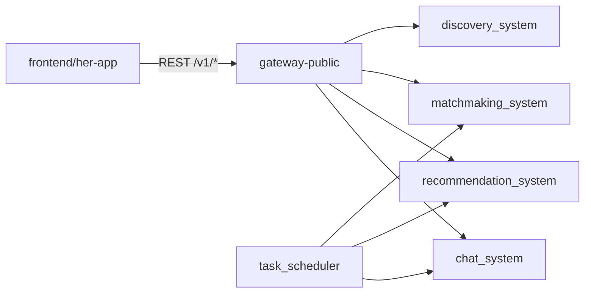

# CLEANUP_CANDIDATES

> **状态：** 清理已于 2026-05-26 执行（归档验证后永久删除）。  
> **生成日期：** 2026-05-26（§7 入口对比更新：2026-05-26）  
> **扫描范围：** 全仓库（Python + `frontend/her-app` TypeScript）

---

## 扫描方法

| 步骤 | 工具 / 方式 | 说明 |
|------|-------------|------|
| 自动（前端） | `cd frontend/her-app && npx knip` | 检测未引用文件、未使用导出、未使用 npm 依赖 |
| 自动（Python） | `python3 -m vulture <项目包路径> --min-confidence 60` | 排除 `.venv`、`node_modules`、`artifacts`；**不扫描第三方 site-packages** |
| 人工（import 图） | 全库文本匹配 + 交叉验证 | 对 knip / vulture 结果逐项 grep；Python 存在 `__getattr__` 懒加载、CLI、`pytest` 收集等**大量假阳性**，以下仅保留高置信条目 |

### 已知局限

- **Next.js 约定路由**（`app/**`）与 **动态 import** 不会被静态分析完整覆盖。
- **Python 包懒导出**（如 `chat_system/__init__.py` 的 `__getattr__`）会使 vulture 误报 `__getattr__`、重导出符号为「未使用」。
- **Radix / shadcn 脚手架依赖**：knip 报 37 个 unused dependencies，多数是 UI 组件库预装但未接入——属于**依赖瘦身**候选，不一定是死代码文件。
- 根目录 **`tmp/`** 下脚本为一次性验证工具，通常**不应**按「生产模块」标准保留。

---

## 1. Knip — `frontend/her-app`

**命令：** `npx knip`（工作目录：`frontend/her-app`）  
**退出码：** 1（存在未使用项）

### 1.1 未引用文件（Unused files）— 高优先级

| 路径 | 判断依据 |
|------|----------|
| `frontend/her-app/components/her/auth/one-click-login-page.tsx` | knip 标记为 unused；全库无 `import` / `OneClickLoginPage` 引用。一键登录逻辑已内联在 `welcome-page.tsx` 的 `onOneClickLogin` 回调中。 |
| `frontend/her-app/components/ui/label.tsx` | knip 标记为 unused；无 `@/components/ui/label` 或相对路径 import。 |

### 1.2 未使用的导出（Unused exports）— 中优先级

以下为 **export 了但无其他模块 import** 的符号（knip）。部分可能在**同文件内部**使用，删除前需打开文件确认。

| 符号 | 位置 |
|------|------|
| `SlideUp` | `components/her/ui/animations.tsx:81` |
| `StaggerContainer` | `components/her/ui/animations.tsx:104` |
| `ScaleOnPress` | `components/her/ui/animations.tsx:158` |
| `Pulse` | `components/her/ui/animations.tsx:183` |
| `Shimmer` | `components/her/ui/animations.tsx:192` |
| `TypingDots` | `components/her/ui/animations.tsx:242` |
| `useAppConnectivity` | `components/her/ui/app-connectivity.tsx:45` |
| `EmptyInbox` | `components/her/ui/empty-states.tsx:82` |
| `EmptyMatches` | `components/her/ui/empty-states.tsx:110` |
| `EmptyPending` | `components/her/ui/empty-states.tsx:124` |
| `ScaleTransition` | `components/her/ui/page-transitions.tsx:64` |
| `VerificationProgress` | `components/her/ui/progress-ring.tsx:80` |
| `CandidateCardSkeleton` | `components/her/ui/skeletons.tsx:14`（同文件内有引用，可考虑改为非 export） |
| `ChatMessageSkeleton` | `components/her/ui/skeletons.tsx:41` |
| `ProfileHeroSkeleton` | `components/her/ui/skeletons.tsx:59` |
| `useTheme` | `components/her/ui/theme-toggle.tsx:9` |
| `ThemeSelector` | `components/her/ui/theme-toggle.tsx:64` |
| `XiaoyaAvatarTyping` | `components/her/ui/xiaoya-avatar.tsx:51` |
| `buttonVariants` | `components/ui/button.tsx:60` |
| `getErrorMessage` | `lib/api/client.ts:4`（re-export） |
| `isGatewayClientError` | `lib/api/client.ts:4`（re-export） |
| `fetchRecommendationExplain` | `lib/api/endpoints/collected.ts:132` |
| `fetchDiscoveryProfileDetail` | `lib/api/endpoints/discovery.ts:32` |
| `mapUiFieldToApiKey` | `lib/api/endpoints/field-verification.ts:17` |
| `createRecommendationSubscription` | `lib/api/endpoints/recommendation.ts:89` |
| `fetchRelationByCase` | `lib/api/endpoints/relations.ts:105` |
| `activateRuleConfigVersion` | `lib/api/endpoints/rule-config.ts:58` |
| `createRuleConfigAssignment` | `lib/api/endpoints/rule-config.ts:65` |
| `isGatewayClientError` | `lib/api/errors.ts:23` |
| `applyPrincipalToSession` | `lib/auth/principal.ts:18`（同文件内有调用，可改为非 export） |
| `hasLinkedProfileIdentity` | `lib/auth/session.ts:55` |
| `getSessionContext` | `lib/auth/session.ts:123`（同文件内其他函数可能间接使用） |
| `getRequesterId` | `lib/auth/session.ts:145` |
| `getPublicEnv` | `lib/env.ts:30`（同文件内 wrapper 使用，可改为非 export） |
| `notifyInfo` | `lib/notify.ts:12` |

### 1.3 未使用的导出类型（Unused exported types）

| 类型 | 位置 |
|------|------|
| `RecommendationExplainResponse` | `lib/api/endpoints/collected.ts:24` |
| `DataProvenanceSource` | `lib/data-provenance.ts:5` |
| `PublicEnv` | `lib/env.ts:26` |
| `DemoPage` | `lib/navigation/types.ts:34` |

### 1.4 未使用的 npm 依赖（Unused dependencies）— 依赖瘦身候选

knip 报告 **37 个** production 依赖未使用（主要为 Radix UI 套件、`react-hook-form`、`recharts`、`date-fns` 等）。完整列表见 knip 原始输出；**不建议**在未确认 UI 路线图前批量卸载。

| 类别 | 示例包 | 判断依据 |
|------|--------|----------|
| Radix 组件 | `@radix-ui/react-accordion` … `@radix-ui/react-tooltip` | 无对应 `components/ui/*` 封装被 import |
| 表单 / 图表 | `react-hook-form`, `@hookform/resolvers`, `recharts` | 无 import |
| 其他 UI | `cmdk`, `vaul`, `embla-carousel-react`, `input-otp` | 无 import |

**未列出依赖（Unlisted）：** `postcss-load-config`（`postcss.config.mjs` 使用）— 应加入 `devDependencies`，非删除对象。

**未使用 devDependencies：** `@eslint/eslintrc`, `eslint-config-next`（可能由 flat config 间接需要，删除前跑 `npm run lint`）。

### 1.5 工作区中已删除、尚未提交的文件（git `D`）

以下路径在 **当前工作区 diff** 中已为删除状态（重构残留，清理时可直接 `git add` 确认删除）：

| 路径 | 说明 |
|------|------|
| `frontend/her-app/components/her/ui/custom-range-slider.tsx` | UI 组件移除 |
| `frontend/her-app/components/her/ui/pull-to-refresh.tsx` | UI 组件移除 |
| `frontend/her-app/hooks/use-app-navigation.ts` | 导航 hook 移除 |
| `frontend/her-app/hooks/use-mobile.ts` | 移动端检测 hook 移除 |
| `frontend/her-app/lib/gateway.ts` | API 层合并 |
| `frontend/her-app/lib/her-types.ts` | 类型合并 |
| `external-systems/partner-chat-system/chat_system/outbox_admin.py` | 合并进 `outbox.py` |
| `external-systems/partner-chat-system/chat_system/outbox_worker.py` | 合并进 `outbox.py` |
| `external-systems/partner-recommendation-system/recommendation_system/criteria_compiler.py` | 上移到 `match_domain/criteria_compiler.py` |
| `match_domain/actor_context.py` | 域模型精简 |
| `match_domain/trace_context.py` | 迁至 `her_runtime_context` 等 |
| `docs/*.md`（多条） | 已迁至 `docs/archive/` |

---

## 2. Vulture — Python（项目代码）

**命令示例：**

```bash
python3 -m vulture \
  partner_search persona_memory_sync profile_service match_domain \
  async_jobs observability task_scheduler db_migrations \
  external-systems/partner-chat-system external-systems/partner-discovery-system \
  external-systems/partner-http-gateway external-systems/partner-matchmaking-system \
  external-systems/partner-recommendation-system tests scripts \
  --min-confidence 60
```

### 2.1 高置信度（≥80%）— 测试/夹具噪声

| 位置 | 符号 | 判断依据 |
|------|------|----------|
| `tests/test_collected_layer_e2e.py:81` | `c` | 100%，测试内未使用的循环变量 |
| `tests/test_db_migrations.py:22` 等 | `exc_type`, `tb` | 100%，`__exit__` 签名占位 |
| `gateway_tests/test_gateway_wsgi.py:210` 等 | 同上 | 测试 mock 签名 |

**建议：** 可改为 `_c` / `_exc_type` / `_tb`，或 `# noqa`，**非业务死代码**。

### 2.2 中置信度（60–79%）— 需人工确认的函数/变量

| 位置 | 符号 | 判断依据 | 建议 |
|------|------|----------|------|
| `match_domain/criteria_compiler.py:337` | `compile_effective_criteria_legacy` | 全库仅定义处出现，无调用 | **可删**（确认无外部脚本依赖后） |
| `discovery_system/view_models.py:137` | `build_profile_detail_view` | 仅定义；运行时使用的是 `build_profile_detail_view_from_payload` | **可删**或标 `@deprecated` |
| `persona_memory_sync/audit.py:343` | `mentions_income_privacy` | 无调用（`build_matcher_payload` 在测试中仍使用） | 审计后删除 |
| `scripts/split_service_modules.py:526` | `rematchmaking_from_git_head` | 一次性重构脚本内的未调用函数 | 随脚本整体归档或删除 |
| `recommendation_system/direct_greet_gate.py:67` | `_load_direct_greet_profile` | 无直接调用 | 打开文件确认是否死分支 |
| `matchmaking_system/matchmaking_cases.py:45` 等 | 未使用的 import | vulture 90% | 运行 `ruff check --fix` 清理 import |
| `db_migrations/targets/*/__init__.py:3` | `ENV_VAR` | 迁移注册表约定变量，可能被反射读取 | **保留** |

### 2.3 低置信 / 假阳性（勿按死代码删除）

- `__getattr__` / `__dir__`：`chat_system`、`gateway`、`recommendation_system` 等包的懒加载机制。
- Pydantic `decision_models._validate_*`：框架回调。
- `live_video_local.analyze_profile_photo_authenticity`：经 `profile_reviews` 动态调用，vulture 无法追踪。

---

## 3. 人工 import 审计

### 3.1 TypeScript — 高置信「无 inbound import」

| 路径 | 判断依据 |
|------|----------|
| `frontend/her-app/components/her/auth/one-click-login-page.tsx` | 见 §1.1；功能已由 `welcome-page.tsx` 承接 |
| `frontend/her-app/components/ui/label.tsx` | 见 §1.1 |
| `frontend/her-app/next-env.d.ts` | Next 自动生成类型声明，**保留** |

### 3.2 Python — 独立脚本 / 临时验证（非生产模块）

`tmp/` 目录下 **15 个** `validate_post_chat_*.py` 与 `run_matchmaker_*.py`：无其他模块 import，属 2026-05 前后**一次性对话/匹配验证脚本**。

| 路径 | 判断依据 |
|------|----------|
| `tmp/live_matchmaker_case_ctl.py` | 仅命令行入口，无包 import |
| `tmp/run_matchmaker_round.py` | 同上 |
| `tmp/run_matchmaker_scene_case.py` | 同上 |
| `tmp/validate_cases_txt_lifecycle_new_profiles.py` | 同上 |
| `tmp/validate_post_chat_*.py`（12 个） | 同上 |

**建议：** 迁入 `scripts/archive/` 或删除；若需保留，在 `docs/` 注明用途与过期时间。

### 3.3 Python — 根目录单文件模块

| 路径 | 判断依据 | 建议 |
|------|----------|------|
| `generate_virtual_profiles.py` | 无 import；`SYSTEM_DOC.md` 提及为冷启动/seed 工具 | **保留**为运维脚本，或移到 `scripts/` |
| `skill_runtime.py` | 仅 `setup.py` / `pyproject.toml` `py-modules` 注册；无 `import skill_runtime` | 与 `scripts/check_skill_packaging.py` 职责重叠，可合并或删除 |
| `her_activate_repo.py` | 被 `her_repo_path_bootstrap.py` 动态 `importlib` 加载 | **保留** |
| `local-skills/*/examples/python_api_integration.py` | 示例代码 | 保留或移到文档 |

### 3.4 全库文本扫描说明（避免误删）

对 `external-systems/**` 下大量 `.py` 做「无 import 字符串」扫描会产生 **150+ 假阳性**（例如 `chat_system/service.py`），原因包括：

- 包内相对 import（`from .service import …`）
- `her_activate_repo` / `_path_bootstrap` 注入 `sys.path`
- 网关 `jsonrpc_dispatch` 按方法名字符串分发
- pytest 与 `scripts/*` CLI

**结论：** Python 生产代码的删除应以 **vulture 符号级结果 + grep 调用点 + 测试通过** 为准，不应仅凭文件名未出现在 import 字符串中。

---

## 4. 损坏代码（优先修复，非「死代码」）

| 路径 | 问题 | 判断依据 |
|------|------|----------|
| `external-systems/partner-matchmaking-system/matchmaking_system/pairs.py` | `list_match_case_events` 函数体（约 184–205 行）SQL 与 observability 代码混杂，**语法无效** | vulture 报 `expected an indented block`；文件内 `def list_match_case_events` 未完成合法 `conn.execute(...)` |

该问题会导致 matchmaking 模块 import 失败，应视为 **合并冲突/编辑事故**，优先于死代码清理修复。

---

## 5. 建议清理阶段（仍须 PR 评审）

| 阶段 | 内容 | 风险 |
|------|------|------|
| **P0** | 修复 `pairs.py` 损坏的 `list_match_case_events` | 高 — 阻塞运行 |
| **P1** | 确认并提交 git 中已 `D` 的删除；删除 `one-click-login-page.tsx`、`label.tsx` | 低 |
| **P1** | 归档或删除 `tmp/validate_post_chat_*.py` | 低 |
| **P2** | 移除 §8 标记的逻辑孤岛（legacy 函数、断链 REST、一次性脚本） | 中 — 需跑 `pytest` + E2E |
| **P2** | 前端：未使用 export 改为非 export 或删除；knip 依赖瘦身 | 中 — 需 `npm run build` |
| **P2** | 决策：`request_proxy_intro` 是补全 UI/API 还是移除 card CTA | 产品 — 见 §8.5 |
| **P3** | `npm` 未使用的 Radix 依赖批量卸载 | 中 — 可能影响后续 UI 工作 |

---

## 6. 复现命令

```bash
# 前端
cd frontend/her-app && npx knip

# Python（项目包，排除 venv）
cd /path/to/Her
python3 -m pip install vulture
python3 -m vulture \
  partner_search persona_memory_sync profile_service match_domain \
  async_jobs observability task_scheduler db_migrations \
  external-systems/partner-chat-system external-systems/partner-discovery-system \
  external-systems/partner-http-gateway external-systems/partner-matchmaking-system \
  external-systems/partner-recommendation-system tests scripts \
  --min-confidence 60

# 回归
ruff check .
pytest
cd frontend/her-app && npm run lint && npm run build
```

---

## 7. 入口对比与逻辑孤岛（深度审计）

本节将候选条目与**真实执行入口**对照。活跃入口定义：

| 入口类型 | 位置 | 生产触发 |
|----------|------|----------|
| **HTTP REST** | `gateway/rest_dispatch.py` → 各 `*_routes.py` | `docker compose` → `gateway-public`(:8080) / `gateway-ops`(:8081)；前端经 `app/api/gateway/[...path]` 代理 |
| **JSON-RPC** | `gateway/jsonrpc_dispatch.py` | 仅 `gateway-internal`(:8082)，`PARTNER_GATEWAY_ENABLE_JSONRPC=1` |
| **定时任务** | `task_scheduler/build.py` | `docker compose` → `scheduler`（outbox / refresh / maintenance / proxy-intro dispatch） |
| **CLI / 一次性** | `external-systems/*/scripts/`、`scripts/` | 运维/CI 手动执行，**非**用户主路径 |
| **前端 UI** | `components/app/her-app.tsx` → pages/hooks | 仅 `save`/`skip`/`direct_greet` 等已接线 action 算活跃 |



### 7.1 前端 API Client 孤岛（有封装、无 UI 调用）

这些函数在 `lib/api/endpoints/*` 中 export，但 **components/hooks/app 均未 import**；对应网关路由虽可能存在，却不在当前产品 UI 的执行路径上。

| 符号 / 文件 | 本应命中路由 | 为何过时 |
|-------------|--------------|----------|
| `fetchDiscoveryProfileDetail` | `GET /v1/discovery/profiles/{id}` | UI 统一走 BFF `fetchCandidateDetail` → `GET /v1/candidates/{id}`（`candidate_detail.py` 内部再调 `DiscoveryService.get_profile_detail`）。独立 discovery profile 路由成为**冗余平行 API**。 |
| `fetchRecommendationExplain` | `GET /v1/recommendations/{id}/explain` | Explain 已聚合进 BFF：`candidate_detail.py::_explain_for_recommendation`。UI 只用 `formatExplainSourceMap` 解析 BFF 响应。 |
| `fetchRelationByCase` | `GET /v1/relations/by-case/{caseId}` | 关系页使用 `fetchCrossDomainTimeline`（`/v1/timeline`）和 `fetchRelationsMine`；按 case 查 relation 的客户端**从未接入**。 |
| `activateRuleConfigVersion` | `POST /v1/ops/rule-config/versions/{id}/activate` | Ops 工作台仅读 active config / experiment / decision-trace，**无版本发布 UI**。 |
| `createRuleConfigAssignment` | `POST /v1/ops/rule-config/assignments` | 同上。 |
| `one-click-login-page.tsx` | （无独立 API） | `her-app.tsx` 中 `auth-one-click` **立即 redirect 到 `auth-welcome`**；一键登录走 `auth-api.ts` + `WelcomePage.onOneClickLogin`。整页组件为合并后残留。 |

### 7.2 后端 REST 路由孤岛（有路由、无 UI / 无 CLI 消费）

| 路由 | 定义位置 | 活跃入口？ | 为何过时 |
|------|----------|------------|----------|
| `GET /v1/discovery/profiles/{id}` | `discovery_routes.py` | 仅 gateway 测试 | 产品路径已被 BFF `/v1/candidates/{id}` 取代（见 §7.1）。 |
| `GET /v1/recommendations/{id}/explain` | `collected_routes.py` | 仅测试 / 潜在 RPC | 功能并入 BFF；独立 explain 端点重复。 |
| `GET /v1/relations/by-case/{id}` | `ledger_routes.py` | 无前端调用 | Timeline 聚合接口已覆盖用户场景。 |

> **保留理由（若暂不删）：** 上述 REST 仍可供 **internal JSON-RPC 镜像** 或未来 native client 使用；删除前需确认 `gateway-internal` 与 OpenAPI 契约。

### 7.3 Service 函数孤岛（包内互引，但不触达任何活跃入口）

| 符号 | 位置 | 引用情况 | 为何不触达入口 |
|------|------|----------|----------------|
| `build_chat_timeline` | `chat_system/timeline.py` | `chat_system/__init__` 懒导出；**仅** `tests/test_recommendation_chat_integration.py` 调用 | 网关 timeline 一律用 `build_case_conversation_timeline`（`chat_routes.py` / `chat_jsonrpc.py`）。旧 thread 模型 helper，已被 v2 conversation 路径替代。 |
| `build_profile_detail_view(profile_id)` | `discovery_system/view_models.py:137` | 无调用者 | `DiscoveryService.get_profile_detail` 使用 `build_profile_detail_view_from_payload`；按 ID 直查版本为**迁移前 API**。 |
| `compile_effective_criteria_legacy` | `match_domain/criteria_compiler.py:337` | 无调用者 | 现行搜索/订阅走 `compile_effective_criteria` / `build_effective_search_request`；legacy 编译路径未挂到 gateway 或 scheduler。 |
| `list_feedback_events` | `matchmaking_system/matchmaking_cases.py` | `__init__` 导出；**仅单测** | 无 `matchmaking_routes` / JSON-RPC / scheduler 暴露；feedback 写入有 `record_feedback`，读取列表未产品化。 |
| `mentions_income_privacy` | `persona_memory_sync/audit.py:343` | 无调用者 | persona 审计链未挂 gateway；`build_matcher_payload` 仍被 local-skills 测试使用，**此函数可单独删除**。 |
| `rematchmaking_from_git_head` | `scripts/split_service_modules.py:526` | 无调用者 | 一次性 service.py 拆分工具内的死分支。 |

### 7.4 互引子图孤岛（模块群内部连通，与主路径断开）

#### A. 一次性重构 / 验证工具链

| 路径 | 互引关系 | 为何过时 |
|------|----------|----------|
| `scripts/split_service_modules.py` | 读写 rec/mm 模块文本 | 注释写明 *One-off extractor*；拆分已完成，仅 `scripts/resplit_matchmaking.py` 仍 import 其符号。 |
| `scripts/resplit_matchmaking.py` | → `split_service_modules` | 维护工具，不在 docker / gateway / scheduler 路径。 |
| `tmp/validate_post_chat_*.py`（12+） | 互调 chat/matchmaker 场景 | 2026-05 对话验证实验脚本；无 CI workflow 引用。 |
| `tmp/run_matchmaker_*.py` | 同上 | 同上。 |

#### B. 兼容垫片层（re-export，无独立业务）

| 路径 | 说明 | 建议 |
|------|------|------|
| `recommendation_system/proxy_intro.py` | 注释：*canonical code is matchmaking_system.proxy_intro_core*；`__getattr__` 转发 | 非孤岛业务，但属于**迁移兼容层**；待调用方全部切到 `matchmaking_system` 后可删。 |
| `skill_runtime.py` | 仅 `setup.py` / `pyproject.toml` `py-modules` 注册 | 与 `scripts/check_skill_packaging.py` 职责重叠，**运行时无 import**。 |

#### C. CI / 评估专用（非运行时业务）

| 路径 | 入口 | 说明 |
|------|------|------|
| `local-skills/persona-eval/**` | `.github/workflows/persona-eval-gate.yml` | Persona 离线评估；**不**在 docker compose 与用户请求路径。属评估资产，非死代码，但应标注为非生产。 |
| `artifacts/persona-eval/*.json` | 无 | 历史实验输出；可归档出仓库。 |

### 7.5 半接入 / 产品断链（最易误导为「仍活跃」）

| 现象 | 涉及代码 | 判断 |
|------|----------|------|
| 推荐卡片 CTA 含「替我去问」 | `in_app_delivery.py` `cta_actions` 含 `request_proxy_intro` | **半接入**：UI `discover-page.tsx` 只渲染 skip/save，未渲染 `direct_greet` / `request_proxy_intro`。 |
| 用户 action API 拒绝 proxy intro | `recommendation_rows.py::record_recommendation_action` 仅允许 `skip/save/direct_greet` | 与 card CTA 不一致；`create_match_case` 仅 **CLI**（`request_proxy_intro.py`）+ **scheduler dispatch** 可达，**无 REST 创建 proxy case**。 |
| 一键登录路由仍存在 | `routes.ts` → `auth-one-click`；E2E 测 one-tap API | 页面已合并到 welcome；路由与 E2E 仍有效，**组件文件**过时。 |
| `no_match_opt_in` 流程 | `handle_opt_in_decision` ← `DiscoveryService.process_turn` | **有入口**（discovery 会话内 opt-in），但 `run_search_session` / `subscribe_after_opt_in` 另仅 CLI/测试可达——属 discovery 集成的子集，非全孤岛。 |

### 7.6 已确认仍在执行路径上（勿删 — 纠正初版误报）

以下在初版「无 import 字符串」扫描中易被误判，但已对照入口确认**活跃**：

| 模块 / 符号 | 活跃入口 |
|-------------|----------|
| `chat_system/assistant_orchestrator.process_pending_agent_tasks` | scheduler → `maintenance.run_chat_maintenance` |
| `chat_system/persona_jobs.process_pending_persona_jobs` | maintenance + JSON-RPC `chat.process_persona_jobs` |
| `chat_system/live_video_whisper_worker` | `live_video_local` subprocess 拉起 |
| `recommendation_system/no_match_opt_in.handle_opt_in_decision` | `DiscoveryService.process_turn` |
| `matchmaking_system/proxy_intro_core.create_match_case` | CLI + scheduler `dispatch_proxy_intro_outreach` + 测试 |
| `match_domain/adapters.py` | `match_domain/__init__`、`case_events`、`ids` 域内核 |
| `her_activate_repo.py` | `her_repo_path_bootstrap` 动态加载；各 `_path_bootstrap.py` 间接依赖 |

---

## 8. 统计摘要

| 来源 | 类别 | 数量 |
|------|------|------|
| knip | 未引用文件 | 2 |
| knip | 未使用 export | 35 |
| knip | 未使用 export type | 4 |
| knip | 未使用 dependencies | 37 |
| vulture (60%+, 项目包) | 高价值死符号候选 | ~5–10（见 §2.2） |
| **§7 入口对比** | 前端 API client 孤岛 | 6 |
| **§7 入口对比** | 后端 REST 路由孤岛 | 3 |
| **§7 入口对比** | Service 函数孤岛 | 6 |
| **§7 入口对比** | 工具/临时脚本子图 | 15+ (`tmp/`) + 2 (`split_service_modules*`) |
| **§7 入口对比** | 半接入 / 产品断链 | 3 处 |
| git diff | 已删除待提交文件 | 20+ |
| **阻断** | 损坏源文件 | 1（`pairs.py`） |

---

---

## 9. 已执行的清理（2026-05-26）

| 动作 | 内容 |
|------|------|
| `@deprecated` 标注 | 归档前已在废弃符号/文件顶部标注及替代方案 |
| `.claudignore` | 新增；忽略 `tmp/`、`docs/archive/`、`artifacts/persona-eval/`、`local-skills/persona-eval/` |
| 归档验证 | 22 个文件移入 `deprecated_archive/` → `pytest` 501 passed → `npm run build` OK |
| 永久删除 | `deprecated_archive/` 已删除 |
| 移除的整文件 | `one-click-login-page.tsx`, `label.tsx`, `chat_system/timeline.py`, `skill_runtime.py`, `scripts/split_service_modules.py`, `scripts/resplit_matchmaking.py`, `tmp/*.py`（15 个验证脚本） |
| 移除的符号 | `build_profile_detail_view`, `compile_effective_criteria_legacy`, `mentions_income_privacy`, `list_feedback_events`, 前端 5 个 dead API client |
| README | 更新架构图与活跃入口说明 |

**未删除（需产品决策）：** 后端 proxy-intro 写路径（CLI + scheduler，§7.5）。

---

## 10. Phase 2 清理（2026-05-26）

| 动作 | 内容 |
|------|------|
| REST 孤岛路由删除 | `GET /v1/discovery/profiles/{id}`、`GET /v1/recommendations/{id}/explain`、`GET /v1/relations/by-case/{id}` |
| Gateway 测试更新 | `test_collected_routes`、`test_ledger_routes`、`test_gateway_wsgi` |
| CTA 对齐 | `in_app_delivery.py` 卡片 CTA 仅保留 `save` / `skip` |
| 前端 export 瘦身 | `session.ts` 修复；移除 `DemoPage`、`DiscoveryProfileDetailResponse`、未用 UI 组件 export；`createRecommendationSubscription` 改内部函数 |
| npm 依赖 | 移除 37 个未用 Radix/表单/图表包，仅保留 `@radix-ui/react-slot` 等 13 个运行时依赖；新增 `postcss-load-config` |
| 文档 | `API_CONTRACT.md` 移除已删路由；README 已有 BFF 约定 |

**验证：** `pytest` 556 passed + `pnpm run lint` + `pnpm run build`（2026-05-26）。

---

## 11. Phase 3 收尾（2026-05-26）

| 动作 | 内容 |
|------|------|
| 脚本 bootstrap | `scripts/_repo_bootstrap.py` 在 import 前注入 repo root，修复 `validate_tech_optimization_env.py` 子进程失败 |
| knip 清零 | 删除未引用的 `request-error-state.tsx`（`ErrorState` 别名）；`applyPrincipalToSession` / `getPublicEnv` 改内部符号 |
| devDependencies | 移除未用的 `@eslint/eslintrc`、`eslint-config-next`（flat ESLint 配置不依赖） |
| 文档 | `SYSTEM_DOC.md` 推荐解释路径改为 BFF `/v1/candidates/{id}` |

---

## 12. Phase 4 收尾（2026-05-26）

| 动作 | 内容 |
|------|------|
| Gateway 路径引导 | `her_repo_path_bootstrap` 加入 `partner-http-gateway`；pytest 不再依赖测试文件字母序 |
| 前端 lint | 移除未用 import；`candidate-detail-page` 删除重复的轮播 touch 状态（`ImageCarousel` 已内置） |
| Gateway 测试 | `test_bff` / `test_collected` / `test_ledger` 去掉重复的 `GATEWAY_ROOT` 引导 |

---

*历史审计记录。进一步清理前请运行 §6 复现命令，并对照 §7 确认无活跃入口依赖。*

