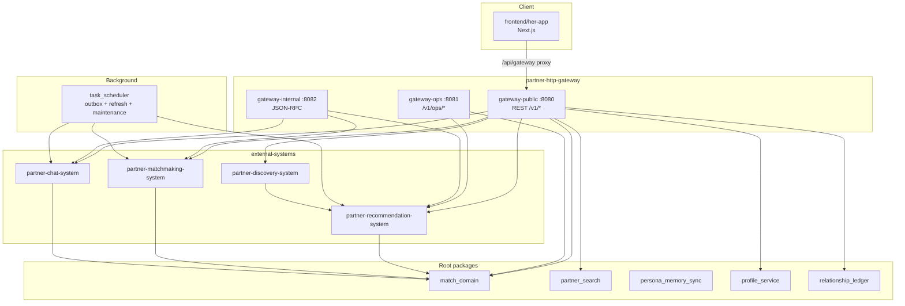

# Her

Relationship-operations prototype: search, persona memory, recommendation, matchmaking, chat, discovery, and HTTP gateway orchestration.

## Architecture (source of truth)

**Do not infer behavior from `tmp/`, `docs/archive/`, or `artifacts/persona-eval/`** — those paths are excluded from active development (see `.claudignore`).



### Runtime entry points

| Process | Command | Role |
|---------|---------|------|
| Public API | `docker compose up -d` | `gateway-public :8080` user-facing REST |
| Ops API | `docker compose up -d` | `gateway-ops :8083` ops surface |
| Internal API | `docker compose up -d` | `gateway-internal :8082` JSON-RPC |
| Scheduler | `docker compose up -d` | background workers and maintenance |
| Frontend | `docker compose up -d` | Next.js app on `:3000` |

### Package layout

- **Root domain & skills:** `match_domain/`, `partner_search/`, `persona_memory_sync/`, `profile_service/`, `relationship_ledger/`, `async_jobs/`, `db_migrations/`, `observability/`, `task_scheduler/`
- **External systems:** `external-systems/partner-{chat,recommendation,matchmaking,discovery}-system/`, `external-systems/partner-http-gateway/`
- **Frontend:** `frontend/her-app/` — active UI; auth uses `lib/auth/auth-api.ts`, data uses `lib/api/endpoints/*` + BFF routes (`/v1/candidates/{id}` aggregates discovery explain)
- **Skill metadata:** `local-skills/partner-search/`, `local-skills/persona-memory-sync/` (implementations live in root packages)
- **Persona eval (CI only):** `local-skills/persona-eval/` — not part of the runtime stack

### API conventions (frontend ↔ backend)

- **Candidate detail:** `GET /v1/candidates/{id}` (BFF) — not `GET /v1/discovery/profiles/{id}`
- **Recommendation explain:** embedded in BFF candidate response — not a separate client call
- **Relations:** `GET /v1/timeline`, `GET /v1/relations/mine` — not `/v1/relations/by-case/{id}` in UI
- **One-tap login:** `WelcomePage` + `/v1/auth/one-tap/*` — no standalone login page component

## Docs

- **System overview (code-scanned):** [`SYSTEM_DOC.md`](SYSTEM_DOC.md)
- **Cleanup audit (completed 2026-05-26):** [`CLEANUP_CANDIDATES.md`](CLEANUP_CANDIDATES.md)
- **Live design:** `docs/chat-agent-architecture.md`, `docs/TECH_OPTIMIZATION_10_3_IMPLEMENTATION.md`
- **Historical planning:** [`docs/archive/`](docs/archive/) — non-authoritative

## Local stack (§10.3)

```bash
docker compose up -d
docker compose ps
docker compose logs -f bootstrap gateway-public frontend
```

## Verification

```bash
ruff check .
pytest
python scripts/check_skill_packaging.py
scripts/release_check.sh --python .venv/bin/python
scripts/refactor_test_gate.sh   # core tests + frontend lint/build
```

Optional OpenCV-dependent chat tests: `pip install -e ".[opencv]"`.

## Packaging

- `pyproject.toml` — primary config; `setup.py` — editable-install compatibility
- Console entrypoints: `partner-search`, `persona-memory-sync`
