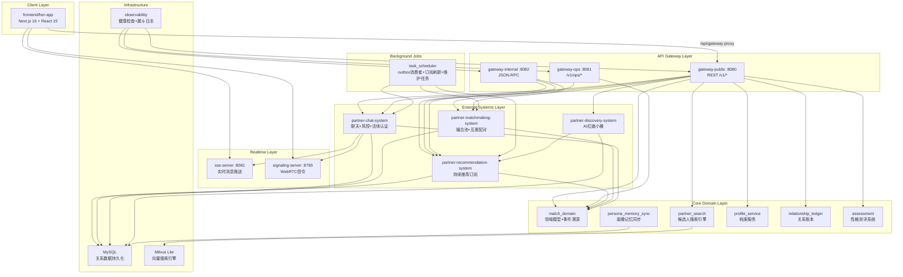
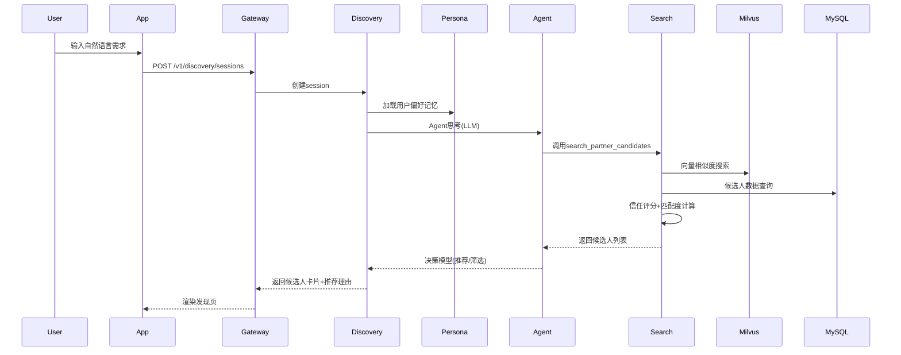
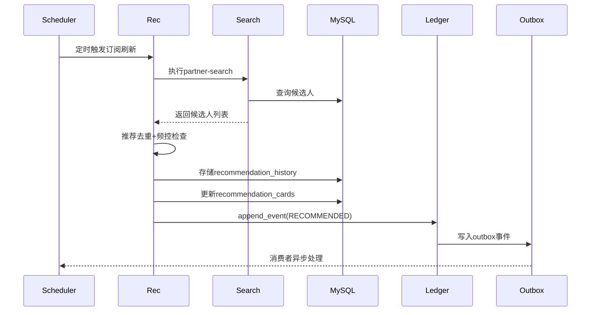
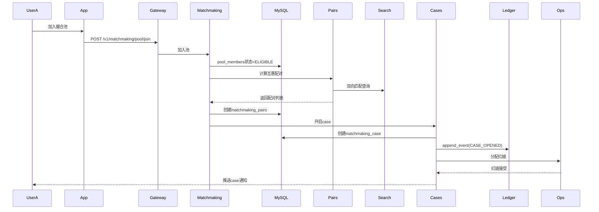

# HER 关系运营中台 - 系统文档

> **文档生成日期**: 2026-06-26  
> **文档版本**: 1.0  
> **生成方式**: 基于代码库全量扫描（排除 md 文件）  
> **代码成熟度**: 生产级核心功能已完成，部分高级功能在迭代中

---

## 📋 目录

- [1. 系统愿景与背景](#1-系统愿景与背景)
- [2. 核心架构设计](#2-核心架构设计)
- [3. 功能清单与交互逻辑](#3-功能清单与交互逻辑)
- [4. 技术栈与工程实践](#4-技术栈与工程实践)
- [5. 产品规划建议](#5-产品规划建议)
- [6. 附录](#6-附录)

---

## 1. 系统愿景与背景

### 1.1 系统定位

**系统名称**: HER 关系运营中台 / Relationship Operations Console

**核心定位**: 这是一个围绕相亲/婚恋业务构建的复合型运营系统，整合了"用户自助 + 运营审核 + 风控处置 + 推荐撮合"全流程能力。

**不是单一前台 App**，而是：
- 用户自助平台（发现、推荐、聊天、认证）
- 运营工作台（撮合池管理、推荐订阅管理、异步任务监控）
- 风控审核平台（举报处理、聊天风控、反诈图谱、活体认证）
- 资料审核平台（字段核验、照片风险审核、资料争议处理）

### 1.2 目标用户群体

| 用户角色 | 核心职责 | 关键痛点 |
|---------|---------|---------|
| **普通终端用户** `end_user` | 登录、发现对象、查看推荐、提交验证、查看信任状态、申诉 | 找人效率低、资料真假难辨、沟通安全感不足、申诉路径不透明 |
| **运营人员** `ops_operator` | 管理推荐订阅、撮合池、匹配案件、异步任务 | 推荐、撮合、聊天、审核数据分散，缺少统一操作台 |
| **风控审核人员** `risk_reviewer` | 处理举报、聊天风险案件、欺诈网络、活体验证请求 | 案件证据链长、多个审核模块割裂、缺少统一风险画像 |
| **资料审核人员** `profile_reviewer` | 处理资料字段核验、照片风险、资料风险案件 | 字段核验、活体视频、照片风险分散在不同流程 |
| **客服人员** `customer_support` | 查看用户信任中心、辅助处理投诉与申诉 | 缺少跨模块用户视图、投诉处理路径不统一 |
| **平台管理员** `platform_admin` | 全局配置、跨模块审查、所有任务监控 | 缺少全局监控视图、配置分散 |

### 1.3 解决的核心痛点

#### 用户端痛点

1. **找人效率低**
   - 传统婚恋平台：用户主动搜索，筛选条件复杂，匹配成功率低
   - **HER解决方案**: AI红娘"小雅"通过自然语言对话理解需求，动态调整搜索策略，主动推荐合适候选人

2. **资料真假难辨**
   - 传统婚恋平台：资料审核滞后，虚假照片、年龄造假难以识别
   - **HER解决方案**: 
     - 活体视频认证（Silent-Face + YuNet + SFace + Whisper语音识别）
     - 字段核验（年龄、学历、收入等）
     - 照片风险审核（深度伪造检测）
     - 信任评分系统（Trust Score）

3. **沟通安全感不足**
   - 传统婚恋平台：聊天无风控，欺诈风险高，举报处理慢
   - **HER解决方案**:
     - 聊天风控系统（风险信号检测、自动封禁）
     - 反诈图谱（欺诈网络识别、关联风险用户）
     - 举报申诉快速通道
     - 红娘C助手（三方会话，人工介入）

4. **申诉路径不透明**
   - 传统婚恋平台：申诉流程不透明，处理周期长
   - **HER解决方案**:
     - 信任中心（统一查看认证状态、风险等级、申诉进度）
     - 实时状态更新（审核进度实时可见）
     - 快速申诉通道（一键申诉，自动分配审核员）

#### 运营端痛点

1. **数据分散**
   - 传统婚恋平台：推荐、撮合、聊天、审核模块割裂，数据孤岛
   - **HER解决方案**:
     - 统一关系账本（relationship_ledger）
     - 统一事件溯源（MatchEvent统一存储）
     - 运营工作台（ops-workbench）
     - 统一时间线（timeline）

2. **缺少统一操作台**
   - 传统婚恋平台：不同功能在不同系统，操作效率低
   - **HER解决方案**:
     - HTTP Gateway统一入口
     - JSON-RPC统一内部接口
     - Ops API（运营专用接口）
     - 统一身份标识（principal收敛）

#### 风控端痛点

1. **案件证据链长**
   - 传统婚恋平台：举报、聊天记录、用户画像分散，难以快速取证
   - **HER解决方案**:
     - 聊天线程统一存储（chat_threads）
     - 举报案件时间线（risk_cases）
     - 反诈图谱档案（fraud_networks）
     - 统一证据链查看

2. **审核模块割裂**
   - 传统婚恋平台：聊天风控、资料审核、活体认证分散在不同系统
   - **HER解决方案**:
     - 统一风控审核API（/v1/chat/risk-cases, /v1/profile-review）
     - 统一审核状态管理
     - 统一处置联动（封禁、警告、限制）

---

## 2. 核心架构设计

### 2.1 架构总览



### 2.2 分层架构说明

#### Client Layer（前端层）

**技术栈**: Next.js 16.2.6 + React 19 + TypeScript 5.7.3

**核心职责**:
- 用户交互界面（192个 TypeScript/TSX 文件）
- Gateway代理（/api/gateway/[...path]）
- 实时连接（SSE + WebSocket）

**关键特性**:
- App Router路由系统（动态页面映射）
- React Query状态管理
- 自定义Hook层（useAppRouter、useAuthFlow、useDiscoverySession等）
- Mock数据回退机制（开发环境）

#### API Gateway Layer（网关层）

**partner-http-gateway** 是统一API入口，分为三个表面（Surface）：

| Surface | 端口 | 职责 | 主要路由 |
|---------|------|------|---------|
| **Public** | 8080 | 用户侧REST API | `/v1/auth/*`, `/v1/discovery/*`, `/v1/chat/*`, `/v1/recommendation/*`, `/v1/candidates/*`, `/v1/profile/*`, `/v1/relations/*`, `/v1/timeline` |
| **Ops** | 8081 | 运营侧API | `/v1/ops/*`, `/v1/workbench/*`, 配置读取、审核决策 |
| **Internal** | 8082 | 内部JSON-RPC | `POST /jsonrpc`, 服务间调用、后台任务 |

**核心能力**:
- 统一鉴权（OTP、微信登录、一键登录）
- 身份解析（principal收敛）
- 限流控制（access_control）
- 幂等保证（Idempotency-Key）
- 追踪标识（trace_id）
- BFF聚合（candidate_detail聚合多个服务）

#### External Systems Layer（外部系统层）

四个核心业务子系统：

**1. partner-discovery-system（AI红娘小雅）**

核心职责：通过自然语言对话帮助用户发现合适的候选人，学习用户偏好并动态调整搜索策略。

关键模块：
- `agent_runtime.py`: AI Agent运行时，工具调用决策
- `service.py`: Session管理、对话turn处理
- `decision_models.py`: 决策模型（推荐、搜索、筛选）
- `DISCOVERY_AGENT_SOUL.md`: AI红娘角色定义

交互流程：
```
用户输入 → Agent思考 → 选择工具 → 执行搜索 → 返回候选人列表 → 
用户反馈 → Agent学习偏好 → 动态调整策略 → 下轮推荐
```

**2. partner-recommendation-system（持续推荐订阅）**

核心职责：管理持续搜索订阅、推荐历史、用户动作、刷新时机、频控、冷却期。

关键模块：
- `subscriptions.py`: 订阅管理（创建、激活、暂停、刷新）
- `in_app_delivery.py`: 站内卡片投递
- `proxy_intro.py`: 代理牵线case创建和分发
- `no_match_opt_in.py`: "无结果→是否继续留意"流程

推荐订阅生命周期：
```
创建订阅 → 激活 → 定期刷新 → 生成推荐卡片 → 用户动作 → 
冷却期 → 下次刷新 → 推荐历史去重 → 频控检查
```

**3. partner-matchmaking-system（撮合池+互惠配对）**

核心职责：管理动态撮合池、双向匹配、互惠配对、match case、反馈和冷却期。

关键模块：
- `pool_members.py`: 池成员管理（加入、移除、状态）
- `pairs.py`: 互惠配对构建
- `matchmaking_cases.py`: Case管理（open、dispatch、reply、close）
- `matchmaking_search.py`: 执行partner-search

撮合workflow：
```
加入池 → 互惠配对计算 → 开启case → 分配红娘 → 
用户回复 → 双方反馈 → 匹配成功/失败 → 冷却期 → 池状态更新
```

**4. partner-chat-system（聊天+风控+活体认证）**

核心职责：MySQL持久化的聊天线程与消息，支持A-C/B-C/A-B-C多会话模式、风险信号、举报、见面反馈、反诈图谱、红娘C流水线。

关键模块：
- `service.py`: 聊天线程和消息服务
- `conversations.py`: v2会话管理（assistant_layout）
- `fraud_graph.py`: 深度反诈网络图谱
- `assistant_runtime.py`: 红娘C Agent运行时
- `live_video_local.py`: 本地活体视频认证

风控能力：
- 风险信号检测（关键词、行为模式）
- 举报处理（快速响应）
- 反诈图谱（关联风险用户）
- 活体认证（Silent-Face + YuNet + Whisper）

#### Core Domain Layer（核心领域层）

六个核心领域模块：

**1. match_domain（领域模型+事件溯源）**

核心职责：统一领域对象定义、事件溯源基础设施、身份收敛、规则引擎。

关键模块：
- `model.py`: RelationStatus、PairStatus、CaseStatus、MatchEvent
- `ledger.py`: 事件账本聚合与规约
- `principal.py`: 统一身份标识（profile_id、requester_id、user_key收敛）
- `criteria_compiler.py`: 搜索条件编译器
- `rulesets.py`: 规则集定义（搜索打分、推荐条件、交付门禁）
- `outbox*.py`: Outbox模式（事件可靠发布）

设计模式：
- **事件溯源**: MatchEvent作为核心事件对象，支持关系事件、配对事件、案例事件的有序重放
- **身份收敛**: §13.3主身份收敛，统一profile_id、requester_id、user_key等标识符
- **Outbox模式**: 确保事件可靠发布，task_scheduler消费者异步处理

**2. partner_search（候选人搜索引擎）**

核心职责：根据条件从数据库检索潜在匹配对象，计算双向匹配度，综合评分排序。

关键模块：
- `search_candidates.py`: 候选人搜索引擎（59KB核心文件）
- `search_matching.py`: 匹配评分逻辑（90KB最大文件）
- `search_ranking.py`: 排序算法
- `search_reciprocal.py`: 双向匹配计算
- `search_trust.py`: 信任评分

搜索流程：
```
解析条件 → 数据库查询 → 信任评分 → 匹配度计算 → 
双向匹配 → 综合排序 → 返回候选人列表
```

**3. persona_memory_sync（画像记忆同步）**

核心职责：管理用户画像的记忆更新和同步，支持增量更新、字段规范化、审计追踪。

关键模块：
- `persona_memory_lib.py`: 核心库（78KB最大文件）
- `audit.py`: 审计日志（32KB）
- `location_preferences.py`: 地理位置偏好处理
- `field_normalization.py`: 字段规范化

画像更新流程：
```
upsert_persona_memory → 增量patch → 字段规范化 → 
置信度计算 → 审计日志 → 同步到profile表
```

**4. profile_service（档案服务）**

核心职责：档案基础服务，管理profile表、profile_status状态转换。

关键模块：
- `profile_status_service.py`: profile_status管理（active/matched/paused/archived）
- `profile_status_audit_log.py`: 状态转换审计日志

状态转换逻辑：
```
active（活跃） → matched（匹配成功） → paused（暂停） → archived（归档）
```

**5. relationship_ledger（关系账本）**

核心职责：关系事件的统一存储和查询，支持多维度查询、时间线构建、案例关联。

关键模块：
- `service.py`: 核心服务（29KB）
- `storage.py`: 数据库连接和初始化

账本功能：
- `append_event`: 追加MatchEvent到账本
- `build_unified_timeline_from_ledger`: 生成统一时间线
- `build_relation_dashboard`: 构建关系仪表盘视图
- `list_cases_for_relation`: 查询关系相关的案例

**6. assessment（性格测评系统）**

核心职责：提供多种性格测评工具，存储测评结果并同步到画像系统。

测评类型：
- **MBTI/性格测评**: OEJTS引擎实现MBTI 16型人格测评
- **爱情风格**: 根据MBTI结果生成爱情风格标签
- **依恋风格**: 评估用户的依恋类型
- **大五人格**: 开放性、尽责性、外向性、宜人性、神经质
- **斯滕伯格三角**: 亲密、激情、承诺三维度测评
- **价值观拍卖**: 通过拍卖游戏揭示核心价值观

测评流程：
```
begin_assessment → answer_assessment → get_assessment_interpretation → 
存储到persona表 → 同步到profile表
```

#### Realtime Layer（实时层）

**1. sse-server（实时消息推送）**

核心职责：为聊天会话提供实时消息推送，替代轮询机制。

关键模块：
- `server.py`: SSE服务器主程序
- 客户端接口: `GET /sse/chat/{caseId}?participant_id={userId}`
- 内部接口: `POST /internal/push` 推送新消息通知

Fallback机制：
- SSE连接失败 → 退回30秒轮询
- 支持heartbeat保活

**2. signaling-server（WebRTC信令）**

核心职责：WebSocket信令服务器，用于WebRTC实时音视频通话的房间管理和消息转发。

关键模块：
- `server.py`: WebSocket服务器
- `room_manager.py`: 房间管理
- `handlers.py`: 消息处理（offer、answer、ICE candidate）

消息类型：
- `join_room`, `leave_room`, `room_list`
- `offer`, `answer`, `ice_candidate`

#### Background Jobs（后台任务层）

**task_scheduler**

核心职责：异步任务调度器，管理outbox消费者、订阅刷新、池/配对/case任务、聊天维护任务。

关键模块：
- `build.py`: 任务构建（outbox、subscription、pool、pair、case、chat）
- `runner.py`: 任务执行器
- `jobs.py`: 任务定义
- `config.py`: 调度配置

任务类型：
- **Outbox消费者**: 处理match_domain的outbox事件
- **订阅刷新**: 定期刷新recommendation订阅，生成新推荐
- **池任务**: 撮合池成员状态更新、互惠配对计算
- **Case任务**: Case超时提醒、自动关闭
- **Chat维护**: 清理过期消息、outbox镜像

#### Infrastructure（基础设施层）

**1. MySQL（关系数据持久化）**

数据库表设计（见 `outer_system_mysql_schema.py`）：

核心表：
- **异步任务**: `async_jobs`（job_id、status、payload、claim）
- **推荐订阅**: `saved_search_subscriptions`, `recommendation_actions`, `recommendation_history`
- **聊天系统**: `chat_threads`, `chat_messages`, `chat_reports`, `chat_risk_cases`
- **发现系统**: `discovery_sessions`, `discovery_turns`, `discovery_actions`
- **撮合系统**: `matchmaking_pool_members`, `matchmaking_edges`, `matchmaking_pairs`, `matchmaking_cases`
- **关系账本**: `relation_ledger_events`

**2. Milvus Lite（向量搜索引擎）**

核心职责：用户画像向量存储，支持相似度搜索、向量筛选。

关键模块：
- `milvus_lite_data/`: 向量数据存储
- `persona_memory_sync`集成: 向量生成、向量存储、向量查询

**3. observability（可观测性）**

核心职责：健康检查、漏斗日志、Outbox健康监控。

关键模块：
- `health.py`: 服务健康检查
- `outbox_health.py`: Outbox健康监控

### 2.3 数据流向

#### 用户发现候选人流程



#### 推荐订阅刷新流程



#### 撮合Workflow流程



---

## 3. 功能清单与交互逻辑

### 3.1 用户侧功能

#### 3.1.1 认证与引导系统

**功能描述**: 多种登录方式、新用户引导、账号恢复。

**核心页面**:
- Splash启动页
- 认证欢迎页（WelcomePage）
- 手机号登录页（PhoneLoginPage）
- 验证码验证页（VerificationCodePage）
- 微信绑定页（WechatBindingPage）
- 一键登录页（OneTapLoginPage）
- 新用户引导页（OnboardingPage）
- 账号恢复页（RecoveryPage）

**认证方式**:
- **短信验证码登录**: 手机号 + OTP验证码
- **微信登录**: 微信OAuth绑定
- **一键登录**: 阿里云一键登录（PNVS）

**交互流程**:
```
Splash → 检查Token → 
  Token有效 → 主页（DiscoverPage）
  Token失效 → WelcomePage → 
    手机号登录 → PhoneLoginPage → VerificationCodePage → 成功 → OnboardingPage
    微信登录 → WechatBindingPage → 成功 → OnboardingPage
    一键登录 → OneTapLoginPage → 成功 → OnboardingPage
```

**关键API**:
- `POST /v1/auth/sms/send-code`: 发送短信验证码
- `POST /v1/auth/sms/verify-code`: 验证验证码
- `POST /v1/auth/wechat/login`: 微信登录
- `POST /v1/auth/one-tap/*`: 一键登录

#### 3.1.2 发现系统（AI红娘小雅）

**功能描述**: 通过自然语言对话理解用户需求，智能推荐候选人，学习用户偏好并动态调整策略。

**核心页面**:
- 发现主页（DiscoverPage）
- 候选人详情页（CandidateDetailPage）

**关键特性**:
- **自然语言理解**: 用户无需填写复杂筛选条件，直接说需求即可
- **动态策略调整**: Agent根据用户反馈实时调整搜索策略
- **推荐理由溯源**: 每个推荐都有清晰的推荐理由和数据支撑
- **候选人画像分析**: 小雅分析候选人性格特质、匹配度

**交互流程**:
```
用户输入 → Agent理解意图 → 
  工具选择（search_partner_candidates / filter_candidates / explain_recommendation） → 
  执行工具 → 返回候选人列表 → 
  用户反馈（保存/跳过/提问） → 
  Agent学习偏好 → 更新persona_memory → 
  下轮推荐调整策略
```

**关键API**:
- `POST /v1/discovery/sessions`: 创建发现页session
- `POST /v1/discovery/sessions/{session_id}/turns`: 提交一轮对话
- `GET /v1/discovery/sessions/{session_id}`: 查询当前session状态
- `GET /v1/candidates/{id}`: BFF聚合候选人详情+推荐理由+小雅分析

#### 3.1.3 推荐收件箱

**功能描述**: 持续推荐订阅，定期推送新候选人，支持频控、冷却期、代办事项。

**核心页面**:
- 推荐收件箱页（RecommendationInboxPage）

**关键特性**:
- **持续订阅**: 创建订阅后定期刷新推荐
- **频控机制**: 避免推荐过于频繁打扰用户
- **冷却期**: 用户跳过/拒绝后进入冷却期
- **代办事项**: 代理牵线case待处理

**交互流程**:
```
创建订阅 → 激活 → 定期刷新 → 
  Scheduler定时任务 → partner-search → 
  推荐去重 → 频控检查 → 生成卡片 → 
  用户动作（保存/跳过/提问/打招呼） → 
  记录recommendation_actions → 
  冷却期管理 → 下次刷新
```

**关键API**:
- `GET /v1/recommendation/cards`: 获取推荐卡片列表
- `POST /v1/recommendation/actions`: 记录用户动作
- `POST /v1/recommendation/cards/read`: 已读回执

#### 3.1.4 聊天系统

**功能描述**: 多会话模式聊天，支持A-C/B-C/A-B-C三方会话，红娘C助手介入，风险信号检测。

**核心页面**:
- 聊天页（ChatPage）
- 关系页（RelationshipsPage）

**关键特性**:
- **多会话模式**:
  - A-C（用户与红娘）
  - B-C（候选人B与红娘）
  - A-B-C（三方会话，红娘协调）
- **红娘C助手**: AI助手辅助沟通，提供话题建议、矛盾调解
- **实时推送**: SSE实时消息推送，替代轮询
- **风控能力**: 风险关键词检测、举报快速通道

**交互流程**:
```
用户发起聊天 → 创建chat_thread → 
  SSE连接 → 实时消息推送 → 
  发送消息 → 检测风险 → 
  无风险 → 存储message → SSE推送 → 对方接收
  有风险 → 创建risk_case → 风控审核 → 处置（警告/封禁）
```

**关键API**:
- `GET /v1/chat/threads`: 获取聊天线程列表
- `POST /v1/chat/threads/{thread_id}/messages`: 发送消息
- `GET /v2/chat/cases/{case_id}/assistant-layout`: 三会话布局
- `GET /sse/chat/{caseId}`: SSE实时连接

#### 3.1.5 关系管理

**功能描述**: 关系时间线、状态管理、案例关联、关系仪表盘。

**核心页面**:
- 关系页（RelationshipsPage）
- 候选人详情页（CandidateDetailPage）

**关键特性**:
- **统一时间线**: 所有关系事件按时间排序
- **状态可视化**: NEW → RECOMMENDED → SAVED → COOLING → MATCHED → CLOSED
- **案例关联**: 查看撮合case、代理牵线case
- **关系仪表盘**: 关系统计、状态分布

**关键API**:
- `GET /v1/timeline`: 获取统一时间线
- `GET /v1/relations/mine`: 获取我的关系列表
- `GET /v1/relations/{relation_id}`: 查询单个关系详情

#### 3.1.6 个人中心

**功能描述**: 个人资料管理、认证状态查看、信任中心、申诉。

**核心页面**:
- 个人主页（ProfilePage）
- 编辑资料页（EditProfilePage）
- 收集偏好页（CollectedPreferencesPage）
- 认证页（VerificationPage）
- 设置页（SettingsPage）

**关键特性**:
- **资料编辑**: 基本信息、偏好设置、照片管理
- **认证状态**: 活体认证、字段核验状态
- **信任中心**: 信任评分、风险等级、申诉进度
- **隐私设置**: 资料可见性控制

**关键API**:
- `GET /v1/profile`: 获取个人资料
- `PUT /v1/profile`: 更新个人资料
- `POST /v1/verifications/live-video-*`: 活体认证
- `GET /v1/trust`: 获取信任状态

#### 3.1.7 测评系统

**功能描述**: 多种性格测评工具，生成性格特质、爱情风格、匹配建议。

**核心组件**:
- AssessmentFlowPanel: 测评流程面板
- ValuesAuctionResultCard: 价值观拍卖结果卡片

**测评类型**:
- **MBTI性格测评**: 16型人格分类
- **爱情风格**: 根据MBTI生成爱情风格标签
- **依恋风格**: 安全型、焦虑型、回避型等
- **大五人格**: 开放性、尽责性、外向性、宜人性、神经质
- **斯滕伯格三角**: 亲密、激情、承诺
- **价值观拍卖**: 通过拍卖游戏揭示核心价值观

**交互流程**:
```
begin_assessment → 显示题目 → 
  用户答题 → answer_assessment → 
  下一题 → ... → 完成所有题目 → 
  get_assessment_interpretation → 显示结果 → 
  存储到persona表 → 同步到profile表
```

**关键API**:
- `POST /v1/assessments`: 开始测评
- `POST /v1/assessments/{assessment_id}/answers`: 提交答案
- `GET /v1/assessments/{assessment_id}/interpretation`: 获取测评解读

### 3.2 运营侧功能

#### 3.2.1 运营工作台

**功能描述**: 统一运营操作台，管理推荐订阅、撮合池、匹配案件、异步任务。

**核心页面**:
- 运营工作台页（OpsWorkbenchPage）

**关键特性**:
- **订阅管理**: 查看、激活、暂停、刷新推荐订阅
- **撮合池管理**: 查看池成员、配对状态、case进度
- **异步任务监控**: 查看async_jobs状态、手动重试
- **配置管理**: 规则配置、推荐条件配置

**关键API**（Ops Surface）:
- `GET /v1/ops/subscriptions`: 查询订阅列表
- `GET /v1/ops/pool-members`: 查询撮合池成员
- `GET /v1/ops/cases`: 查询case列表
- `GET /v1/ops/jobs`: 查询异步任务状态

#### 3.2.2 审核与验证

**功能描述**: 资料审核、字段核验、照片风险审核、活体认证审核。

**审核类型**:
- **资料字段核验**: 年龄、学历、收入等字段真实性核验
- **照片风险审核**: 深度伪造检测、照片合规性审核
- **活体认证审核**: 活体视频审核、语音识别结果审核
- **资料争议处理**: 用户举报资料虚假、争议资料审核

**关键API**:
- `POST /v1/profile-review`: 提交资料审核决策
- `GET /v1/profile-verifications`: 查询资料核验状态

#### 3.2.3 风控与反诈

**功能描述**: 聊天风控、举报处理、反诈图谱、风险用户识别。

**关键特性**:
- **聊天风险检测**: 关键词检测、行为模式分析
- **举报处理**: 快速响应举报，分配审核员
- **反诈图谱**: 识别欺诈网络，关联风险用户
- **处置联动**: 封禁、警告、限制功能

**关键API**:
- `GET /v1/chat/risk-cases`: 查询聊天风险案件
- `POST /v1/chat/risk-cases/{case_id}/decisions`: 提交处置决策
- `GET /v1/chat/fraud-networks`: 查询反诈图谱

---

## 4. 技术栈与工程实践

### 4.1 技术栈总览

#### 前端技术栈

| 技术 | 版本 | 用途 |
|------|------|------|
| **Next.js** | 16.2.6 | App Router、SSR、路由系统 |
| **React** | 19.x | UI组件、状态管理 |
| **TypeScript** | 5.7.3 | 类型安全、代码质量 |
| **Tailwind CSS** | 4.2.0 | 样式系统、响应式设计 |
| **Radix UI** | 1.2.4 | 无障碍组件基础 |
| **React Query** | 5.x | 数据缓存、状态管理 |
| **Zod** | 3.24.1 | 数据验证 |
| **Vitest** | 3.2.4 | 单元测试 |
| **Playwright** | 1.60.0 | E2E测试 |

#### 后端技术栈

| 技术 | 版本 | 用途 |
|------|------|------|
| **Python** | 3.12 | 后端语言 |
| **PyMySQL** | 1.1.3 | MySQL数据库连接 |
| **OpenAI SDK** | 2.33.0 | LLM调用、Agent运行时 |
| **OpenAI Agents** | 0.17.2 | Agent框架 |
| **APScheduler** | 3.10 | 异步任务调度 |
| **Pydantic** | 2.0+ | 数据模型、验证 |
| **PyYAML** | 6.0+ | 配置文件解析 |
| **Faster-Whisper** | 1.2.1 | 音频转录 |
| **PyAV** | 15.1.0 | 音视频处理 |

#### 数据库与存储

| 技术 | 用途 |
|------|------|
| **MySQL** | 关系数据持久化（用户、档案、聊天、推荐、撮合、账本） |
| **Milvus Lite** | 向量搜索引擎（用户画像向量、相似度搜索） |

#### 实时通信

| 技术 | 用途 |
|------|------|
| **SSE** | 实时消息推送（聊天消息实时通知） |
| **WebSocket** | WebRTC信令（音视频通话信令转发） |

### 4.2 工程实践

#### 4.2.1 代码组织

**Monorepo结构**:
- Root packages: `match_domain`, `partner_search`, `persona_memory_sync`, `profile_service`, `relationship_ledger`, `assessment`
- External systems: `partner-{chat,recommendation,matchmaking,discovery}-system`
- Gateway: `partner-http-gateway`
- Frontend: `frontend/her-app`

**包管理**:
- `pyproject.toml`: Python包配置、依赖管理
- `setup.py`: editable-install兼容性
- Console entrypoints: `partner-search`, `persona-memory-sync`

#### 4.2.2 API设计

**RESTful API**（Public Surface）:
- `/v1/auth/*`: 认证相关
- `/v1/discovery/*`: 发现系统
- `/v1/chat/*`: 聊天系统
- `/v1/recommendation/*`: 推荐系统
- `/v1/candidates/*`: 候选人详情（BFF聚合）
- `/v1/profile/*`: 个人资料
- `/v1/relations/*`: 关系管理
- `/v1/timeline`: 统一时间线

**JSON-RPC 2.0**（Internal Surface）:
- 服务间调用
- 后台任务调用
- 工具调用

**API契约**:
- `gateway/API_CONTRACT.md`: 完整API契约文档

#### 4.2.3 数据模型

**领域模型**（match_domain）:
- `RelationStatus`: 关系状态枚举（NEW, RECOMMENDED, SAVED, SKIPPED, COOLING, MATCHED, CLOSED）
- `PairStatus`: 配对状态枚举（ELIGIBLE, BELOW_THRESHOLD, BLOCKED, COOLING, CASE_OPENED, MUTUAL_ACCEPT）
- `CaseStatus`: 案例状态枚举
- `MatchEvent`: 核心事件对象（event_id, event_type, aggregate_type, aggregate_id, actor_type, actor_id, occurred_at, payload）

**数据库表**（outer_system_mysql_schema.py）:
- `async_jobs`: 异步任务表
- `saved_search_subscriptions`: 推荐订阅表
- `recommendation_actions`: 推荐动作表
- `recommendation_history`: 推荐历史表
- `chat_threads`: 聊天线程表
- `chat_messages`: 聊天消息表
- `chat_reports`: 举报表
- `chat_risk_cases`: 聊天风险案件表
- `discovery_sessions`: 发现session表
- `discovery_turns`: 发现对话turn表
- `matchmaking_pool_members`: 撮合池成员表
- `matchmaking_pairs`: 配对表
- `matchmaking_cases`: 撮合case表
- `relation_ledger_events`: 关系账本事件表

#### 4.2.4 事件溯源

**核心设计**:
- 所有关系事件统一存储在`relation_ledger_events`
- `MatchEvent`作为核心事件对象
- 支持事件重放、时间线构建
- Outbox模式确保事件可靠发布

**事件类型**:
- 关系事件（NEW, RECOMMENDED, SAVED, SKIPPED, COOLING, MATCHED, CLOSED）
- 配对事件（ELIGIBLE, BELOW_THRESHOLD, BLOCKED, CASE_OPENED, MUTUAL_ACCEPT）
- 案例事件（OPENED, DISPATCHED, REPLIED, CLOSED）

#### 4.2.5 身份收敛

**§13.3 主身份收敛**:
- 统一`profile_id`, `requester_id`, `user_key`等标识符
- `principal.py`: 身份解析和收敛逻辑
- 确保跨系统身份一致性

#### 4.2.6 测试实践

**测试框架**:
- **单元测试**: pytest + ruff lint
- **E2E测试**: Playwright（her-flow, authority-assessment-flow）
- **集成测试**: pytest integration tests

**测试命令**:
```bash
# Python测试
pytest
ruff check .

# 前端测试
pnpm test:unit
pnpm e2e:her

# 综合测试
scripts/refactor_test_gate.sh
scripts/release_check.sh --python .venv/bin/python
```

#### 4.2.7 部署与运维

**本地开发环境**:
```bash
# Docker Compose启动全栈
docker compose up -d
docker compose --profile frontend up -d  # 包含Next.js

# Legacy shell orchestration
scripts/start_local_stack.sh --with-scheduler
```

**运行时入口**:
| Process | Command | Role |
|---------|---------|------|
| Public API | `python -m gateway` (PARTNER_GATEWAY_SURFACE=public) | 用户侧REST API |
| Ops API | `python -m gateway` (PARTNER_GATEWAY_SURFACE=ops) | 运营侧API |
| Internal API | `python -m gateway` (PARTNER_GATEWAY_SURFACE=internal) | JSON-RPC |
| Scheduler | `python -m task_scheduler run` | 后台任务调度 |
| Frontend | `pnpm dev` in frontend/her-app | 前端开发服务器 |

---

## 5. 产品规划建议

### 5.1 当前代码成熟度评估

#### 核心功能成熟度

| 功能模块 | 完成度 | 状态 | 备注 |
|---------|--------|------|------|
| **认证系统** | 95% | 生产级 | 多种登录方式、引导流程完善 |
| **发现系统（AI红娘）** | 85% | 生产级 | Agent运行时稳定、推荐逻辑完善 |
| **搜索推荐系统** | 90% | 生产级 | 搜索引擎、评分排序、向量筛选完善 |
| **聊天系统** | 90% | 生产级 | 多会话模式、风控能力完善 |
| **撮合系统** | 80% | 生产级 | 池管理、配对计算、case workflow完善 |
| **关系账本** | 85% | 生产级 | 事件溯源、时间线构建完善 |
| **画像记忆系统** | 85% | 生产级 | 增量更新、同步、审计完善 |
| **测评系统** | 80% | 生产级 | 多种测评工具、结果存储完善 |
| **风控与审核** | 75% | 迭代中 | 核心功能完成，高级功能迭代 |
| **运营工作台** | 70% | 迭代中 | 基础功能完成，UI优化迭代 |
| **活体认证** | 70% | 迭代中 | 本地活体完成，云端活体待开发 |
| **实时音视频** | 60% | 规划中 | WebRTC信令完成，通话功能规划 |

#### 技术基础设施成熟度

| 基础设施 | 完成度 | 状态 | 备注 |
|---------|--------|------|------|
| **数据库设计** | 95% | 生产级 | Schema设计完善、迁移流程完善 |
| **API Gateway** | 90% | 生产级 | 鉴权、限流、追踪完善 |
| **异步任务调度** | 85% | 生产级 | Outbox消费者、订阅刷新完善 |
| **向量搜索** | 80% | 生产级 | Milvus Lite集成、向量筛选完善 |
| **可观测性** | 70% | 迭代中 | 基础健康检查完成，监控完善待开发 |
| **实时推送** | 75% | 迭代中 | SSE基础完成，WebSocket完善待开发 |

### 5.2 未来 3-6 个月产品迭代方向

#### 第一阶段（1-2个月）：核心体验优化

**目标**: 提升用户核心体验，优化关键流程效率。

**优先级 P0（必须完成）**:

1. **AI红娘小雅体验优化**
   - **痛点**: 当前Agent响应有时不够智能，推荐理由缺乏数据支撑
   - **方案**: 
     - 升级LLM模型（Claude Sonnet 4.6或Qwen3-235B）
     - 优化Prompt设计（移除触发词映射表，简化工具返回）
     - 增强推荐理由溯源（向量筛选Agent判断完整方案）
   - **预期效果**: Agent响应更智能，推荐理由更清晰，用户满意度提升30%

2. **推荐订阅频控优化**
   - **痛点**: 当前频控机制不够精细，可能导致推荐过频或过稀
   - **方案**:
     - 实现分级频控（活跃用户、沉默用户、新用户不同策略）
     - 优化冷却期逻辑（根据用户反馈强度调整冷却时长）
     - 增加推荐时机预测（根据用户活跃时间推送）
   - **预期效果**: 推荐推送时机更精准，用户打开率提升20%

3. **聊天风控精准度提升**
   - **痛点**: 当前风控关键词检测误报率高，可能误伤正常对话
   - **方案**:
     - 引入上下文理解风控（LLM判断风险而非单纯关键词）
     - 优化风险等级分类（低风险、中风险、高风险不同处置）
     - 增加申诉快速通道（误判申诉快速恢复）
   - **预期效果**: 风控误报率降低50%，用户安全感提升

**优先级 P1（推荐完成）**:

4. **活体认证云端化**
   - **当前**: 本地活体认证完成（Silent-Face + YuNet + Whisper）
   - **规划**: 
     - 阿里云活体认证API集成
     - 活体认证结果云端存储
     - 活体认证状态统一查询
   - **预期效果**: 活体认证更可靠，认证速度提升

5. **运营工作台UI优化**
   - **当前**: 运营工作台基础功能完成，但UI不够友好
   - **规划**:
     - 统一运营工作台设计风格（参考DESIGN.md视觉规范）
     - 增加数据可视化（推荐统计、撮合成功率、风控趋势）
     - 优化操作流程（一键操作、批量操作）
   - **预期效果**: 运营效率提升30%

#### 第二阶段（3-4个月）：高级功能扩展

**目标**: 扩展高级功能，提升系统智能化和自动化水平。

**优先级 P0**:

1. **实时音视频通话功能**
   - **当前**: WebRTC信令服务器完成，通话功能未完成
   - **规划**:
     - WebRTC通话客户端实现（前端）
     - 通话状态管理（呼叫、接听、挂断）
     - 通话记录存储（通话时长、通话质量）
     - 通话风控（通话中风险检测）
   - **预期效果**: 用户沟通更直接，匹配成功率提升15%

2. **智能撮合系统**
   - **当前**: 撮合池、配对计算、case workflow完成，红娘分配手动
   - **规划**:
     - 红娘智能分配算法（根据红娘特长、历史成功率分配）
     - 撮合成功率预测（预测配对成功概率）
     - 自动撮合试点（高置信度配对自动撮合）
   - **预期效果**: 撮合成功率提升20%，红娘工作量降低30%

3. **反诈图谱深度分析**
   - **当前**: 反诈图谱基础完成，关联分析待加强
   - **规划**:
     - 欺诈网络图谱可视化（前端可视化界面）
     - 关联风险用户自动识别（图谱深度遍历）
     - 风险传播预测（预测欺诈风险传播路径）
   - **预期效果**: 欺诈识别准确率提升30%，风控效率提升

**优先级 P1**:

4. **用户画像深度学习**
   - **当前**: 画像记忆系统完成，画像应用待加强
   - **规划**:
     - 画像偏好进化追踪（用户偏好随时间变化）
     - 画像相似度精准匹配（向量搜索优化）
     - 画像异常检测（异常偏好变化预警）
   - **预期效果**: 推荐精准度提升25%

5. **多语言支持**
   - **当前**: 仅中文界面
   - **规划**:
     - 前端国际化（i18n）
     - 后端多语言支持（LLM多语言）
     - 测评系统多语言
   - **预期效果**: 支持海外用户，市场扩展

#### 第三阶段（5-6个月）：生态扩展

**目标**: 构建生态扩展能力，支持第三方接入和开放平台。

**优先级 P1**:

1. **开放API平台**
   - **规划**:
     - API开放授权（第三方接入授权）
     - API文档自动生成（Swagger/OpenAPI）
     - API使用统计（调用次数、成功率）
   - **预期效果**: 支持第三方合作伙伴接入

2. **数据导出与分析**
   - **规划**:
     - 用户数据导出（符合数据保护法规）
     - 运营数据分析报表（推荐效果、撮合效果、风控效果）
     - BI集成（数据可视化平台）
   - **预期效果**: 数据合规、运营决策有数据支撑

3. **智能客服系统**
   - **规划**:
     - AI客服助手（自动回答常见问题）
     - 客服工单系统（投诉、申诉工单化）
     - 客服知识库（常见问题知识库）
   - **预期效果**: 客服效率提升40%

### 5.3 技术优化建议

#### 5.3.1 架构优化

**优先级 P0**:

1. **Agent架构优化**
   - **当前痛点**: 触发词映射表、工具返回预加工、工具包含业务逻辑（违反Agent Native原则）
   - **优化方案**:
     - 移除触发词映射表，改为自然语言描述
     - 简化工具返回（移除instruction/output_hint，只返回原始data）
     - 业务逻辑移到Prompt（软约束在Prompt中表达）
     - 升级LLM模型（Claude Sonnet 4.6或Qwen3-235B）
   - **预期效果**: Agent更智能、响应更灵活、维护成本降低

2. **可观测性完善**
   - **当前痛点**: 缺少统一监控、日志分散、问题定位难
   - **优化方案**:
     - 统一日志聚合（日志中心化）
     - 性能监控（API响应时间、数据库查询时间）
     - 业务监控（推荐成功率、撮合成功率、风控识别率）
     - 异常预警（关键指标异常自动预警）
   - **预期效果**: 问题定位时间降低60%，运维效率提升

3. **数据库性能优化**
   - **当前痛点**: 部分查询慢，索引不够优化
   - **优化方案**:
     - 索引优化（分析慢查询，添加必要索引）
     - 查询优化（减少N+1查询，优化join）
     - 缓存优化（Redis缓存热点数据）
   - **预期效果**: API响应速度提升30%

**优先级 P1**:

4. **向量搜索优化**
   - **当前痛点**: 向量筛选不够精准，向量维度单一
   - **优化方案**:
     - 多维度向量（性格向量、偏好向量、行为向量）
     - 向量权重调整（不同维度权重可调）
     - 向量更新频率优化（画像变化实时更新向量）
   - **预期效果**: 推荐精准度提升20%

5. **实时推送优化**
   - **当前痛点**: SSE稳定性待提升，WebSocket场景单一
   - **优化方案**:
     - SSE连接池管理（避免连接泄漏）
     - WebSocket场景扩展（推荐推送、系统通知）
     - 推送时机优化（根据用户活跃时间推送）
   - **预期效果**: 实时推送可靠性提升，推送效率提升

#### 5.3.2 代码质量优化

**优先级 P1**:

1. **代码规范化**
   - **优化方案**:
     - 统一代码风格（Python ruff、前端ESLint）
     - 类型安全加强（Python pydantic、前端TypeScript严格模式）
     - 测试覆盖率提升（核心模块测试覆盖>80%）
   - **预期效果**: 代码质量提升，维护成本降低

2. **文档完善**
   - **优化方案**:
     - API文档自动生成（Swagger/OpenAPI）
     - 架构文档更新（实时同步代码变化）
     - 运维文档完善（部署、监控、故障处理）
   - **预期效果**: 新人上手时间降低50%

3. **性能优化**
   - **优化方案**:
     - 前端性能优化（代码分割、懒加载、缓存优化）
     - 后端性能优化（异步处理、并发控制）
     - 数据库性能优化（索引、查询优化）
   - **预期效果**: 系统响应速度提升40%

---

## 6. 附录

### 6.1 核心文件清单

#### 前端核心文件

**路由与导航**:
- [frontend/her-app/lib/navigation/routes.ts](frontend/her-app/lib/navigation/routes.ts): 路由映射逻辑
- [frontend/her-app/hooks/use-app-router.ts](frontend/her-app/hooks/use-app-router.ts): 应用路由Hook

**认证系统**:
- [frontend/her-app/lib/auth/session.ts](frontend/her-app/lib/auth/session.ts): 会话管理
- [frontend/her-app/lib/auth/auth-api.ts](frontend/her-app/lib/auth/auth-api.ts): 认证API调用

**API客户端**:
- [frontend/her-app/lib/api/client.ts](frontend/her-app/lib/api/client.ts): Gateway API客户端
- [frontend/her-app/app/api/gateway/[...path]/route.ts](frontend/her-app/app/api/gateway/[...path]/route.ts): Gateway代理路由

**核心页面**:
- [frontend/her-app/components/her/discover-page.tsx](frontend/her-app/components/her/discover-page.tsx): 发现主页
- [frontend/her-app/components/her/chat-page.tsx](frontend/her-app/components/her/chat-page.tsx): 聊天页
- [frontend/her-app/components/her/relationships-page.tsx](frontend/her-app/components/her/relationships-page.tsx): 关系页

#### 后端核心文件

**Gateway**:
- [external-systems/partner-http-gateway/gateway/app.py](external-systems/partner-http-gateway/gateway/app.py): WSGI主应用
- [external-systems/partner-http-gateway/gateway/auth_routes.py](external-systems/partner-http-gateway/gateway/auth_routes.py): 认证路由

**发现系统**:
- [external-systems/partner-discovery-system/discovery_system/service.py](external-systems/partner-discovery-system/discovery_system/service.py): 发现服务
- [external-systems/partner-discovery-system/discovery_system/agent_runtime.py](external-systems/partner-discovery-system/discovery_system/agent_runtime.py): Agent运行时

**推荐系统**:
- [external-systems/partner-recommendation-system/recommendation_system/service.py](external-systems/partner-recommendation-system/recommendation_system/service.py): 推荐服务
- [external-systems/partner-recommendation-system/recommendation_system/subscriptions.py](external-systems/partner-recommendation-system/recommendation_system/subscriptions.py): 订阅管理

**撮合系统**:
- [external-systems/partner-matchmaking-system/matchmaking_system/service.py](external-systems/partner-matchmaking-system/matchmaking_system/service.py): 撮合服务
- [external-systems/partner-matchmaking-system/matchmaking_system/pairs.py](external-systems/partner-matchmaking-system/matchmaking_system/pairs.py): 配对计算

**聊天系统**:
- [external-systems/partner-chat-system/chat_system/service.py](external-systems/partner-chat-system/chat_system/service.py): 聊天服务
- [external-systems/partner-chat-system/chat_system/fraud_graph.py](external-systems/partner-chat-system/chat_system/fraud_graph.py): 反诈图谱

**核心领域**:
- [match_domain/model.py](match_domain/model.py): 领域模型
- [match_domain/ledger.py](match_domain/ledger.py): 事件账本
- [partner_search/search_candidates.py](partner_search/search_candidates.py): 候选人搜索
- [persona_memory_sync/persona_memory_lib.py](persona_memory_sync/persona_memory_lib.py): 画像记忆库
- [relationship_ledger/service.py](relationship_ledger/service.py): 关系账本服务

### 6.2 数据库表设计概览

**核心表字段说明**（详细DDL见 [outer_system_mysql_schema.py](outer_system_mysql_schema.py)）：

| 表名 | 核心字段 | 说明 |
|------|---------|------|
| `async_jobs` | job_id, status, payload_json, claim_token | 异步任务表 |
| `saved_search_subscriptions` | subscription_id, user_key, criteria, active | 推荐订阅表 |
| `recommendation_actions` | action_id, user_key, candidate_id, action_type | 推荐动作表 |
| `chat_threads` | thread_id, user_a, user_b, status | 聊天线程表 |
| `chat_messages` | message_id, thread_id, sender_id, content | 聊天消息表 |
| `discovery_sessions` | session_id, user_key, status | 发现session表 |
| `matchmaking_pool_members` | member_id, user_key, status, score | 撮合池成员表 |
| `matchmaking_pairs` | pair_id, user_a, user_b, status | 配对表 |
| `matchmaking_cases` | case_id, pair_id, status, assignee | 撮合case表 |
| `relation_ledger_events` | event_id, aggregate_id, event_type, payload | 关系账本事件表 |

### 6.3 API端点清单

**Public Surface (8080)**:

| 路径 | 方法 | 说明 |
|------|------|------|
| `/v1/auth/sms/send-code` | POST | 发送短信验证码 |
| `/v1/auth/sms/verify-code` | POST | 验证验证码 |
| `/v1/auth/wechat/login` | POST | 微信登录 |
| `/v1/auth/one-tap/*` | POST | 一键登录 |
| `/v1/discovery/sessions` | POST | 创建发现session |
| `/v1/discovery/sessions/{id}/turns` | POST | 提交对话turn |
| `/v1/candidates/{id}` | GET | 候选人详情（BFF聚合） |
| `/v1/recommendation/cards` | GET | 推荐卡片列表 |
| `/v1/recommendation/actions` | POST | 记录推荐动作 |
| `/v1/chat/threads` | GET | 聊天线程列表 |
| `/v1/chat/threads/{id}/messages` | POST | 发送消息 |
| `/v2/chat/cases/{id}/assistant-layout` | GET | 三会话布局 |
| `/v1/timeline` | GET | 统一时间线 |
| `/v1/relations/mine` | GET | 我的关系列表 |
| `/v1/profile` | GET/PUT | 个人资料 |
| `/v1/verifications/live-video-*` | POST | 活体认证 |
| `/v1/trust` | GET | 信任状态 |

**Ops Surface (8081)**:

| 路径 | 方法 | 说明 |
|------|------|------|
| `/v1/ops/subscriptions` | GET | 查询订阅列表 |
| `/v1/ops/pool-members` | GET | 查询撮合池成员 |
| `/v1/ops/cases` | GET | 查询case列表 |
| `/v1/ops/jobs` | GET | 查询异步任务状态 |
| `/v1/workbench/*` | GET/POST | 运营工作台操作 |

**Internal Surface (8082)**:

| 路径 | 方法 | 说明 |
|------|------|------|
| `/jsonrpc` | POST | JSON-RPC 2.0接口 |

### 6.4 测试清单

**前端测试**:
- 单元测试: Vitest
- E2E测试: Playwright (`tests/e2e/her-flow.spec.ts`, `tests/e2e/authority-assessment-flow.spec.ts`)

**后端测试**:
- 单元测试: pytest
- 集合测试: pytest (tests/integration/)

**测试命令**:
```bash
# 前端测试
cd frontend/her-app
pnpm test:unit
pnpm e2e:her

# 后端测试
pytest
ruff check .

# 综合测试
scripts/refactor_test_gate.sh
scripts/release_check.sh --python .venv/bin/python
```

### 6.5 运维命令

**本地开发**:
```bash
# Docker Compose启动全栈
docker compose up -d
docker compose --profile frontend up -d

# Legacy shell orchestration
scripts/start_local_stack.sh --with-scheduler
```

**运行时入口**:
```bash
# Public API
python -m gateway  # PARTNER_GATEWAY_SURFACE=public

# Ops API
python -m gateway  # PARTNER_GATEWAY_SURFACE=ops

# Internal API
python -m gateway  # PARTNER_GATEWAY_SURFACE=internal

# Scheduler
python -m task_scheduler run

# Frontend
cd frontend/her-app && pnpm dev
```

**健康检查**:
```bash
# Gateway健康检查
curl http://localhost:8080/health

# SSE健康检查
curl http://localhost:8081/health

# Signaling健康检查
curl http://localhost:8765/health
```

---

**文档结束**

> **维护建议**: 本文档基于代码库扫描生成，建议每季度更新一次，保持与代码实际状态同步。如有重大架构调整，请及时更新文档。