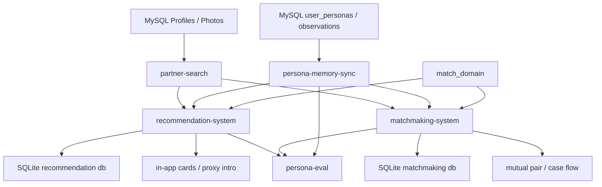
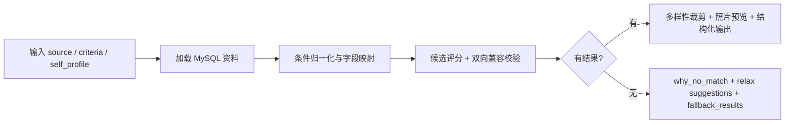

# 系统文档

## 1. 文档说明

本文基于当前代码仓库的实际实现生成，重点扫描了可执行脚本、核心 Python 包、测试代码和运行配置，未参考仓库中的历史 `*.md` 文档。

当前仓库没有标准的 `src/` 目录，核心代码实际分布在以下三个层次：

| 层次 | 目录 | 作用 |
| --- | --- | --- |
| 核心领域层 | `match_domain/` | 定义推荐与撮合共享的领域对象、状态枚举、事件载体 |
| 能力层 | `local-skills/partner-search/`、`local-skills/persona-memory-sync/`、`local-skills/persona-eval/` | 提供筛人引擎、画像记忆同步、评测审计能力 |
| 外部系统层 | `external-systems/partner-recommendation-system/`、`external-systems/partner-matchmaking-system/` | 将底层能力编排成“持续推荐”和“双向撮合”业务流程 |

扫描时同步检查了测试现状：

- 已执行测试：`pytest -q tests external-systems/partner-recommendation-system/tests external-systems/partner-matchmaking-system/tests local-skills/partner-search/tests local-skills/persona-memory-sync/tests local-skills/persona-eval/tests`
- 结果：`216 passed`

这说明该仓库虽然还不是完整的平台化产品，但核心业务引擎和规则链路已经具备较强的可验证性。

## 2. 项目定位

### 2.1 一句话定义

这是一个面向严肃婚恋/相亲场景的“关系运营系统”原型：它把资料检索、偏好画像、持续推荐、主动触达、代问撮合、双向撮合和反馈学习串成一条闭环。

### 2.2 基于代码推断的系统愿景

结合当前实现，可以推断出本项目的长期愿景不是一个单点“筛人脚本”，而是一个围绕关系建立全过程的智能基础设施：

1. 让“找人”从一次性搜索，升级为可持续运营的推荐流。
2. 让“偏好”从静态条件表，升级为可持续更新的长期 persona memory。
3. 让“撮合”从人工口头跟进，升级为可追踪、可回溯、可风控的状态机流程。
4. 让“公开资料”与“内部真实偏好”分层存储，兼顾推荐效果与隐私安全。
5. 让产品迭代建立在可回归、可审计、可复盘的评测闭环之上。

### 2.3 推断出的目标用户

代码体现出的目标用户不是单一角色，而是三类：

| 角色 | 诉求 | 对应系统能力 |
| --- | --- | --- |
| 严肃婚恋用户 | 找到更合适的人、减少无效沟通、保护隐私 | 搜索、持续推荐、主动推荐审核、代问、双向撮合 |
| 平台/红娘/运营人员 | 批量管理推荐与撮合流程，减少人工记忆负担 | saved search、推荐卡片、代理开口 case、撮合 case 状态机 |
| 算法/产品/评测人员 | 评估画像准确性、隐私暴露、匹配质量 | persona-eval、memory audit、regression、audit summary |

### 2.4 系统试图解决的核心痛点

1. 用户真实偏好远比“年龄/城市/学历”复杂，静态条件无法表达现实婚恋语义。
2. 一次搜索无结果时，传统产品通常流程结束，没有后续持续发现机制。
3. 用户偏好会随着沟通反馈不断变化，资料库和用户真实要求之间会持续漂移。
4. 推荐结果不只是“分高就推”，还要判断是否适合主动打招呼、是否需要人工复核、是否适合代问。
5. 撮合流程中存在冷却期、二次联系、超时、重复触达、状态回退等复杂运营逻辑。
6. 内部画像越丰富，越容易发生隐私泄露，因此公开展示与内部记忆必须明确隔离。

## 3. 代码结构总览

| 目录/文件 | 职责 |
| --- | --- |
| `skill_runtime.py` | 将本地 skill 包动态加入 `sys.path`，给外部系统层调用 |
| `match_domain/` | 统一定义 `ProfileRef`、`MatchEvent`、关系状态、pair 状态、case 状态 |
| `local-skills/partner-search/` | 资料检索、条件归一化、候选评分、双向偏好校验、文本/JSON 输出 |
| `local-skills/persona-memory-sync/` | persona patch 归一化、显式/推断合并、画像回写 profile、公开资料生成 |
| `local-skills/persona-eval/` | 回归执行、审计快照、评审反馈标准化、汇总报告 |
| `external-systems/partner-recommendation-system/` | saved search、持续刷新、推荐卡片、用户动作、代理开口流程 |
| `external-systems/partner-matchmaking-system/` | 撮合池、双向 edge、pair 建模、双阶段联系、反馈驱动重算 |
| `generate_virtual_profiles.py` | 生成大规模虚拟资料与照片数据 |
| `start_partner_mysql.sh` / `stop_partner_mysql.sh` | 启停本地 MySQL 运行时，默认端口 `3307` |
| `tests/` 及各子模块 `tests/` | 核心规则与流程的回归测试 |

## 4. 运行形态与依赖方式

### 4.1 技术栈

- 语言：Python
- 运行方式：可导入包 + 命令行脚本
- 数据源：本地 MySQL
- 业务状态存储：SQLite
- 设计风格：规则引擎 + 轻量服务编排 + 测试驱动

### 4.2 当前运行特点

1. 仓库中没有 `pyproject.toml`、`requirements.txt`、`Dockerfile` 或统一部署描述。
2. 当前更像“能力引擎仓库”而不是已经封装成 HTTP 服务的生产平台。
3. 推荐系统和撮合系统都使用独立 SQLite 数据库保存业务状态。
4. 用户资料、画像和公开资料主要依赖 MySQL。
5. 大量业务能力通过 CLI 脚本暴露，适合本地运行、批处理任务和离线验证。

### 4.3 配置与环境变量

代码中显式使用了以下环境变量和运行约定：

| 配置 | 作用 |
| --- | --- |
| `PARTNER_SEARCH_MYSQL_SOURCE` | `partner-search` 默认 MySQL 数据源 |
| `PARTNER_SEARCH_MYSQL_PHOTOS_TABLE` | 默认照片表名 |
| `PERSONA_MEMORY_MYSQL_SOURCE` | `persona-memory-sync` 默认 MySQL 数据源 |
| `.partner-search-mysql/` | 本地 MySQL runtime/data 目录 |
| `/usr/local/mysql/bin/mysqld` | MySQL 启动脚本依赖的本机安装路径 |

### 4.4 数据准备与补池能力

仓库中存在完整的数据准备链路：

- `generate_virtual_profiles.py`：生成 10000 条虚拟资料与照片数据。
- `backfill_profile_enrichment.py`：给 MySQL profile 表补充结构化画像字段。
- `seed_gap_profiles.py`：向资料池补充“高质量补池”样本，解决供给缺口。
- `run_persona_regression.py`：重放历史 persona 检索命令，做回归对比。

这表明项目并不只关注线上流程，也在显式建设“资料供给”和“离线回归”能力。

## 5. 系统总体架构

### 5.1 分层架构图

### 5.2 架构结论

当前系统本质上由五个边界清晰的子域组成：

1. `partner-search`：候选资料发现与评分引擎。
2. `persona-memory-sync`：长期偏好记忆与 profile/public profile 同步层。
3. `recommendation-system`：单边持续推荐与代问运营系统。
4. `matchmaking-system`：双边互选撮合系统。
5. `persona-eval`：离线评测与质量审计系统。

`match_domain` 则是上述子域之间的统一语言层，用于沉淀共享状态、关系 key 和 canonical event。

## 6. 核心模块详解

### 6.1 `match_domain`: 统一领域词汇层

该模块定义了系统统一的领域对象：

- `ProfileRef`：通过 `source + profile_id/user_key` 表示任一资料实体。
- `relation_key`：有方向的单边关系键，适用于“我 -> 候选人”。
- `pair_key`：无方向的双边关系键，适用于“用户 A <-> 用户 B”。
- `MatchEvent`：统一事件载体，包含事件类型、聚合类型、相关 actor、关联 payload、幂等键等字段。

统一状态枚举包括：

- `RelationStatus`：`new / recommended / saved / skipped / cooling / direct_greeted / proxy_intro_requested / proxy_intro_active / closed`
- `PairStatus`：`eligible / below_threshold / blocked / cooling / case_opened / mutual_accept / needs_revalidation / stale`
- `CaseType`：`proxy_intro / matchmaking`
- `CaseStatus`：`pending_contact / awaiting_reply / accepted / declined / timed_out / closed`

这说明项目已经开始为“推荐系统”和“撮合系统”做统一抽象，为后续关系总账、事件总线或统一 CRM 奠定基础。

### 6.2 `partner-search`: 候选搜索与匹配评分引擎

这是整个项目的底层能力中心，主要职责包括：

1. 从 MySQL 资料表中加载候选记录。
2. 归一化字段别名，兼容中英文、历史字段和自然语言风格输入。
3. 根据筛选条件和自我画像，对候选人做规则化打分。
4. 同时评估“我喜欢 TA”与“TA 也可能接受我”的双向兼容性。
5. 在无结果时给出诊断、放宽建议和 fallback 候选。
6. 输出结构化 JSON 和可读文本两种结果。

其核心实现特点：

- 支持大量条件维度：年龄、城市、定居地、学历、婚况、孩子、抽烟喝酒、异地、结婚节奏、认证等级、照片数量、关键字标签等。
- 支持 reciprocal matching：如果传入 `self_profile` 或 `self_id`，会把“对方是否也接受你”纳入评分。
- 输出解释字段非常完整：`matched_on`、`reciprocal_on`、`risk_flags`、`missing_fields`、`self_profile_gaps`、`follow_up_questions`、`match_evidence`。
- 有显式的风险建模：分数不是纯排序分，而是 `fit_score + confidence_score - risk_score`。
- 做了结果多样性控制：通过职业簇、生活节奏、沟通风格等信号做 diversity penalty，避免 top N 过于同质化。
- 支持照片预览：可以从照片表拼接 `photo_preview`。
- 支持无结果解释：返回 `pool_summary`、`diagnostics`、`fallback_results`，并生成 `why_no_match` 与 `relax_suggestions`。
- 做了敏感信息处理：展示时会对手机号、邮箱、身份证、微信号、地址、单位、子女年龄等信息做脱敏或摘要化。

从产品角度看，`partner-search` 已经不是“数据库 where 查询”，而是一套可解释的婚恋匹配规则引擎。

### 6.3 `persona-memory-sync`: 长期画像与公开资料同步层

该模块负责把用户长期偏好、现实边界和互动反馈沉淀成结构化 persona，并决定什么可以同步到资料库、什么只能留在内部。

它包含三条主能力：

1. `upsert_persona_memory`
   将 patch 写入 `user_personas`，并记录 observation。
2. `sync_persona_profile`
   把 persona 同步回 profile 表。
3. `render_public_profile`
   生成对外展示安全的公开资料文本。

其关键机制如下：

#### 6.3.1 Patch 归一化

- 支持 list/int/bool/text 归一化。
- 会从摘要文本中推断子女人数、是否同住、婚况规范化、位置偏好语义等。
- 会把模糊“硬要求”自动降级为 `preferred_traits`，避免过度硬筛。
- 会对“婚史接受强度”“孩子接受语义”“异地接受语义”做现实语义规范化。

#### 6.3.2 Persona 合并策略

系统区分三种来源强度：

| 来源类型 | 含义 | 写入策略 |
| --- | --- | --- |
| `explicit` | 用户明确表达 | 可以覆盖明确字段 |
| `strong_inference` | 强推断 | 只能更新允许推断的字段，不能覆盖硬事实 |
| `weak_inference` | 弱推断 | 基本只记录 observation，不改关键 persona |

这是一套很典型的“事实层 > 强推断层 > 弱推断层”的画像治理策略。

#### 6.3.3 内部画像与公开画像分层

模块显式区分三套视图：

- `persona`：内部长期记忆，保留更完整的现实条件和约束。
- `profile internal fields`：用于匹配与运营的内部 profile 字段。
- `public profile fields`：对外公开的 `public_job / public_education / public_personality / public_values / public_notes`。

公开层做了大量安全收敛：

- 职业会被映射为“高校教师 / 医疗相关工作 / 金融相关工作”等粗粒度分类。
- 学历会被压缩为公开可接受带宽。
- 原始负面标签不会直接公开，而是转成“希望沟通更稳定直接”“关系边界希望更清晰”等安全表达。
- 位置、婚育、孩子现实等会被改写成更克制的展示语句。

这说明系统在设计上非常重视“匹配效果”和“隐私风险”之间的平衡。

### 6.4 `partner-recommendation-system`: 持续推荐与代理开口系统

这是建立在 `partner-search` 之上的单边推荐运营层，围绕 saved search 和代理开口构建。

核心能力包括：

#### 6.4.1 Saved Search 订阅

- 通过 `saved_search_subscriptions` 保存用户的持续筛选请求。
- 订阅不仅存基础条件，还保存：
  - `initial_request_json`
  - `subscription_overrides_json`
  - `self_profile_json`
  - `self_id`
  - `top_k`
  - `min_notify_score`
  - `daily_notification_cap`
  - `quiet_hours`
  - `skip_cooldown_days`
  - `recommendation_mode`
  - `direct_greet_profile_json`

这表明推荐系统不只是“定时搜一下”，而是一套可运营、可调策略的用户订阅模型。

#### 6.4.2 画像驱动的条件编译

`criteria_compiler.py` 会把三层条件合并成最终搜索请求：

1. 初始 saved search 条件。
2. 来自 persona/profile 的动态偏好补丁。
3. 订阅级 override。

这使得同一条订阅会随着用户画像更新自动演进。

#### 6.4.3 候选推荐与状态管理

每次 refresh 会：

1. 解析最新 persona profile。
2. 调用 `partner-search` 获取候选。
3. 对 top K 候选执行 `upsert_recommendation`。
4. 记录本次 `saved_search_runs` 快照。
5. 更新订阅最后刷新时间和结果数。

候选记录会落到 `profile_recommendations`，同时记录：

- 候选分数与快照
- `matched_on`、`risk_flags`
- `final_review_status / score / payload`
- `user_review_status / payload`
- `relation_key`
- owner/target profile refs
- `active_match_case_id`

#### 6.4.4 主动推荐审核闸门

`direct_greet_gate.py` 是该系统的重要产品特性。

它把候选分成：

- `direct_greet_ready`
- `save_only`
- `review_deferred`
- `rejected`
- `match_ready`

核心判断维度包括：

- 综合分是否足够高
- 是否有风险标签
- 是否还有待确认问题
- 是否缺信息
- 是否满足 direct greet profile 中定义的“额外要求”
- 是否进入本次 refresh 的 review pool

这体现出产品策略非常明确：

“不是所有高分候选都适合主动推给用户，更不是所有人都适合直接促成打招呼。”

#### 6.4.5 预投递用户审核

在 `direct_greet_only` 模式下，规则闸门通过仍不会立即发卡，而是进入 `review_pending`，等待真实用户做预审核：

- `direct_greet`
- `save`
- `skip`

这是一个非常接近真实婚恋业务的设计：系统先筛，用户再拍板。

#### 6.4.6 in-app 推荐卡片

`deliver_in_app_recommendations` 会把 `pending_delivery` 的候选转成卡片。

卡片控制逻辑包括：

- quiet hours
- daily notification cap
- 按用户维度计数
- 卡片内文拼装
- 默认 CTA：
  - `save`
  - `skip`
  - `direct_greet`
  - `request_proxy_intro`

这说明当前推荐系统已经有明确的“投递层”抽象，而不是停留在候选列表。

#### 6.4.7 代理开口 / 代问流程

`proxy_intro.py` 在推荐之后再加一层 case 管理：

1. 从推荐候选创建 `match_case`。
2. 生成脱敏 `safe_summary`。
3. 生成对候选人的 `outreach_payload`。
4. 记录触达尝试。
5. 等待候选人 `accepted / declined`。
6. 支持超时关闭、冷却期、handoff 完成、请求人取消等关闭原因。

其本质是一个轻量 CRM case flow，用于管理“替我去问”这类高摩擦动作。

### 6.5 `partner-matchmaking-system`: 双向互选撮合系统

这是比 recommendation 更进一步的系统：它不再从“单边我喜欢 TA”出发，而是运营整个可撮合池。

#### 6.5.1 撮合池成员

`matchmaking_pool_members` 记录进入撮合池的用户，包括：

- 用户唯一标识 `user_key`
- 来源与 profile id
- 自我资料
- 搜索条件
- 状态
- 是否仍在找
- 允许渠道
- 最低 pair score
- 每日 case 上限
- refresh 周期
- 是否需要重刷

这说明该模块的用户对象不是“临时查询发起者”，而是“可持续运营的撮合成员”。

#### 6.5.2 单向边与双向 pair

系统先为每个成员调用 `partner-search`，形成单向 `matchmaking_edges`：

- A 看 B 的匹配结果是一条 edge
- B 看 A 的匹配结果是另一条 edge

只有双向 edge 同时存在时，才会生成 `matchmaking_pairs`。

pair 的分数取双向分数中的较低值，体现了“短板约束”的保守撮合策略。

pair 还会检查：

- 两人是否都活跃
- 是否都还在找
- 是否有风险标签
- 是否有 follow up questions
- 是否缺信息
- 是否已有开放 case
- 是否处于冷却期

最终 pair 状态会落到：

- `eligible`
- `below_threshold`
- `blocked`
- `cooling`
- `case_opened`
- `mutual_accept`
- `needs_revalidation`
- `stale`

#### 6.5.3 双阶段联系 case

撮合 case 不是一次性发给双方，而是分两段推进：

1. `pending_first_contact -> awaiting_first_reply`
2. `pending_second_contact -> awaiting_second_reply`
3. 如果双方都接受，则进入 `mutual_accept`

这说明系统设计中有明确的“先问一方，再问另一方”的运营节奏。

#### 6.5.4 冷却与超时

撮合 case 会在以下情况触发 pair cooling：

- 第一联系人拒绝
- 第二联系人拒绝
- 任一阶段超时
- case 过期

这避免了重复骚扰与过度打扰，是很典型的撮合平台运营机制。

#### 6.5.5 反馈驱动重算

`record_feedback` 是 Phase 5 的关键能力。

用户一旦给出反馈：

1. 反馈先落到 `matchmaking_feedback_events`。
2. 可选地转成 persona patch，同步到 `persona-memory-sync`。
3. 相关成员和相关对象被标记 `needs_refresh = 1`。
4. 相关 edge 被设为 `stale`。
5. 相关 pair 被标记 `needs_revalidation`。
6. 相关开放 case 会被强制关闭。

这构成了一个真正的闭环：

用户反馈 -> 画像更新 -> 匹配重算 -> 案件终止/重建

### 6.6 `persona-eval`: 评测与审计体系

该模块说明项目已经开始把“匹配是否正确”当成独立产品能力来建设。

它的能力包括：

1. 重跑 persona benchmark 命令集。
2. 统计命中率、候选数、失败率。
3. 从 MySQL 抽取 memory snapshot。
4. 生成给评审用的 review packets。
5. 标准化多 agent 评审反馈。
6. 汇总 memory drift、公开风险、匹配满意度、系统性问题。

当前评测关注四个维度：

- persona memory 准确性
- public exposure 风险
- partner-search 匹配满意度
- 多 agent 审阅质量

这使项目拥有较强的“产品规则可审计能力”，是后续做 A/B、模型升级和规则重构的基础。

## 7. 核心业务流程

### 7.1 资料搜索流程

### 7.2 空结果转持续推荐

1. 用户发起即时搜索。
2. 若 `result_count == 0`，系统触发 opt-in prompt。
3. 用户同意后，创建 `saved_search_subscription`。
4. 后续由 `refresh_due_subscriptions` 定时刷新。

### 7.3 持续推荐刷新

1. 取最新订阅。
2. 若有 `self_id`，优先从 profile 源中重新加载用户画像。
3. 编译有效条件。
4. 调用 `partner-search`。
5. 生成/更新候选推荐记录。
6. 记录本次 `saved_search_runs` 快照。

### 7.4 主动推荐决策

1. 候选先过 `min_notify_score`。
2. 再过 `direct_greet_gate`。
3. 若是 `direct_greet_only` 模式，系统要求用户先审。
4. 用户审完后再进入 `pending_delivery`。
5. 定时任务按 quiet hours 和 daily cap 生成卡片。

### 7.5 用户动作处理

推荐卡片触发后的动作包括：

- `skip`：进入冷却。
- `save`：转收藏态。
- `direct_greet`：标记已主动打招呼。
- `request_proxy_intro`：升级为代理开口 case。

所有动作都会通过 `recommendation_actions` 留痕，并嵌入 canonical event。

### 7.6 代理开口流程

1. 从推荐记录创建 case。
2. 生成安全摘要和外呼 payload。
3. 系统派发 outreach。
4. 进入 `awaiting_reply`。
5. 候选人接受、拒绝或超时。
6. 推荐状态随 case 同步更新。

### 7.7 双向撮合流程

1. 把用户加入撮合池。
2. 系统定期刷新每个成员的单向搜索结果。
3. 生成双向 mutual pairs。
4. 为 `eligible` pair 开 case。
5. 先联系第一方。
6. 第一方接受后联系第二方。
7. 双方都接受则 mutual accept。
8. 任何一方拒绝或超时，则 pair 冷却。

### 7.8 反馈学习流程

1. 用户在撮合场景给出反馈。
2. 反馈转成结构化 `persona_patch`。
3. 写入 persona memory 并同步 profile。
4. 相关 pair/case 触发 revalidation。
5. 相关用户在下一轮 refresh 中重新计算匹配。

### 7.9 公开资料生成流程

1. 从 persona 中提取公开安全字段。
2. 对职业、学历、负面边界等做脱敏改写。
3. 生成 `public_personality / public_values / public_notes`。
4. 可选写回 profile 表。

## 8. 数据模型与存储结构

### 8.1 MySQL 侧

| 表/视图 | 作用 |
| --- | --- |
| `profiles` | 原始资料和同步后的内部/公开字段主表 |
| `profile_photos` 或指定照片表 | 候选照片预览 |
| `user_personas` | 长期 persona 记忆主表 |
| `user_persona_observations` | patch 级别的证据与写入记录 |
| `public_profile_view` | 面向审计或公开展示的安全视图 |

### 8.2 推荐系统 SQLite

| 表 | 作用 |
| --- | --- |
| `saved_search_subscriptions` | 持续搜索订阅 |
| `saved_search_runs` | 每次刷新快照 |
| `profile_recommendations` | 推荐候选历史与状态 |
| `recommendation_actions` | 用户动作与系统动作事件日志 |
| `in_app_recommendation_cards` | 实际投递卡片 |
| `match_cases` | 代理开口 case |
| `match_case_events` | case 状态流转事件 |
| `match_case_outreach_attempts` | case 外呼尝试记录 |

### 8.3 撮合系统 SQLite

| 表 | 作用 |
| --- | --- |
| `matchmaking_pool_members` | 撮合池成员 |
| `matchmaking_edges` | 单向匹配边 |
| `matchmaking_pairs` | 双向 pair |
| `match_cases` | 双向撮合 case |
| `match_case_events` | 撮合 case 事件 |
| `matchmaking_feedback_events` | 用户反馈与画像同步结果 |

### 8.4 事件模型

虽然系统目前没有独立消息队列，但两大外部系统都已采用统一事件负载思路：

- 每条 recommendation action / case event / feedback event 都可嵌入 `canonical_event`
- 事件具有：
  - `event_type`
  - `aggregate_type`
  - `aggregate_id`
  - `actor_type`
  - `actor_id`
  - `source_service`
  - `correlation_id`
  - `idempotency_key`
  - `occurred_at`

这说明系统已经在向“统一关系总账”方向演进，只是目前事件仍内嵌在业务库 JSON 字段中，而不是独立事件流。

## 9. 已实现功能清单

### 9.1 搜索与解释层

- 多条件资料筛选
- 双向偏好校验
- 风险标签与待确认问题生成
- 无结果诊断
- fallback 候选生成
- 结果多样性控制
- 照片预览拼装
- 文本/JSON 双格式输出
- 敏感信息脱敏

### 9.2 长期画像层

- persona patch 写入
- 显式/强推断/弱推断合并
- 画像 observation 留痕
- profile 字段同步
- matcher payload 生成
- 公开 profile 摘要生成
- 公开层隐私降敏

### 9.3 持续推荐层

- 无结果转 opt-in
- saved search 订阅创建
- 订阅 override 管理
- 动态画像驱动的条件重编译
- 定时刷新与推荐 upsert
- refresh run 快照留存
- direct greet 审核闸门
- 用户预审
- in-app 卡片投递
- quiet hours / daily cap 控制
- 用户动作留痕

### 9.4 代理开口层

- 代理开口 case 创建
- 安全摘要生成
- 外呼 payload 生成
- 派发尝试记录
- 接受 / 拒绝 / 超时处理
- 冷却期控制
- case 关闭与状态同步

### 9.5 双向撮合层

- 撮合池成员管理
- 单向 edge 更新
- mutual pair 计算
- pair 阻断与冷却
- 双阶段联系 case
- case 过期关闭
- mutual accept 达成
- 反馈驱动重验证

### 9.6 质量评估层

- persona benchmark 重跑
- 结果指标汇总
- memory snapshots 抽取
- review packets 生成
- 原始 agent 反馈标准化
- audit summary 汇总
- 隐私边界审计

## 10. 关键运行入口

### 10.1 推荐系统脚本

| 脚本 | 作用 |
| --- | --- |
| `create_saved_search_subscription.py` | 创建持续推荐订阅 |
| `refresh_saved_searches.py` | 刷新到期订阅 |
| `deliver_in_app_recommendations.py` | 投递待发推荐卡片 |
| `record_user_review.py` | 记录用户预审结果 |
| `record_recommendation_action.py` | 记录用户实际动作 |
| `request_proxy_intro.py` | 发起代理开口 |
| `dispatch_match_case_outreach.py` | 派发代理开口外呼 |
| `record_match_case_reply.py` | 记录候选答复 |
| `close_timed_out_match_cases.py` | 关闭超时 case |
| `close_match_case.py` | 手动关闭 case |

### 10.2 `partner-search` 脚本

| 脚本 | 作用 |
| --- | --- |
| `search_candidates.py` | 检索主入口 |
| `backfill_profile_enrichment.py` | 给 profile 补充结构化字段 |
| `seed_gap_profiles.py` | 向资料池补样本 |
| `run_persona_regression.py` | 重放历史 persona 检索命令 |

### 10.3 `persona-memory-sync` 脚本

| 脚本 | 作用 |
| --- | --- |
| `ensure_persona_tables.py` | 建表/补列 |
| `upsert_persona_memory.py` | 写入 persona patch |
| `sync_persona_to_profile.py` | persona 回写 profile |
| `render_public_profile.py` | 生成公开资料 |
| `run_persona_memory_audit.py` | 做记忆与公开层审计 |

### 10.4 `persona-eval` 脚本

| 脚本 | 作用 |
| --- | --- |
| `run_persona_eval.py` | 批量重跑 persona 检索 |
| `run_persona_eval_bundle.py` | 一次产出结果、packet、metrics、audit summary |
| `normalize_agent_feedback.py` | 标准化 reviewer 输出 |
| `build_memory_snapshots.py` | 生成 memory snapshot |
| `build_review_packets.py` | 生成评审材料 |
| `build_audit_summary.py` | 生成审计汇总 |
| `summarize_agent_feedback.py` | 汇总评审指标 |

### 10.5 当前入口形态补充判断

从入口完整度看，三个层次并不对称：

- `partner-search`、`persona-memory-sync`、`partner-recommendation-system` 都已形成较完整的 CLI 运营入口。
- `partner-matchmaking-system` 目前主要以 importable service API 方式暴露，缺少同等完整的运维脚本层。
- 这意味着如果未来 3 个月只做一项平台化改造，优先级应放在“给撮合系统补操作入口或标准 API”上。

### 10.6 SQLite -> MySQL 迁移工具

仓库已新增 `migrate_sqlite_to_mysql.py`，用于把推荐系统和撮合系统的 SQLite 状态表迁移到 MySQL：

- 支持 `recommendation` 与 `matchmaking` 两套外部系统。
- 支持自动建 MySQL 表、索引和外键。
- 支持按主键 `upsert`，可重复执行。
- 支持 `--table-prefix`，方便把两套系统落到同一个 MySQL 库时避免表名冲突。
- 支持 `--schema-only`、`--data-only`、`--truncate-first` 等迁移模式。

这说明当前仓库已经具备“SQLite 运行态 + MySQL 目标库”的平滑迁移路径，但业务运行时尚未整体切换到 MySQL 存储。

## 11. 当前成熟度评估

### 11.1 总体判断

当前代码库已经具备“业务规则引擎成熟、平台化能力不足”的典型特征。

更准确地说，它已经是一个很强的婚恋业务中台原型，但还不是完整的在线产品架构。

### 11.2 分维度评估

| 维度 | 评估 | 说明 |
| --- | --- | --- |
| 匹配规则深度 | 高 | 条件维度多，解释性强，覆盖双向偏好与现实约束 |
| 推荐运营流程 | 高 | saved search、投递、预审、代问已形成闭环 |
| 撮合状态机 | 中高 | pair/case/cooling/revalidation 逻辑较完整 |
| 画像记忆能力 | 高 | 支持来源强度、隐私分层、回写 profile |
| 评测与审计 | 高 | 有完整离线回归和审计汇总工具链 |
| 服务化程度 | 低 | 缺统一 API 层、任务调度器、部署方案 |
| 配置治理 | 低 | 缺统一依赖管理、环境配置规范和迁移机制 |
| 可观测性 | 低 | 缺日志规范、监控指标、告警和运营后台 |
| 数据治理 | 中 | 已有隐私意识，但还缺更正式的权限与审计边界 |

### 11.3 当前阶段定位

建议将当前项目定位为：

> “可验证、可演示、可离线运营的婚恋推荐与撮合引擎原型”

而不是：

> “可直接大规模生产托管的完整平台”

## 12. 未来 3-6 个月产品迭代建议

### 12.1 第 1 阶段：把原型变成可运营产品骨架

建议优先级最高的产品迭代：

1. 建立“持续推荐中心”界面或 API，让 saved search、待审核推荐、已发卡片、已收藏候选进入统一收件箱。
2. 建立“代理开口工作台”，支持查看 case、外呼记录、候选回复、超时与冷却状态。
3. 建立“撮合池管理台”，支持成员状态、eligible pairs、open cases、mutual accept 转化漏斗。
4. 把 `why_no_match`、`relax_suggestions`、`fallback_results` 直接产品化，提升空结果场景体验。

### 12.2 第 2 阶段：把反馈学习真正接进主流程

建议的产品方向：

1. 在推荐卡片和撮合流程中显式采集“为什么喜欢/为什么拒绝”。
2. 把反馈自动映射成 persona patch，并让用户可查看与确认。
3. 增加“偏好变化时间线”，让运营和用户都能理解系统为什么改写条件。
4. 对直接打招呼、代理开口、双向撮合分别建立成功率和满意度指标。

### 12.3 第 3 阶段：建立安全可解释的智能运营系统

建议的产品方向：

1. 提供“为什么推荐这个人”的可解释面板。
2. 提供“为什么系统没有继续推进”的阻断原因面板。
3. 增加隐私边界标注，让用户知道哪些信息只在内部记忆层使用。
4. 增加人工审核开关，让高风险候选必须经过运营或用户确认。

## 13. 未来 3-6 个月技术优化建议

### 13.1 平台化改造

1. 增加统一依赖管理，补齐 `pyproject.toml` 或等价配置。
2. 把 recommendation 和 matchmaking 暴露为标准 HTTP API 或 RPC 服务。
3. 引入统一任务调度层，替代当前纯 CLI 定时执行模式。
4. 基于现有 `migrate_sqlite_to_mysql.py` 继续演进正式迁移机制，补齐回滚、校验和 PostgreSQL 等目标库支持。

### 13.2 架构统一

1. 将 `match_domain` 从“共享枚举层”升级为真正的关系总账抽象。
2. 把 recommendation case 与 matchmaking case 的事件模型统一到同一事件规范。
3. 引入 outbox/event bus，避免 canonical event 只嵌在 JSON payload 中。
4. 统一 profile/persona/recommendation/pair 的标识体系与 trace id 体系。

### 13.3 数据与规则治理

1. 将复杂规则拆分为更清晰的 rule set 和版本号。
2. 记录每次推荐和撮合时使用的规则版本、画像版本、搜索快照版本。
3. 对 `source_channel`、风险标签、公开字段、安全边界建立更严格的数据字典。
4. 增加 schema contract test，防止 MySQL profile 扩展字段演进时破坏兼容性。

### 13.4 可观测性与运营支持

1. 增加结构化日志与关键指标输出。
2. 记录推荐漏斗：refresh -> review_pending -> pending_delivery -> delivered -> action -> proxy intro。
3. 记录撮合漏斗：member -> edge -> pair -> case -> first accept -> second accept -> mutual accept。
4. 增加告警：数据库不可达、refresh 失败、case 超时积压、补池不足、候选扫描量异常低。

### 13.5 质量与隐私

1. 将 `persona-eval` 纳入持续集成，形成版本回归门禁。
2. 扩大 privacy audit 样本，特别覆盖收入、婚育、单位、家庭负担等高敏感场景。
3. 区分内部字段、公开字段、仅模型可见字段，建立更正式的访问控制策略。
4. 在公开资料生成链路中保留更明确的 redaction reason，便于复盘。

## 14. 关键风险

### 14.1 架构风险

- 当前没有统一 API 网关，系统集成主要依赖 Python import 和 CLI。
- recommendation 与 matchmaking 各自维护 SQLite 状态，后续扩展容易出现状态孤岛。
- 规则非常丰富，但当前仍主要以内嵌代码形式存在，后续维护成本会上升。

### 14.2 产品风险

- 如果没有前台工作台，当前强能力难以被运营和用户稳定使用。
- 如果没有更明确的审核策略，`direct_greet` 与 `proxy_intro` 可能把高风险候选推得过早。
- 若资料供给不足，推荐与撮合效果会被候选池规模而不是算法本身限制。

### 14.3 数据与合规风险

- persona 与公开资料已做分层，但还缺明确的权限、审批和审计制度。
- 反馈学习一旦规模化，需防止错误推断污染长期画像。
- 当前大量依赖 MySQL 中动态扩展字段，生产化时需要严格 schema 治理。

## 15. 结论

从代码本身判断，本项目已经不是一个单点的“相亲资料筛人脚本”，而是一个围绕婚恋场景构建的多阶段关系运营系统原型。

它已经覆盖了：

- 资料搜索与解释
- 长期偏好记忆
- 空结果转持续推荐
- 主动推荐审核
- in-app 推荐投递
- 代理开口 case 管理
- 双向 mutual pair 撮合
- 反馈驱动画像更新
- 多 agent 评测与隐私审计

下一阶段最重要的不是继续堆单点规则，而是把这些已经很强的业务引擎，收敛为统一 API、统一状态总账、统一运营后台和统一评测门禁。只要完成这一步，项目就会从“强原型”进入“可持续扩展的平台”阶段。
