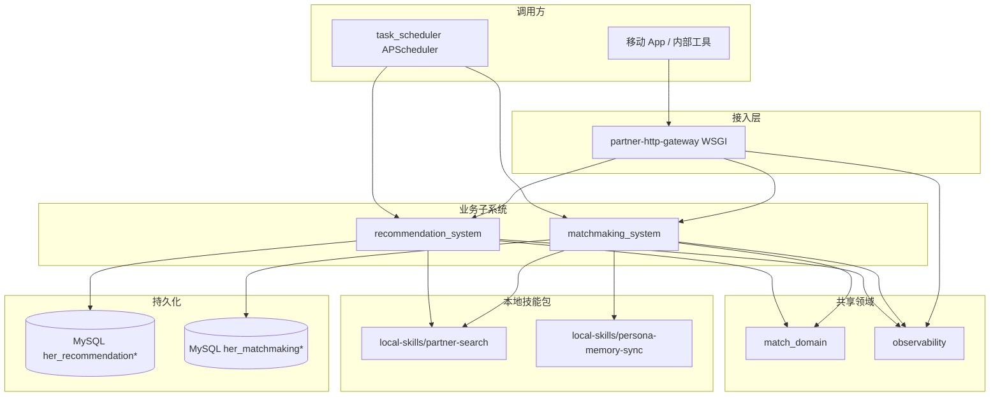

# Her — 系统文档（由代码库扫描生成）

> **文档性质**：本文档依据当前仓库中的 `pyproject.toml`、Python 源码与 MySQL 元数据整理，**不依赖**仓库内其他 Markdown 说明文件的历史描述。  
> **仓库布局说明**：本项目**没有**统一的 `src/` 目录；可安装包与核心逻辑分布在仓库根目录、`match_domain/`、`task_scheduler/`、`observability/`、`external-systems/*` 以及通过 `skill_runtime` 挂载的 `local-skills/*`。

---

## 1. 项目概览

### 1.1 包与元数据（`pyproject.toml`）

- **包名**：`her`（版本 `0.1.0`）
- **定位（官方描述）**：Relationship-operations prototype：search、persona memory、recommendation、matchmaking。
- **运行时**：Python ≥ 3.10
- **主要依赖**：`apscheduler`、`openai`、`pydantic`、`pymysql`
- ** setuptools 发现的包**：`match_domain*`、`task_scheduler*`、`observability*`、`recommendation_system*`（partner-recommendation-system）、`matchmaking_system*`（partner-matchmaking-system）、`chat_system*`（partner-chat-system）、`gateway*`（partner-http-gateway）
- **根目录 py-modules**：含 `her_activate_repo`（由 `_path_bootstrap` / 网关经 `importlib` 加载，再激活 `her_monorepo_bootstrap`）、`her_monorepo_bootstrap`、`outer_mysql_compat`（含外层库共用的 `connect_mysql_repo_db` / `json_dumps` 等）、`outer_system_mysql_schema`、`skill_runtime`、`generate_virtual_profiles` 等。布局异常时可设 **`HER_REPO_ROOT`**。

### 1.2 愿景（Vision，由实现反推）

在**可审计、可回放**的事件模型之上，把「资料检索 → 个性化推荐与卡片触达 → 用户动作与关系状态 → 代理牵线 / 双边撮合案例」串成一条**关系运营（relationship-operations）流水线**，并具备：

- **领域统一**：`match_domain` 用 `MatchEvent`、关系/案例账本归约、幂等与 trace，对齐推荐侧与撮合侧状态机。
- **数据落地**：推荐与撮合**仅支持 MySQL**（SQLite 已移除），Schema 由 `outer_system_mysql_schema` 声明式维护。
- **可集成**：HTTP 网关（REST + JSON-RPC）、定时任务调度器、结构化可观测性日志，便于对接真实 App / 运营后台。

### 1.3 要解决的核心痛点

| 痛点 | 代码中的应对方式 |
|------|------------------|
| 推荐与撮合状态分散、难对账 | `MatchEvent` + `reduce_relation_ledger` / `reduce_case_ledger` + `recommendation_actions` / `match_case_events` |
| 跨服务/异步集成缺可靠投递语义 | `outbox_events` + `append_outbox_pending`（与业务写入同事务） |
| 规则与输入不可追溯 | `match_domain.rulesets`：`RULE_PROVENANCE_SCHEMA`、规则集版本钉扎、`saved_search_runs.rule_provenance_json` |
| 多入口重复实现 | `PartnerGateway` 统一 REST 与 JSON-RPC，内聚调用 `recommendation_system` / `matchmaking_system` |
| 批处理与 API 行为不一致 | `task_scheduler` 与网关调用同一套 service 函数 |

### 1.4 补充：核心目标与目标用户（推断）

- **本项目的核心目标是**：在 MySQL 资料库之上，提供**可配置的 saved search 订阅**、**站内推荐卡片投递**、**代理牵线（proxy intro）**与**双边撮合（matchmaking）**的完整后端原型，并以事件账本与 outbox 支撑后续统一与扩展。
- **主要目标用户是**：需要对接「相亲/交友」类业务的**后端/架构团队**、**产品与运营**（通过网关与任务调度驱动流程），以及需要**可解释、可回放**推荐决策的研发与审计方。

---

## 2. 系统架构

### 2.1 逻辑分层

### 2.2 物理组件说明

| 组件 | 路径 / 入口 | 职责 |
|------|-------------|------|
| **共享领域** | `match_domain/` | `ProfileRef`、关系键/对键、`MatchEvent`、账本归约、outbox 写入、规则溯源、trace/idempotency 辅助 |
| **Schema & DB** | `outer_system_mysql_schema.py`、`outer_mysql_compat.py` | DSN 解析、建库建表、索引、兼容层 SQL 占位符（`?` → `%s`） |
| **推荐子系统** | `external-systems/partner-recommendation-system/recommendation_system/` | 订阅、刷新、候选行、审核门槛、卡片投递、用户动作、代理牵线案例 |
| **撮合子系统** | `external-systems/partner-matchmaking-system/matchmaking_system/` | 池成员、边、双向对、案例状态机、触达与回复、反馈与 persona 同步 |
| **聊天子系统** | `external-systems/partner-chat-system/chat_system/` | 按 `case_id` 的线程、`chat_messages`、侧信道占位 `assistant/query` 与 `adopt-draft`（见 `docs/chat-agent-architecture.md`） |
| **HTTP 网关** | `external-systems/partner-http-gateway/gateway/` | `/health`、REST `/v1/...`（含 `/v1/chat/...`）、`POST /jsonrpc`、API Key、限流、可选连接池 |
| **任务调度** | `task_scheduler/` | 推荐：outbox worker + 刷新/投递/代理派发/超时关闭；撮合：outbox worker + 池刷新/组对/开案/关 stale；聊天：outbox worker + maintenance |
| **可观测性** | `observability/` | `her.pipeline` JSON 行日志：漏斗、gauge、告警；健康度与队列深度 |
| **技能运行时路径** | `skill_runtime.py` | 将 `local-skills/partner-search`、`persona-memory-sync` 加入 `sys.path` |

### 2.3 数据域划分

- **推荐库**（`recommendation_tables()`）：`saved_search_subscriptions`、`profile_recommendations`、`recommendation_actions`、`in_app_recommendation_cards`、`saved_search_runs`、推荐域的 `match_cases` / `match_case_events` / `match_case_outreach_attempts`、`outbox_events`
- **撮合库**（`matchmaking_tables()`）：`matchmaking_pool_members`、`matchmaking_edges`、`matchmaking_pairs`、`match_cases`（双边模型）、`match_case_events`、`matchmaking_feedback_events`、`outbox_events`
- **聊天库**（`chat_tables()`）：`chat_threads`、`chat_messages`、`outbox_events`、`persona_sync_jobs`（独立 MySQL database，DSN `PARTNER_CHAT_DB`）

> 注意：**两套 schema 中均有名为 `match_cases` / `match_case_events` / `outbox_events` 的表，但列结构不同**，分别服务于「订阅-候选-代理牵线」与「池内双边撮合」，部署时**必须使用不同 MySQL database**（或明确隔离）。

---

## 3. 功能清单与交互逻辑

### 3.1 本地检索引擎（`local-skills/partner-search`）

- **对外 API**：`partner_search.api` 的 `search` / `search_profiles` 等，底层调用 `scripts.search_candidates`。
- **交互**：`recommendation_system` 与 `matchmaking_system` 在刷新/扫描时调用，输入为 **source、criteria、self_profile、MySQL 表名** 等，输出为打分与结构化候选。
- **与领域的关系**：推荐刷新时编译有效条件（`criteria_compiler`）、应用 **direct greet 门槛**（`direct_greet_gate`），并把规则版本写入 `rule_provenance`。

### 3.2 推荐子系统（`recommendation_system`）

**已实现能力（从 `service.py`、`proxy_intro.py` 与存储层推断）：**

1. **订阅生命周期**：创建/读取 `saved_search_subscriptions`，更新 `subscription_overrides`，按间隔刷新（`refresh_subscription` / `refresh_due_subscriptions`）。
2. **搜索运行记录**：每次刷新写入 `saved_search_runs`（persona、effective criteria、结果数、状态统计、rule provenance）。
3. **候选行**：`profile_recommendations` 维护分数、投递状态、审核状态、用户 review、`relation_key` 与 profile ref JSON；与订阅、唯一 `(subscription_id, candidate_id)` 约束关联。
4. **动作账本**：`recommendation_actions` 存储 `action_type` 与 `action_payload_json`；payload 可内嵌 `canonical_event`（`merge_payload_with_event`），供 `match_events_from_action_rows` 回放关系账本。
5. **站内卡片**：`deliver_in_app_recommendations` → `in_app_recommendation_cards`；支持列表、已读标记。
6. **用户审核与动作**：`record_user_review`、`record_recommendation_action`（含客户端幂等键）；驱动 `RelationStatus` 相关事件类型（跳过、保存、直接打招呼、请求代理牵线等，见 `reduce_relation_ledger`）。
7. **代理牵线（Proxy Intro）**：`proxy_intro.py` — 创建案例、安全摘要、触达 payload、deadline、cooling；案例事件写入 `match_case_events`（含 `canonical_event_json`）；与 `profile_recommendations.active_match_case_id` 等字段协同。
8. **Outbox**：关键写入路径调用 `append_outbox_pending`，与业务行同事务插入 `outbox_events`（`publish_status=pending`），便于下游异步消费（当前仓库以写入与同步 `SyncEventBus` 为主，完整 publisher 可由运维扩展）。

**与 `match_domain` 的衔接：**

- `build_canonical_event`、`recommendation_relation_key`、`reduce_relation_ledger` 等保证「动作流」与「关系聚合状态」一致。
- `CaseType.PROXY_INTRO` 与案例账本归约支持代理牵线案例状态机。

### 3.3 撮合子系统（`matchmaking_system`）

**已实现能力（从 `service.py` 与 schema 推断）：**

1. **池成员**：`matchmaking_pool_members` — `user_key` + `source` 唯一；资料 JSON、搜索条件、渠道、阈值、刷新标记；`create_pool_member` / `refresh_pool_member` / `refresh_active_pool`。
2. **有向边**：`matchmaking_edges` — owner→candidate 打分与风险；用于发现潜在双向兴趣。
3. **无向对**：`matchmaking_pairs` — `pair_key`、双向分数、`pair_status`（与 `PairStatus` 映射）；`build_mutual_pairs`。
4. **双边案例**：`match_cases` — `first_contact_member_id` / `second_contact_member_id`、多阶段 status（`pending_first_contact`、`awaiting_first_reply` 等）；`open_match_cases`、`dispatch_case_contact`、`record_case_reply`、`close_stale_cases`。
5. **案例事件**：`match_case_events` + `canonical_event_json` → `match_events_from_case_event_rows` → `reduce_case_ledger` 得 `canonical_case_status`（`inflate_case` 时对读侧暴露摘要）。
6. **反馈与 Persona**：`record_feedback` → `matchmaking_feedback_events`，并调用 `persona_memory_sync.upsert_persona_memory` 将补丁同步到 persona 记忆（技能包路径由 `skill_runtime` 注入）。

### 3.4 HTTP 网关（`gateway.app.PartnerGateway`）

- **REST**（前缀 `/v1/`）  
  - 推荐：`subscriptions`、`refresh`、`recommendations`、`runs`、`cards`、`deliver`、`actions`、`reviews` 等。  
  - 撮合：`members`、`pool/refresh`、`pairs`、`cases`（open、dispatch、reply、close-stale）等。  
  - 聊天：`/v1/chat/threads`（创建/获取）、`messages`、`assistant/query`、`messages/adopt-draft`（契约见 `external-systems/partner-http-gateway/API_CONTRACT.md`）。
- **JSON-RPC 2.0**：`POST /jsonrpc`，方法名如 `recommendation.get_subscription`、`matchmaking.open_match_cases`、`chat.list_messages`（与 REST 同底层函数）。
- **横切能力**：`X-Trace-ID` / `X-Request-ID` 与 `match_domain.trace_context`；`Authorization: Bearer` 或 `X-API-Key`（`PARTNER_GATEWAY_API_KEY`）；按 IP 的每分钟限流（`PARTNER_GATEWAY_RATE_LIMIT_PER_MINUTE`）；可选 DB 连接池（`PARTNER_GATEWAY_DB_POOL_MAX`，启用时为推荐/撮合/聊天各一池）。
- **环境变量**：`PARTNER_RECOMMENDATION_DB`、`PARTNER_MATCHMAKING_DB`、`PARTNER_CHAT_DB` 等，与各子系统 `storage.DEFAULT_*_DSN` 对齐。

### 3.5 任务调度（`task_scheduler`）

- **配置**：`SchedulerSettings.from_environ()` — `HER_SCHED_RECOMMENDATION_DB`、`HER_SCHED_MATCHMAKING_DB`、**`HER_SCHED_CHAT_DB`**（可选）及各类 `*_SEC` 间隔；三套系统都已支持独立 outbox worker 调度，其中聊天另外保留 maintenance。
- **推荐任务**：`refresh_due_subscriptions`、`deliver_in_app_recommendations`、`dispatch_pending_match_cases`、`close_timed_out_match_cases`。
- **撮合任务**：`refresh_active_pool`、`build_mutual_pairs`、`open_match_cases`、`close_stale_cases`。
- **聊天任务**：`chat.outbox_worker` → `chat_system.run_chat_outbox_worker`；`chat.maintenance` → `chat_system.run_chat_maintenance`（persona / assistant / summary）。
- **包装器**：`jobs.make_recommendation_job` / `make_matchmaking_job` / **`make_chat_job`** — 连接失败时 `alert_signal`，推荐/撮合成功后可选跑 `observability.health` 中的健康检查与 gauge。

### 3.6 可观测性（`observability`）

- **管道日志**：`emit_pipeline_record` → logger `her.pipeline`，JSON 单行，字段含 `her_schema`、`her_kind`（`funnel` / `metric` / `alert`）。
- **漏斗常量**：推荐（refresh、review、delivery、action、proxy_intro）；撮合（member、edge、pair、case、accept 阶段等）。
- **健康与告警**：`health.py` — 队列深度、活跃订阅/池成员、超期案例计数、`recommendation.candidate_scan_low` 等。

---

## 4. 关键配置与环境变量（摘自代码）

| 变量 | 用途 |
|------|------|
| `PARTNER_RECOMMENDATION_DB` | 推荐 MySQL DSN |
| `PARTNER_MATCHMAKING_DB` | 撮合 MySQL DSN |
| `PARTNER_CHAT_DB` | 聊天 MySQL DSN（默认 `mysql://root@127.0.0.1:3307/her_chat`） |
| `PARTNER_CHAT_TEST_DB` | 聊天子系统测试库 DSN |
| `PARTNER_RECOMMENDATION_ROLEPLAY_DB` / `PARTNER_RECOMMENDATION_TEST_DB` | 角色扮演/测试库 |
| `HER_SCHED_RECOMMENDATION_DB` / `HER_SCHED_MATCHMAKING_DB` | 调度器使用的 DSN |
| `HER_SCHED_RECOMMENDATION_OUTBOX_SEC` | 推荐 outbox worker 调度间隔（秒），默认 `30` |
| `HER_SCHED_MATCHMAKING_OUTBOX_SEC` | 撮合 outbox worker 调度间隔（秒），默认 `30` |
| `HER_SCHED_CHAT_DB` | 调度器侧聊天库 DSN（设置后注册 `chat.outbox_worker` 与 `chat.maintenance`） |
| `HER_SCHED_CHAT_OUTBOX_SEC` | 聊天 outbox worker 调度间隔（秒），默认 `15` |
| `HER_SCHED_CHAT_MAINTENANCE_SEC` | 聊天 maintenance 调度间隔（秒），默认 `120` |
| `HER_SCHED_CHAT_FLUSH_OUTBOX` | `1`/`true` 时维护任务将 `outbox_events` 的 `pending` 批置为 `published`（占位消费者） |
| `HER_CHAT_PERSONA_MYSQL_SOURCE` | persona-memory-sync 的 MySQL `source` DSN；未设置时聊天触发的 persona job 仅标记 `needs_review` |
| `OPENAI_API_KEY` / `HER_CHAT_ASSISTANT_MODEL` | 可选：聊天助手 `assistant/query`（OpenAI 或兼容端点） |
| `HER_CHAT_ASSISTANT_BASE_URL` / `OPENAI_BASE_URL` | 可选：Chat Completions 根路径，如阿里云 DashScope `https://coding.dashscope.aliyuncs.com/v1` |
| （本地） | 仓库根目录 **`cp .env.example .env`** 填写 `OPENAI_API_KEY`；**`python -m gateway`** 启动时会自动加载根目录 `.env`（`python-dotenv`） |
| `HER_SCHED_CHAT_OUTBOX_CONSUME` | 维护时 outbox 是否写 `outbox_dispatched` 漏斗后再标记 `published`（默认开启） |
| `HER_CHAT_OUTBOX_BATCH_LIMIT` / `HER_CHAT_OUTBOX_MAX_BATCHES` | outbox worker 每批条数 / 每轮最多消费批次数 |
| `HER_CHAT_OUTBOX_RETRY_DELAY_SECONDS` / `HER_CHAT_OUTBOX_RETRY_BACKOFF_MULTIPLIER` / `HER_CHAT_OUTBOX_RETRY_MAX_DELAY_SECONDS` | outbox 重试基础延迟 / 退避倍数 / 最大退避时长 |
| `HER_CHAT_OUTBOX_MAX_ATTEMPTS` | outbox 最大投递尝试次数 |
| `HER_CHAT_OUTBOX_CLAIM_TIMEOUT_SECONDS` | outbox 处于 `processing` 状态的超时回收阈值 |
| `HER_CHAT_OUTBOX_POLL_INTERVAL_SECONDS` / `HER_CHAT_OUTBOX_MAX_IDLE_POLLS` | 独立 worker `serve` 模式轮询间隔与空转退出阈值 |
| `HER_CHAT_MAINTENANCE_SKIP_SUMMARY` | `1` 时维护任务不刷新 `chat_thread_summaries` |
| `HER_SCHED_*_SEC` | 各定时任务周期 |
| `PARTNER_GATEWAY_API_KEY` | 网关鉴权（空则开放除健康检查外的行为需结合实现确认：未设置 key 时 `ApiKeyGuard` 允许所有请求） |
| `PARTNER_GATEWAY_RATE_LIMIT_PER_MINUTE` | 限流，默认 600 |
| `PARTNER_GATEWAY_DB_POOL_MAX` | >0 时启用连接池 |
| `PARTNER_GATEWAY_TRUST_X_FORWARDED_FOR` | 信任 `X-Forwarded-For` 取客户端 IP |
| `HER_PIPELINE_LOG_LEVEL` | 管道日志级别 |

---

## 5. 代码成熟度观察

**相对成熟：**

- 领域模型与账本归约测试覆盖（`tests/test_match_domain.py` 等）
- MySQL schema 单源定义与迁移式 `ADD COLUMN`
- 网关路由与 JSON-RPC 并行暴露
- 调度器与 health 钩子

**仍处于原型/衔接期：**

- `LedgerStore` 在生产路径以表内事件与 payload 为主，`InMemoryLedgerStore` 偏测试
- `outbox_events` 已抽成共享 worker runtime，并接入推荐/撮合/聊天三套系统；后续仍可继续补真实消息总线投递和死信看板
- `openai` 在依赖中，主要流程以 MySQL + 规则检索为核心，LLM 边界需按实际调用点另行梳理
- `local-skills` 未纳入 setuptools `packages.find`，部署需保证工作目录与 `skill_runtime` 路径一致

---

## 6. 当前路线图执行进度（截至 2026-05-14）

**一句话结论**：如果按最初列出的 8 项任务顺序看，项目当前已经明确推进到**第 3 项**。其中 **第 2 项标准 migration 已基本完成**；**第 3 项 outbox worker 已从聊天域扩展成推荐 / 撮合 / 聊天可复用的共享基础设施**。

| 序号 | 任务 | 当前状态 | 当前代码现状 | 建议下一步 |
|------|------|----------|--------------|------------|
| 1 | 本地 skill 打包 | 部分完成 | `pyproject.toml` 已纳入 `partner_search*`、`persona_memory_sync*`；但 `skill_runtime.py` 仍在做运行时路径注入，多个模块还依赖 `ensure_*_skill_on_path()` | 把技能包变成稳定安装产物或固定加载入口，逐步移除运行时注入 |
| 2 | 标准 migration | 基本完成 | 已有 `db_migrations/`、`schema_migrations`、目标库初始化入口、迁移脚手架与执行脚本；并且已存在真实后续迁移，不再只是集中建表 | 后续所有表变更都只通过 migration 进入，停止直接改初始化 schema 代替线上升级 |
| 3 | outbox worker | 基本完成（共享基础设施已落地） | 共享层已抽出通用 outbox runtime；推荐 / 撮合 / 聊天都具备独立 worker、claim/processing 状态、超时回收、退避重试、失败队列、调度任务和管理脚本入口 | 后续可继续补真正的外部消息总线投递、死信看板和跨域统一监控 |
| 4 | 权限模型 | 未开始（仅基础鉴权） | 当前更像内部系统鉴权：网关有 API Key / 限流，聊天和案例有少量成员级检查；还没有完整 RBAC / ACL | 先定义角色，再落权限矩阵、资源粒度和审计日志 |
| 5 | 端到端测试 | 部分完成 | 已有一些真实流程测试和 smoke 脚本，但还没有统一的跨系统回归测试入口 | 选 3 到 5 条核心链路，做可重复执行的 E2E 套件 |
| 6 | 在线请求和后台作业分离 | 部分完成 | 已存在调度器、聊天维护、persona 作业、outbox worker 等后台路径，但不是所有重任务都完成了接口外移 | 继续把耗时刷新、批量写入、投递和汇总从接口线程剥离 |
| 7 | 观测与报表 | 部分完成 | 已有 `observability/`、健康检查、漏斗/告警日志，以及部分聊天视角概览；但业务 dashboard 还不完整 | 增加业务看板、日/周报表和任务 SLA 指标 |
| 8 | 统一主资料服务 | 未开始 | 目前多个模块仍直接写或读资料表，Persona 同步也会触碰共享资料，没有独立“资料真源”服务 | 先划清资料主键、写入口和同步边界，再决定是否拆服务 |

---

## 7. 未来 3–6 个月：产品迭代与技术优化建议

### 7.1 产品方向

1. **统一「关系」时间线**：面向运营/用户的单页时间轴 API（聚合 `recommendation_actions`、`match_case_events`、卡片与 outbox），减少跨表排查成本。
2. **代理牵线与双边撮合的 UX 策略**：明确何时走 proxy intro、何时进入 pool matchmaking；在订阅与池成员上暴露统一「意向强度」与冷却策略配置。
3. **通知渠道落地**：当前大量 `in_app` / payload 结构已就绪，可对接真实推送/Webhook，并打通 `match_case_outreach_attempts` 的投递回执。
4. **实验与灰度**：利用 `rule_provenance` 与 `CURRENT_RULE_SET_VERSIONS` 扩展为 A/B bucket 字段，支持按订阅或人群切换 `direct_greet_gate` 与刷新频率。

### 7.2 技术优化

1. **Outbox 消费者**：独立 worker 拉取 `publish_status=pending`，可靠投递到消息总线或下游服务，并幂等更新 `published_at`。
2. **持久化 LedgerStore**：可选按 `aggregate_type` + `aggregate_id` 分表或专用 event store，减少从 action 行「拼事件」的成本。
3. **网关与配置**：OpenAPI 文档生成、请求体 JSON Schema、更细粒度 RBAC（当前为单 API key）。
4. **依赖与打包**：将 `local-skills` 正式纳入包或 namespace package，避免运行时 `sys.path` 隐式依赖。
5. **可观测性**：对 `her.pipeline` 对接具体后端（Loki/Datadog 等）的字段规范文档与 dashboard 模板；分布式 trace 与 `trace_id` 全链路透传核对。

---

## 8. 文档维护

- **相亲场景产品复盘**（用户侧痛点与系统切入点，由外部规划笔记整理）：**`docs/conversation-debrief-planning.md`**。
- **聊天与 Agent 中间人**（主对话 / 侧信道、outbox 触发 Agent、`persona-memory-sync` 对接）的完整架构方案见 **`docs/chat-agent-architecture.md`**（设计与实现待代码落地后与 schema/网关同步更新）。
- 当 **schema**（`outer_system_mysql_schema.py`）、**网关路由**（`gateway/app.py`）或 **调度任务列表**（`task_scheduler/build.py`）变更时，应同步更新本节与功能清单。
- **pytest**：仓库根目录包名为 `tests`；`partner-http-gateway` 下的 WSGI 测试目录为 **`gateway_tests/`**（勿再使用同名 `tests/`，否则与根目录 `tests` 冲突导致收集失败）。
- 愿景与用户描述若由产品正式定义，可替换 §1.4 中的推断表述。

---

*生成说明：基于仓库 Python 源码与 `pyproject.toml` 扫描整理；生成日期以仓库当前版本为准。*
