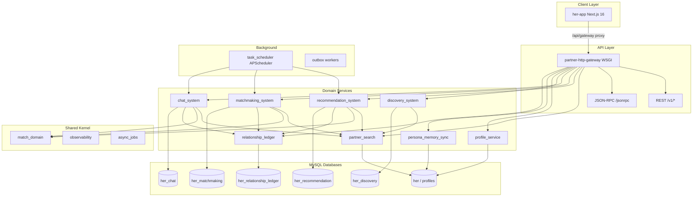
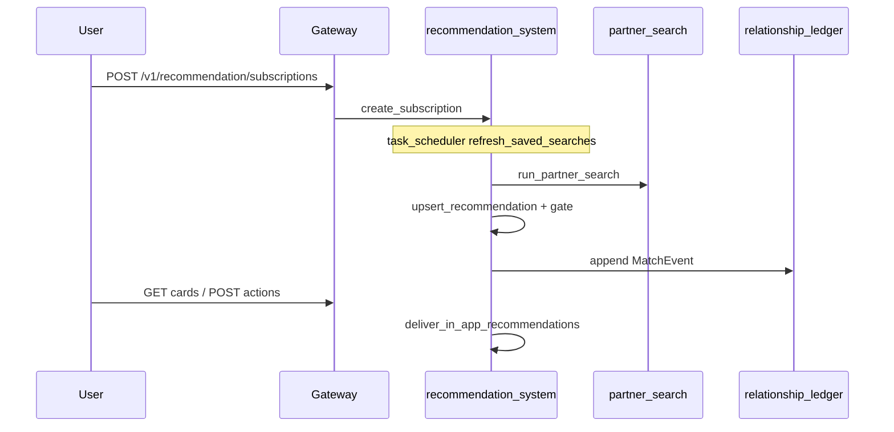
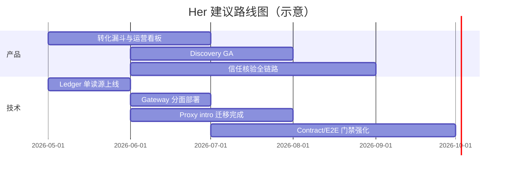

# Her 系统文档

> 文档版本：基于代码库全量扫描生成（2026-05-26）  
> 扫描范围：配置文件、`src/` 等价核心目录（`external-systems/`、`match_domain/`、`partner_search/`、`frontend/her-app/` 等），**未引用仓库内既有 Markdown 设计稿**，以避免过期文档干扰。

---

## 目录

1. [愿景与背景](#1-愿景与背景)
2. [目标用户与产品定位](#2-目标用户与产品定位)
3. [系统架构总览](#3-系统架构总览)
4. [数据与存储架构](#4-数据与存储架构)
5. [功能模块清单与交互逻辑](#5-功能模块清单与交互逻辑)
6. [前端应用（her-app）](#6-前端应用her-app)
7. [API 网关与接口面](#7-api-网关与接口面)
8. [后台任务与可观测性](#8-后台任务与可观测性)
9. [工程化与质量现状](#9-工程化与质量现状)
10. [产品规划（3–6 个月）](#10-产品规划36-个月)

---

## 1. 愿景与背景

### 1.1 产品愿景（从代码推断）

**Her** 是一个面向严肃婚恋/相亲场景的 **「关系运营（Relationship Operations）」平台原型**：用 AI 红娘与结构化匹配引擎，把「找人 → 了解 → 建立联系 → 撮合跟进 → 信任与安全」串成一条可追踪的关系漏斗，而不是一次性搜索工具。

`pyproject.toml` 将项目描述为：

> *Relationship-operations prototype: search, persona memory, recommendation, and matchmaking.*

这与代码中的核心抽象一致：`match_domain` 统一了推荐、撮合、私信、代理介绍（proxy intro）等子系统的 **关系状态（RelationStatus）**、**配对（Pair）** 与 **案件（Case）** 词汇表，并由 `relationship_ledger` 提供跨域时间线。

### 1.2 解决的核心痛点

| 痛点 | 系统如何应对（代码证据） |
|------|--------------------------|
| 择偶条件难表达、搜索结果难解释 | `partner_search` 多阶段检索（预筛 → 打分 → 互惠偏好 → 信任信号）；`match_domain.criteria_compiler` 将订阅条件编译为可执行检索；BFF `GET /v1/candidates/{id}` 聚合推荐解释（`explain`） |
| 推荐与真实关系进展脱节 | `recommendation_system` 订阅制 saved search + 定时刷新 + 应用内卡片投递；`conversion_views` 对接 ledger 阶段 |
| 双方意愿不对称、跟进成本高 | `matchmaking_system` 活跃池、互选配对、案件派发/回复/反馈；`proxy_intro` 代理介绍流程 |
| 对话缺乏上下文与专业引导 | `chat_system` v2 案件会话 + `assistant_orchestrator` AI 红娘（OpenAI Agents SDK） |
| 资料真实性、照片与字段可信度 | 活体视频核验（`verification_*`）、字段认证（`profile_verifications`）、照片风险（`photo_risk_*`）、信任中心（`trust-hub`） |
| 欺诈与风控 | `fraud_graph`、风险案件/信号/申诉、成员举报与见面反馈 |
| 用户画像分散、难以持续学习 | `persona_memory_sync`（`user_personas` / observations）+ `collected_profile` 分层，与 Discovery/Chat 同步 |
| 多子系统状态不一致 | `relationship_ledger` 从 `MatchEvent` 归约；各子系统 outbox + 延迟镜像提交 |
| 运营与实验难以配置 | `rule_config` 版本化规则、`experiment_bucket`、ops 工作台与决策追踪 |

### 1.3 补充信息（基于代码推断，可替换）

| 维度 | 推断值 |
|------|--------|
| **核心目标** | 为单身用户提供 AI 辅助的、可审计、可运营的相亲匹配与关系推进体验；为运营方提供规则配置、风控与转化漏斗能力 |
| **主要目标用户** | C 端：有明确婚恋意向、愿完成资料与核验的成年用户；B/Ops：红娘运营、审核与风控人员 |

---

## 2. 目标用户与产品定位

### 2.1 C 端用户旅程（前端 `her-app` 路由映射）

```
启动页 → 登录（一键/微信/短信）→ 新用户引导/资料完善
    → 主 Tab「红娘」（发现/对话式搜人 + 推荐收件箱）
    → Tab「关系」（关系列表、聊天）
    → Tab「我的」（资料、信任中心、采集偏好、核验）
```

### 2.2 运营/内部角色

Gateway 通过 `IdentityResolver` 与角色集（如 `INTERNAL_WRITE_ROLES`）区分：

- **public**：面向用户的 REST（生产建议 `PARTNER_GATEWAY_SURFACE=public`，关闭 JSON-RPC）
- **ops**：异步任务看板、规则配置、决策追踪、工作台摘要
- **internal**：脚本与 JSON-RPC 批量操作

---

## 3. 系统架构总览

### 3.1 逻辑架构图



### 3.2 仓库结构（Monorepo）

| 路径 | 职责 |
|------|------|
| `external-systems/partner-http-gateway/` | 统一 HTTP 入口、鉴权、BFF、限流 |
| `external-systems/partner-recommendation-system/` | 订阅推荐、卡片投递、用户动作 |
| `external-systems/partner-matchmaking-system/` | 撮合池、配对、案件、代理介绍 |
| `external-systems/partner-chat-system/` | 聊天、AI 红娘、核验、风控、认证 |
| `external-systems/partner-discovery-system/` | 发现页 Agent 会话（标注为 skeleton，但已接 MySQL + Agent） |
| `match_domain/` | 跨域模型、规则、门控、搜索可见性、outbox 协议 |
| `partner_search/` | 候选人搜索引擎 |
| `persona_memory_sync/` | 人格记忆 upsert/sync/render |
| `profile_service/` | 资料读写统一入口 |
| `relationship_ledger/` | 跨系统关系时间线 |
| `frontend/her-app/` | Next.js 用户端 + Ops 工作台 |
| `task_scheduler/` | 定时任务编排 |
| `db_migrations/` | 分库 schema 迁移 |
| `local-skills/` | Agent/CLI 技能包（partner-search、persona-memory-sync、persona-eval） |

### 3.3 本地运行栈

`scripts/start_local_stack.sh` 依次启动：

1. 本地 MySQL  
2. HTTP Gateway（`gateway.__main__`）  
3. 前端 `next dev`  
4. 可选 `--with-scheduler` 启动 `task_scheduler`

---

## 4. 数据与存储架构

### 4.1 数据库划分（来自 `.env.example`）

| 环境变量 | 数据库 | 主要实体 |
|----------|--------|----------|
| `PERSONA_MEMORY_MYSQL_SOURCE` / `HER_PROFILE_SOURCE_DSN` | `her` | `profiles`、`profile_photos`、`user_personas`、`user_persona_observations` |
| `PARTNER_RECOMMENDATION_DB` | `her_recommendation` | `saved_search_subscriptions`、`profile_recommendations`、`in_app_recommendation_cards`、`match_cases`（legacy）、`criteria_snapshots`、`rule_config_*`、`outbox_events` |
| `PARTNER_MATCHMAKING_DB` | `her_matchmaking` | `matchmaking_pool_members`、`matchmaking_pairs`、`match_cases`、`proxy_intro_cases` |
| `PARTNER_CHAT_DB` | `her_chat` | `chat_threads`/`chat_conversations`、`chat_messages`、`user_accounts`、`auth_*`、`verification_*`、`chat_risk_*`、`persona_sync_jobs` |
| `PARTNER_DISCOVERY_DB` | `her_discovery` | `discovery_agent_sessions`、`discovery_agent_turns`、`discovery_search_runs`、`discovery_view_snapshots` |
| `HER_RELATION_LEDGER_DB` | `her_relationship_ledger` | `match_relations`、`match_relation_cases`、`match_relation_events` |

Schema 权威定义：`outer_system_mysql_schema.py`；变更通过 `db_migrations/targets/{recommendation,matchmaking,chat,discovery,persona,relationship_ledger}` 管理，`HER_SCHEMA_INIT_MODE=migrate|validate`。

### 4.2 跨域一致性机制

1. **事务内写业务表 + outbox 事件**（`match_domain.outbox`）  
2. **Outbox worker** 异步消费（chat / recommendation / matchmaking 各有 worker）  
3. **Ledger 延迟镜像**：`relationship_ledger.runtime.commit_conn_with_ledger` 在事务提交后刷入 `MatchEvent`  
4. **读取策略**：`HER_RELATION_LEDGER_READ_MODE=ledger_primary`；开发可开 `HER_ALLOW_LEGACY_TIMELINE_FALLBACK`

### 4.3 代理介绍存储切换

Proxy intro 案件**仅**落在撮合库 `proxy_intro_*` 表；`HER_PROXY_INTRO_STORAGE` 非 `matchmaking` 时会被忽略并告警。实现：`matchmaking_system/proxy_intro_core.py`；`recommendation_system` 通过懒加载 re-export 兼容旧 import。历史数据迁移：`scripts/migrate_proxy_intro_to_matchmaking.py`。

---

## 5. 功能模块清单与交互逻辑

### 5.1 候选人搜索（partner_search）

**职责**：从 MySQL 资料源加载候选人，经预筛、互惠偏好、信任与文本信号打分排序，输出结构化 `search_run`。

**主管线**（`partner_search/search_candidates.py` + helpers）：

```
resolve source DSN → load records + photos → evaluate_candidate (search_matching)
  → rank (search_ranking) → no_match diagnostics (search_no_match)
```

**对外 API**：`partner_search/api.py` — `search()`、`search_profiles()`、`load_self_profile()`

**调用方**：

- Gateway `POST /v1/search/profiles`、JSON-RPC `search.search_profiles`（经 `match_domain.search_visibility` 门控）
- `recommendation_system` 订阅刷新
- `discovery_system` Agent 工具调用

---

### 5.2 推荐系统（recommendation_system）

**职责**：将用户择偶意图固化为 **saved search subscription**，周期性调用 `partner_search` 刷新，经 gate/review 后生成 **profile_recommendations**，投递 **in_app_recommendation_cards**，并记录用户动作与评价。

**核心流程**：



**关键能力**（`recommendation_system/service.py`）：

- 订阅 CRUD、overrides、criteria 编译与 snapshot
- `refresh_subscription` / `refresh_due_subscriptions`
- `record_recommendation_action`、`record_user_review`
- `build_recommendation_conversion_view`（对接 ledger 阶段）
- `deliver_in_app_recommendations`（静默时段、日配额）
- 与 proxy intro / direct greet 相关的 gate（`direct_greet_gate.py`）

---

### 5.3 撮合系统（matchmaking_system）

**职责**：维护 **活跃池成员**，计算 **互选配对**，打开 **match_cases**，执行联系派发、回复、反馈与过期关闭；`proxy_intro.py` 负责代理介绍外联。

**核心流程**：

```
refresh_active_pool → build_mutual_pairs → open_match_cases
  → dispatch_case_contact → record_case_reply → record_feedback
  → close_stale_cases
```

**与推荐的关系**：推荐侧可将高意向候选人推进至撮合案件；proxy intro 案件类型在 `match_domain.model.CaseType` 中区分 `PROXY_INTRO` 与 `MATCHMAKING`。

---

### 5.4 聊天与 AI 红娘（chat_system）

**职责**：

| 子域 | 说明 |
|------|------|
| **v1 线程** | `chat_threads` + `chat_messages`，兼容早期 API |
| **v2 案件会话** | `chat_conversations` 按 channel 分轨；`/v2/chat/cases/{id}/...` |
| **AI 红娘** | `assistant_orchestrator` 消费 agent task 队列，调用 `run_matchmaker_agent`，自动发帖到指定 conversation |
| **Persona 同步** | `persona_jobs` 将对话观察写入 persona memory |
| **核验** | 活体视频 challenge/request/submission、通知、复审 |
| **字段认证** | profile field verification 策略与审核流 |
| **风控** | 举报、见面反馈、风险案件/信号/申诉、fraud network 观测与评估 |
| **认证** | SMS / 微信 / 一键登录、`user_accounts`、session token |

**AI 运行时配置**（`.env.example`）：`HER_CHAT_AGENT_MODEL`、`HER_CHAT_AGENT_RUNTIME=agents_sdk`、独立 Discovery Agent 端点配置。

---

### 5.5 发现页 Agent（discovery_system）

**职责**：对话式「发现」体验——用户通过多轮 turn 与 Agent 交互，Agent 可调用搜索工具、展示候选人卡片、生成 view snapshot。

**状态**：代码注释为 *skeleton*，但已实现：

- `DiscoveryService`：session/turn CRUD、MySQL 持久化
- `DiscoveryAgentRuntime`（`agent_runtime.py`）
- 与 `partner_search`、`persona_memory_sync`、`recommendation` 绑定集成（`service_integrations.py`）
- 前端 `DiscoverPage` 已调用 `createDiscoverySession` / `submitDiscoveryTurn`

**交互**：

```
用户输入 turn → Agent 决策 → 可选 search_profiles → 更新 session view
  → 用户点击候选人 → 跳转 CandidateDetail（可带 session 参数）
  → 可 saveDiscoveryAsSubscription 进入推荐订阅
```

**性能与交互演进（方案，待落地）**：首屏按 onboarding 资料直接搜人（不调 AI 开场）、聊天中不写 persona、聊后自动批量更新画像，以及前端并行/体感优化，见 [`docs/discovery-matchmaker-performance-plan.md`](docs/discovery-matchmaker-performance-plan.md)。

---

### 5.6 人格记忆与资料（persona_memory_sync + profile_service）

**persona_memory_sync**：

- `upsert_persona_memory`：写入 `user_personas` / observations
- `sync_persona_profile`：合并到 `profiles` 公开字段
- `render_public_profile`：渲染对外展示层
- CLI：`persona-memory-sync` entry point

**profile_service**：

- 统一 DSN 解析、`get_profile` / `list_profiles` / `apply_profile_updates`
- `persona_bridge` 桥接 persona 层
- Gateway `collected_routes` 暴露 `/v1/persona/collected`（§13.1.2 collected profile 分层）

**match_domain.collected_profile**：区分采集层 metadata 与 persona 推理字段，支撑搜索消毒与互惠偏好。

---

### 5.7 关系账本（relationship_ledger）

**职责**：从各子系统发出的 `MatchEvent` 流归约出：

- `match_relations`：单向关系状态（new → recommended → proxy_intro_active → matched → closed 等）
- `match_relation_cases`：关联案件
- `match_relation_events`：事件溯源

**对外读 API**（Gateway `ledger_routes`）：

- `GET /v1/relations`、`/mine`、`/list`、`/dashboard`、`/by-case/{case_id}`

前端 `relationships-page` 与 `relations` API 消费上述数据展示关系漏斗。

---

### 5.8 共享域层（match_domain）

| 模块 | 作用 |
|------|------|
| `model.py` / `status_vocab.py` | 统一枚举与 `ProfileRef`、`MatchEvent` |
| `gate_runner.py` | 推荐门控 pass/hold/reject |
| `rule_config*.py` | 可版本化规则切片与激活 |
| `criteria_compiler.py` | 订阅条件 → 搜索 criteria |
| `search_visibility.py` | Gateway 搜索请求消毒与 moderation 叠加 |
| `experiment_bucket.py` | A/B 分桶 |
| `ledger.py` | 事件归约逻辑 |
| `outbox.py` | 跨服务 outbox 协议 |
| `principal.py` + `her_runtime_context.py`（`script_actor` / `ids`） | 请求主体与追踪 ID |

---

### 5.9 模块间典型端到端链路

#### 链路 A：发现 → 详情 → 订阅推荐

```
DiscoverPage → POST /v1/discovery/sessions → turns
  → search (partner_search) → 卡片展示
  → CandidateDetailPage → GET /v1/candidates/{id} (BFF)
  → saveDiscoveryAsSubscription → recommendation subscription
  → scheduler refresh → in-app cards
```

#### 链路 B：推荐卡片 → 用户动作 → 撮合

```
用户打开 inbox → GET cards → POST recommendation/actions
  → gate 通过 → matchmaking open_case / proxy_intro
  → ledger 更新 relation 阶段
```

#### 链路 C：案件聊天 → AI 红娘

```
打开 chat case → v2 assistant-layout
  → 用户发消息 → enqueue agent task
  → assistant_orchestrator → post agent message
  → 可选 persona_sync_job
```

#### 链路 D：信任与核验

```
Profile/TrustCenter → 发起 live video / field verification
  → chat DB 存储 submission → 审核 → 写回 profile 认证字段
  → trust-hub 聚合展示
```

---

## 6. 前端应用（her-app）

### 6.1 技术栈

- **框架**：Next.js 16.2、React 19、TypeScript 5.7  
- **UI**：Tailwind CSS 4、Radix UI、shadcn 风格组件  
- **质量**：ESLint、Vitest 单元测试、Playwright E2E（`her-flow.spec.ts`）  
- **网关访问**：`gatewayJson('/v1/...')` → Next 代理 `/api/gateway`

### 6.2 页面与导航

| 页面 ID | 组件 | 功能 |
|---------|------|------|
| `main-matchmaker` | `DiscoverPage` | 对话式发现 + 推荐卡片预览 |
| `sub-recommendation-inbox` | `RecommendationInbox` | 推荐收件箱 |
| `sub-candidate-detail` | `CandidateDetailPage` | 候选人详情 |
| `main-relationships` | `RelationshipsPage` | 关系列表 |
| `sub-chat` | `ChatPage` | 案件/会话聊天 |
| `main-profile` | `ProfilePage` | 个人资料 |
| `sub-trust-center` | `TrustCenterPage` | 信任中心 |
| `sub-verification` | `VerificationFlowPage` | 核验流程 |
| `sub-collected-preferences` | `CollectedPreferencesPage` | 采集偏好陈述 |
| `ops-workbench` | `OpsWorkbenchPage` | 运营工作台 |
| Auth 系列 | `welcome-page` 等 | 一键/微信/短信登录、引导、找回 |

### 6.3 环境开关

| 变量 | 含义 |
|------|------|
| `NEXT_PUBLIC_USE_AUTH_STUB` | 开发联调登录 stub（对应 Gateway `HER_AUTH_*_PROVIDER=stub`） |
| `NEXT_PUBLIC_ALLOW_MOCK_FALLBACK` | API 失败时回退 demo 数据 |
| `NEXT_PUBLIC_ENABLE_DEMO_NAV` | 演示导航 |

生产 CI（`.github/workflows/frontend-her-app.yml`）强制关闭 mock/stub，并跑 E2E bootstrap（含 gateway + migrations）。

---

## 7. API 网关与接口面

### 7.1 部署面（surface）

`PARTNER_GATEWAY_SURFACE`：

| 值 | 典型用途 |
|----|----------|
| `public` | 用户 REST，生产关闭 JSON-RPC |
| `ops` | 运营 REST |
| `internal` | 脚本 + JSON-RPC |
| `all` | 本地开发 |

### 7.2 REST 路由摘要

（完整列表见 `gateway/rest_dispatch.py` 及各 `*_routes.py`）

| 域 | 代表路径 |
|----|----------|
| 健康检查 | `GET /health` |
| 搜索 | `POST /v1/search/profiles` |
| 认证 | `POST /v1/auth/sms/*`、`wechat/login`、`one-tap/*`；`GET|PATCH /v1/auth/me` |
| 发现 | `POST /v1/discovery/sessions`、`.../turns` |
| 推荐 | `/v1/recommendation/subscriptions`、`.../cards`、`.../actions` |
| 撮合 | `/v1/matchmaking/members`、`.../pairs`、`.../cases` |
| 聊天 | `/v1/chat/threads`、`/v2/chat/cases/...` |
| 安全 | `/v1/user-center/trust-hub`、reports、risk、fraud-networks |
| 核验 | `/v1/...` live-video、profile-verifications、profile-review |
| 关系 | `/v1/relations/*` |
| 运营 | `/v1/ops/async-jobs/dashboard`、rule-config、decision-trace |

### 7.3 JSON-RPC 方法命名空间

`POST /jsonrpc`（`PARTNER_GATEWAY_ENABLE_JSONRPC=1` 时）：

- `search.*`、`recommendation.*`、`matchmaking.*`、`chat.*`、`verification.*`、`profile.*`、`ops.get_async_job_dashboard`

适合内部脚本与 `local-skills` 集成，**不建议对公网暴露**。

### 7.4 鉴权模型

- Bearer access token（chat `user_accounts` / session）  
- `IdentityResolver` 解析 `ActorPrincipal`（用户 / 运营 / 内部角色）  
- `her_runtime_context` / `match_domain.script_actor` 注入 actor 与 `trace_id` 用于审计（`observability.audit_event`）

---

## 8. 后台任务与可观测性

### 8.1 task_scheduler 任务一览

| Job ID | 子系统 | 作用 |
|--------|--------|------|
| `recommendation.refresh_saved_searches` | 推荐 | 刷新到期订阅 |
| `recommendation.deliver_in_app_recommendations` | 推荐 | 投递应用内卡片 |
| `recommendation.outbox_worker` | 推荐 | 消费 outbox |
| `matchmaking.refresh_active_pool` | 撮合 | 刷新活跃池 |
| `matchmaking.build_mutual_pairs` | 撮合 | 构建互选配对 |
| `matchmaking.open_match_cases` | 撮合 | 打开案件 |
| `matchmaking.close_stale_cases` | 撮合 | 关闭过期案件 |
| `matchmaking.dispatch_proxy_intro_outreach` | 撮合 | 代理介绍外联 |
| `chat.maintenance` | 聊天 | 摘要/助手维护 |
| `chat.outbox_worker` | 聊天 | outbox + persona jobs |

环境变量 `HER_SCHED_*` 控制间隔与开关（见 `.env.example`）。

### 8.2 async_jobs

各子系统库内 `async_jobs` 表 + `async_jobs/queue.py` 通用 worker，用于长耗时任务（刷新、批量审核等），Gateway 暴露 `GET /v1/*/jobs/{id}`。

### 8.3 observability

- 管道日志：`observability` — `funnel_stage`、`metric_gauge`、`audit_event`  
- 健康检查：`observability/health.py` — 推荐逾期、async job 堆积等  
- Gateway 请求贯穿 `trace_id` 响应头

---

## 9. 工程化与质量现状

### 9.1 成熟度评估

| 维度 | 状态 | 说明 |
|------|------|------|
| 领域模型 | **较成熟** | `match_domain` + ledger 统一词汇与事件 |
| 数据迁移 | **较成熟** | 分 target 版本化 migrations + validate 模式 |
| 推荐/撮合/聊天 | **功能完整度高** | 服务层庞大，outbox/async 齐全 |
| Discovery | **中等** | 标注 skeleton，但前后端已贯通 |
| 前端 | **中等偏上** | 主流程页面齐全，保留 mock/demo 路径 |
| 测试 | **中等** | ~22 个 Python 集成/域测试；前端 unit + e2e |
| 生产化 | **原型阶段** | 多库 MySQL、WSGI gateway、本地核验/SMS 多种 provider 占位 |

### 9.2 测试与 CI

- **Python**：`tests/test_*` 覆盖 match_domain、ledger、migration、recommendation-chat 集成、rule_config 等  
- **Gateway**：`gateway_tests/` 端到端回归  
- **前端 CI**：lint → unit → build → production build → E2E（bootstrap MySQL + gateway）

### 9.3 Local Skills（Agent 工具链）

| 技能包 | 用途 |
|--------|------|
| `local-skills/partner-search` | 搜索 CLI、回归、种子数据 |
| `local-skills/persona-memory-sync` | Persona upsert/sync/audit |
| `local-skills/persona-eval` | Persona 基准评测、agent feedback 归一化 |

用于 Cursor/Codex Agent 与离线评测，**非运行时依赖**。

---

## 10. 产品规划（3–6 个月）

> 以下建议基于当前代码成熟度：核心后端链路已打通，前端为可演示原型，生产化与安全/规模化仍有明显缺口。

### 10.1 产品迭代方向（0–3 个月）

| 优先级 | 方向 | 理由与建议 |
|--------|------|------------|
| P0 | **闭环转化度量** | 已有 ledger + conversion_views + observability funnel；产品化统一「阶段定义」仪表盘，对齐运营 OKR |
| P0 | **Discovery 脱离 skeleton** | 前后端已接 Agent；补齐失败重试、会话恢复、推荐订阅一键转化 A/B |
| P1 | **信任闭环用户体验** | 核验/字段认证/信任中心 API 齐全；前端减少 mock，打通「核验中 → 通过 → 资料展示」全链路 |
| P1 | **AI 红娘可控性** | 增加人工接管、话术模板、冷却策略（已有 `chat_cooldown`）；运营可配置 agent 边界 |
| P2 | **推荐解释与偏好编辑** | 强化 BFF 候选人详情中的 `explain` 与 `collected-preferences` 双向同步，降低用户「不知道为什么推荐」的流失 |

### 10.2 产品迭代方向（3–6 个月）

| 优先级 | 方向 | 建议 |
|--------|------|------|
| P1 | **社交裂变与留存** | 在关系漏斗中增加见面反馈闭环（已有 API）驱动复访 |
| P1 | **运营工作台产品化** | 扩展 `ops-workbench`：rule-config UI、risk 批量审核、decision-trace 可视化 |
| P2 | **双边市场冷启动** | `generate_virtual_profiles` / seed 脚本已有；建立合规的演示数据与区域化运营包 |
| P2 | **付费与配额** | `deliver_in_app_recommendations` 已有日配额与静默时段；可扩展订阅档位 |

### 10.3 技术优化建议

> **已全部落地**（2026-05-26）：执行清单与 cutover 脚本见 [`docs/TECH_OPTIMIZATION_10_3_IMPLEMENTATION.md`](docs/TECH_OPTIMIZATION_10_3_IMPLEMENTATION.md)；本地可运行 `python scripts/tech_optimization_cutover.py`。

| 领域 | 建议 | 落地状态 |
|------|------|----------|
| **架构** | Gateway 生产分 surface 部署（public/ops/internal）；proxy intro 已收敛至 matchmaking 存储（legacy env 已移除） | `docker-compose.yml` 三分面 |
| **数据** | 推进 `HER_RELATION_LEDGER_READ_MODE=ledger_primary` 全环境；关闭 `HER_ALLOW_LEGACY_TIMELINE_FALLBACK` | 默认已配置；`HER_PRODUCTION_MODE=1` 强制校验 |
| **可靠性** | Outbox 监控告警接入 `observability.alert_signal`；统一 retry 策略文档化 | `observability/outbox_health.py`；[`docs/RETRY_POLICY.md`](docs/RETRY_POLICY.md) |
| **性能** | 启用 `PARTNER_GATEWAY_DB_POOL_MAX`；`partner_search` 热点 criteria 内存缓存 + MySQL 快照表 | `.env.example` + `search_cache.py` + `search_snapshot_store.py` |
| **安全** | 生产强制真实 SMS/微信；JSON-RPC 仅 internal；敏感配置走密钥管理；fraud_graph 规则外置 | `her_production.py`、`config/fraud_graph_rules.yaml` |
| **AI** | Discovery 与 Chat Agent 分离模型与端点（已预留 env）；建立 persona-eval 回归门禁 | 生产隔离校验；`.github/workflows/persona-eval-gate.yml` |
| **前端** | 移除生产 mock fallback；统一错误态与 offline；a11y | `app-connectivity.tsx`、`request-error-state.tsx`、`error-state.tsx` |
| **DevEx** | 单命令 `docker compose`；contract test；cutover/环境校验脚本 | `tech_optimization_cutover.py`、`validate_tech_optimization_env.py` |

### 10.4 建议里程碑



---

## 附录 A：环境变量速查

详见仓库根目录 `.env.example`（41+ 行核心配置，含 DB、Agent、Scheduler、SMS、核验等）。

## 附录 B：关键入口命令

```bash
# 安装 Python 包（editable）
pip install -e ".[dev]"

# 启动 Gateway
python -m gateway

# 启动调度器
python -m task_scheduler

# 数据库迁移
python -m db_migrations

# 本地全栈
scripts/start_local_stack.sh --with-scheduler

# 前端
cd frontend/her-app && pnpm dev
```

## 附录 C：文档维护说明

- 本文档由代码扫描生成，**当架构或路由变更时请同步更新** `SYSTEM_DOC.md`。  
- 设计稿目录 `docs/design-pages/` 可能领先或滞后于实现，以 Gateway 路由与各 `service.py` 为准。  
- Schema 变更请同时更新 `outer_system_mysql_schema.py` 与 `db_migrations/targets/`。

---

*Generated from codebase analysis. Project: Her v0.1.0 — Relationship-operations prototype.*
