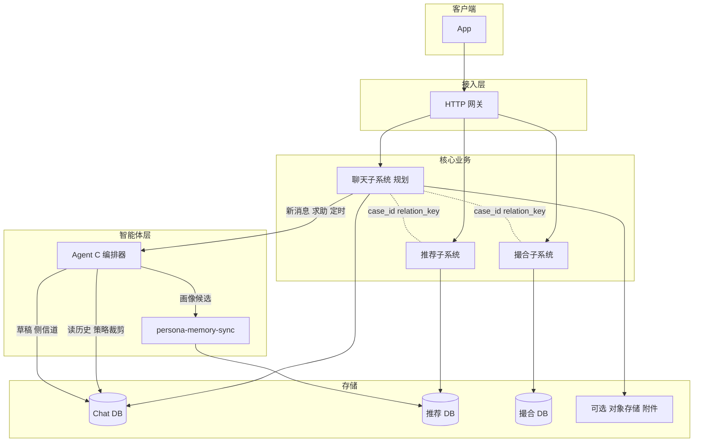

# 聊天与 Agent 中间人架构方案

本文档描述 Her 关系运营流水线中 **用户与匹配对象聊天**、**Agent C 协助**、以及 **对话触发 persona-memory-sync** 的完整架构设计，作为实现与评审的单一事实来源（与当前代码是否已落地无关）。

**关联代码与能力**（现状参考）：

- 推荐 / 代理牵线：`external-systems/partner-recommendation-system/`、`match_domain` 案例类型 `PROXY_INTRO`
- 撮合与反馈画像同步：`external-systems/partner-matchmaking-system/matchmaking_system/service.py`（`upsert_persona_memory`）
- 画像技能：`local-skills/persona-memory-sync/`（`persona_memory_sync.upsert_persona_memory`）
- 接入与事件习惯：`partner-http-gateway`、`match_domain.outbox`、`observability`

---

## 1. 目标与边界

### 1.1 目标

- 用户在 **同一案子（关系线）** 下与匹配对象进行持续对话。
- **Agent C** 可读取对话内容，在 **侧信道** 提供建议与草稿；用户 **确认后** 内容进入 **主对话**（对双方可见的正式记录）。
- 对话中出现 **与说话人本人画像相关** 的陈述时，以 **可审计** 方式 **自动触发** `persona-memory-sync`（`upsert_persona_memory`），与现有撮合反馈路径在 **同一套画像合并规则** 下对齐。
- 与现有 **推荐 / 撮合 / `match_domain` 事件与 outbox** 叙事兼容，支撑统一时间线、风控与回放。

### 1.2 非目标（首版可不做）

- 端到端加密即时通讯、实时音视频。
- 默认 **三人同屏群聊** 式调解（可作为后续 **双方显式同意** 的模式）。

---

## 2. 总体架构

### 2.1 逻辑分层

### 2.2 设计原则

1. **聊天独立域**：独立 schema/库；通过 **`case_id`** 与 **`relation_key`**（或统一的 `conversation_aggregate_id`）与推荐/撮合关联。
2. **对话 = 追加日志**：语义上 append-only；实现可为关系表、JSONL、对象存储 blob，由实现阶段选定。
3. **Agent 无状态 worker**：会话状态在存储中；编排器负责触发、限流、重试与幂等。
4. **主对话与侧信道分离**：默认非三人同群；对端仅见经确认的正式消息（产品可配置「由助手润色」披露）。

---

## 3. 核心概念与标识符

| 概念 | 说明 |
|------|------|
| `case_id` | 与现有 `match_cases` 一致（推荐侧 proxy intro 或撮合侧双边案）。 |
| `relation_key` | 与 `match_domain` 关系键一致，便于与时间线、推荐行对齐。 |
| `thread_id` | 一条主对话线程（A↔B）。 |
| `message_id` | 单条消息全局唯一。 |
| `participant_id` | 用户 / 系统 / agent 角色标识。 |
| `visibility` | `dyadic`（双方可见） / `owner_only`（发起方 + 平台 + Agent） / `system`。 |

---

## 4. 聊天子系统数据模型（建议）

### 4.1 `chat_threads`

- `thread_id`, `case_id`, `relation_key`, `status`（`open` / `paused` / `closed`）
- `participant_a_id`, `participant_b_id`
- `created_at`, `updated_at`, `metadata_json`（客户端版本、渠道等）

### 4.2 `chat_messages`（或事件表 + 读模型）

最小列建议：

- `message_id`, `thread_id`, `author_id`, `visibility`
- `body` 或 `content_json`（文本 / 图片引用 / 系统卡片）
- `client_msg_id`（客户端幂等）
- `reply_to_message_id`（可选）
- `source`：`user` | `agent_draft` | `agent_sent_after_confirm` | `system`
- `created_at`

若采用完整事件溯源：

- `chat_events`：`event_type`、`payload_json`、`occurred_at`
- `chat_messages` 为投影表，由 worker 维护

### 4.3 `agent_turns`（可选，或并入 `chat_messages`）

记录侧信道多轮、tool 调用摘要、`draft_id → sent_message_id` 映射。

### 4.4 `persona_sync_jobs`（由聊天触发的画像同步）

- `job_id`, `thread_id`, `message_id` 或 `message_id` 范围
- `subject_user_id`：**画像归属主体，仅为陈述者本人**
- `status`：`pending` / `extracted` / `applied` / `rejected` / `needs_review`
- `patch_json`（候选 patch）、`evidence_json`（原文片段与引用 id）
- `sync_result_json`（`upsert_persona_memory` 返回摘要）
- `created_at`, `processed_at`

---

## 5. 主对话与侧信道

| 类型 | 可见性 | 典型内容 |
|------|--------|----------|
| 主对话 `dyadic` | A、B（及授权运营工具） | 用户正式消息 |
| 侧信道 `owner_only` | 该用户、平台、Agent | 求助、草稿、解释、风险提示 |
| `system` | 系统 | 会话开启、超时、拦截提示 |

### 代发流程（推荐强制）

1. Agent 写入 `agent_draft`（或对用户展示的草稿态）。
2. 用户 **确认** → 服务端写入主对话，标记 `agent_sent_after_confirm` 或等价元数据。
3. 对端仅见主对话最终内容（可选设置中披露「由助手润色」）。

---

## 6. Agent C：职责、触发与流水线

### 6.1 职责

- **读**：按策略拉取 `thread_id` 近期消息 + 可选 safe profile 摘要（与 `build_safe_summary` 哲学一致）。
- **写**：侧信道建议、草稿；不直接修改对端可见内容（除非经确认或产品定义的模板自动发送）。
- **编排**：决定是否进入 **persona 抽取**、是否 **escalation**（人工）。

### 6.2 触发方式（可并存）

| 触发 | 说明 |
|------|------|
| 用户显式 | 「问助手」「帮我回」 |
| 消息落库后 | outbox / 队列 / Webhook：`on_message_appended` |
| 定时 | 摘要、沉默提醒 |
| 规则 | 关键词、情绪风险、举报入口 |
| 批量 | 会话结束后合并处理 persona，降低调用频率 |

### 6.3 标准流水线

1. 鉴权：仅参与者或系统 worker 可读取 `thread_id`。
2. 上下文裁剪：轮次上限 + 可选 `thread_summaries` 缓存表。
3. 推理：生成草稿 / 建议 / 风险标签。
4. 写回：侧信道与可选 `agent_turns`。
5. 画像分支：若判定为「本人画像陈述」→ 写入 `persona_sync_jobs`（见 §7）。

---

## 7. 与 persona-memory-sync 的集成

### 7.1 输入策略

- **优先处理说话人关于自己的陈述**；对「评价对方」的内容默认 **不写入对方画像**；若需 observation 类存储，须与 `persona-memory-sync` 的 merge 规则与 visibility 策略对齐（参见 `local-skills/persona-memory-sync/references/`）。
- 携带 **`conversation_ref`**：建议 `thread_id` + `message_id`，与 audit 脚本中的引用风格一致，便于审计。

### 7.2 置信度与合并

- **高敏感**（收入、婚史、联系方式等）：**候选 patch + `needs_review`** 或用户确认后按 `explicit` 合并。
- **低敏感**（爱好、作息等）：可在强约束下自动合并，与现有 `merge_persona` / `explicit` vs `strong_inference` 语义对齐。

### 7.3 执行路径

- Worker 消费 `persona_sync_jobs` → 调用 `persona_memory_sync.upsert_persona_memory`（与 `matchmaking_system` 注入方式一致）。
- 成功更新 `applied`；失败重试 + 死信；记录 `sync_result_json`。

### 7.4 与撮合反馈的关系

- 同一用户画像目标库：在 evidence 或 metadata 中区分来源（如 `chat` vs `matchmaking_feedback`），支持回滚与对账。

---

## 8. 网关与 API 草图（REST）

前缀示例：`/v1/chat/`

| 方法 | 路径 | 作用 |
|------|------|------|
| POST | `/threads` | 按 `case_id` 创建或获取线程 |
| GET | `/threads/{id}/messages` | 分页拉消息（按 `visibility` 过滤） |
| POST | `/threads/{id}/messages` | 发主对话消息（`client_msg_id` 幂等） |
| POST | `/threads/{id}/assistant/query` | 用户求助 → 同步或异步侧信道 |
| POST | `/threads/{id}/messages/adopt-draft` | 确认草稿 → 入主对话 |
| POST | `/threads/{id}/read-receipt` | 已读（可选） |

若与现网 JSON-RPC 统一，可镜像上述方法名。

---

## 9. 异步与可靠性

- 消息持久化与 **`append_outbox_pending`** 模式对齐：`event_type=chat.message.created`，供 Agent worker、推送、画像队列消费。
- **幂等**：`client_msg_id` + 数据库唯一约束。
- **顺序**：同 `thread_id` 以服务端 `created_at`（及可选单调序号）为准。
- **重试**：Agent 与 persona job 采用 at-least-once 时依赖 job 去重。

---

## 10. 安全与合规

- **最小披露**：Agent 上下文使用 safe summary；全量资料仅经授权路径读取。
- **留存与删除**：与账号注销、撤回策略对齐；画像同步须支持溯源与修正。
- **滥用防护**：速率限制、敏感升级人工队列、访问审计日志。

---

## 11. 可观测性

- 漏斗建议：`chat.thread.open`、`chat.message.send`、`chat.assistant.invoke`、`chat.persona_job.applied` / `failed`。
- 与 `observability` / `her.pipeline` 对齐；`trace_id` 从网关透传至 Chat 与 persona worker。

---

## 12. 分阶段落地

| 阶段 | 内容 |
|------|------|
| MVP | `threads` + `messages`；仅主对话；网关 CRUD。 |
| Phase 2 | 侧信道 + 草稿 + 确认后发；单一触发（用户点击）。 |
| Phase 3 | outbox 驱动 Agent；上下文摘要表。 |
| Phase 4 | `persona_sync_jobs` + 自动抽取 + 规则/人工 gate。 |
| Phase 5 | 统一用户时间线 API（推荐动作 + case 事件 + 聊天 + persona job）。 |

---

## 13. 与「文件协作」模型的对应

- **共享工件**：实现上等于 **`thread_id` 下的追加日志**（表或对象存储上的 JSONL）。
- **Agent C**：等于订阅 **日志追加事件** 的 worker（工程上多用 outbox/队列，而非单机目录轮询）。
- **persona-memory-sync**：等于消费 **已标记为画像相关** 的片段或 `persona_sync_jobs` 的独立流水线。

---

## 14. 文档维护

- **已实现**：`chat_tables()` 含 **`chat_threads`**、**`chat_messages`**、**`chat_thread_summaries`**、**`outbox_events`**、**`persona_sync_jobs`**；消息/开线程同事务 **`append_outbox_pending`**；**`funnel_stage(system="chat", …)`** 覆盖 thread_open、message_send、assistant_invoke、draft_adopt、persona_job_enqueued、outbox_dispatched；**`consume_chat_outbox_batch`**（维护任务默认）；**`refresh_stale_thread_summaries`**（concat 摘要）；**`assistant/query`** 可选 **OpenAI 或兼容 Chat Completions**（`OPENAI_API_KEY`，可选 `HER_CHAT_ASSISTANT_BASE_URL` / `OPENAI_BASE_URL`）；**`/v1/timeline`** 聚合 **撮合 + 推荐** proxy-intro 案例事件；**`GET /v1/chat/threads/{id}/summary`**；详见 `API_CONTRACT.md` / `SYSTEM_DOC.md` §3.5。
- 本方案与 **`SYSTEM_DOC.md`** 中的组件划分一致；Kafka 等外部队列、端到端加密、三人调解模式等仍可按 §1.2 / §12 演进。
- 画像合并与可见性细节以 `local-skills/persona-memory-sync/references/` 为准，与本方案冲突时以 skill 引用文档为实施准绳。
- 助手评估、角色扮演压测发现、以及下一步产品/提示词/延迟改造，请见 [聊天助手改进方案](chat-assistant-improvement-plan.md)。

---

*文档版本：与仓库同仓维护；重大架构变更请更新本节与分阶段表。*
