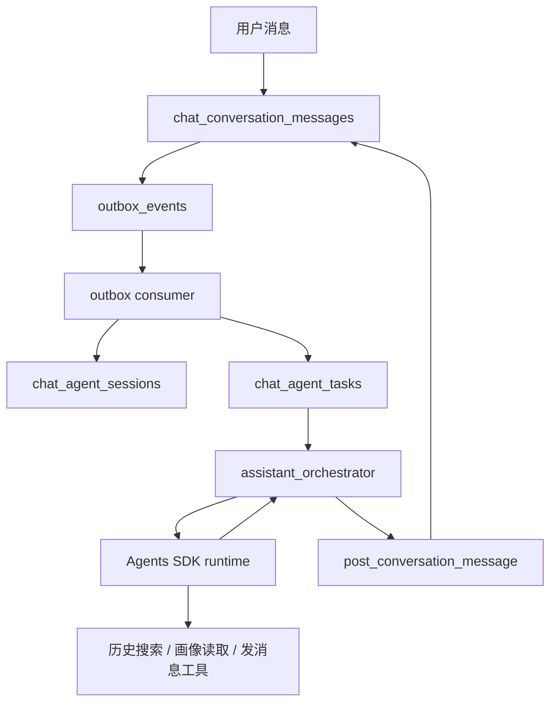

# 触发式红娘 C 方案

本文档定义一套更贴近真实产品的实现：

- A / B 一开始聊天，系统自动分配一个红娘 C
- C 不是临时出现一轮，而是跟着这条 `case_id` 持续服务
- C 可以看：
  - A / B 主群
  - A / C 私聊
  - B / C 私聊
- C 不是靠“常驻进程一直盯着”，而是靠 **事件触发 + session 持久化**
- C 的内部推理使用 **Agents SDK runtime**

这份文档的目标是两件事：

1. 用大白话把方案讲清楚
2. 给工程实现一份可直接落地的设计

---

## 1. TL;DR

一句话版本：

- **外层系统自己写**
  - 负责 session、task、幂等、节流、结束条件
- **内层红娘 C 用 Agents SDK 运行**
  - 负责看消息、查历史、做多步推理、决定怎么回

所以这不是“让一个 AI 常驻在线”，而是：

1. 第一条用户消息来了
2. 系统为这个 `case_id` 创建一条红娘 session
3. 后续每来一条用户消息，就唤醒这条 session 一次
4. 红娘 C 用 Agents SDK 自己决定：
   - 要不要查更早历史
   - 回 A、回 B、回主群，还是不回
5. case 结束或长时间没消息，就关闭这条 session

---

## 2. 大白话版本

你真正想要的不是：

- A 和 B 聊一下
- 人工再临时叫红娘出来
- 回一轮
- 下次再手动叫

你想要的是：

- A 和 B 一开聊，系统自动给他们配一个专属红娘
- 红娘一直记得他们前面发生过什么
- A 来找她，她能接上文
- B 来找她，她也能接上文
- 她还能看主群，知道这段关系是在升温、冷战，还是起冲突

但真正写代码时，不会真的搞一个“24小时挂着看消息的 AI 进程”。

工程上更合理的做法是：

1. 给这对 A/B 建一条“红娘档案”
2. 每次有新消息，系统就通知这个红娘档案处理一下
3. 红娘处理完就休息
4. 下次再有消息，再叫她起来

对用户来说，体验上等于“红娘一直在”。

对系统来说，实际上是“有事再唤醒”。

这样做的好处：

- 更省资源
- 更容易做重试
- 更容易审计
- 更容易控制频率
- 不容易因为一个进程挂掉就整条关系线失忆

---

## 3. 为什么这里要用 Agents SDK

如果红娘 C 只是：

- 看最近 3 条消息
- 回一句固定建议

那不用 agent 运行时也行。

但你现在想要的是：

- 红娘不只看最近几条
- 红娘能自己判断“信息够不够”
- 不够时自己去搜索更早历史
- 结合 A/B 画像和现在的关系阶段做判断
- 最后再决定怎么回

这就不是一次性 prompt 了，而是一个小型 agent 流程：

1. 先看最新消息
2. 判断问题是什么
3. 决定要不要搜历史
4. 去搜历史
5. 找到关键片段
6. 结合画像和当前关系状态做推理
7. 决定回复位置和内容

所以这里推荐：

- **外层系统调度不用交给 agent 框架**
- **红娘 C 的内部推理用 Agents SDK**

原因：

- 外层是后端系统问题
- 内层才是 agent 问题

---

## 4. 为什么不是重型多智能体框架

不推荐一开始就上：

- AutoGen
- CrewAI
- 其他多 agent 自由协作框架

原因不是这些框架不行，而是你现在的问题重点不在：

- 多个 AI 互相开会
- 多角色自由分工

而在：

- 一条关系线怎么建 session
- 新消息怎么唤醒红娘
- 怎么避免重复处理
- 怎么做节流
- 怎么结束

这些更像系统工程，不像多智能体协作。

所以我的推荐非常明确：

- **v1：外层自研 + 内层 Agents SDK**
- **不建议一开始就上多智能体框架**

---

## 5. 现有仓库能直接复用什么

当前仓库已经有很好的基础：

### 5.1 多会话布局

已经支持同一个 `case_id` 下的三条会话：

- `main_group`
- `assistant_dm_a`
- `assistant_dm_b`

入口在：

- `external-systems/partner-chat-system/chat_system/conversations.py`
- `create_assistant_case_layout(...)`

### 5.2 消息写入

已经有统一入口：

- `post_conversation_message(...)`

这意味着红娘 C 回消息时，不需要发明新写法，直接复用现有写入接口。

### 5.3 事件流

每条消息落库后已经会写 `outbox_events`，而且聊天事件已经定义好了：

- `chat.conversation.message.created`

### 5.4 维护任务

当前维护任务已经会跑：

- outbox consume
- persona jobs
- summaries

所以红娘 C 最合适的接入点不是 gateway，而是：

- **chat outbox consumer**
- **chat maintenance worker**

一句话：  
**聊天骨架已经有了，我们要加的是“红娘运行层”，不是重写聊天系统。**

---

## 6. 整体架构



怎么理解这张图：

1. 用户消息先正常入库
2. 入库后产生 outbox 事件
3. outbox consumer 看见事件后：
   - 创建或唤醒红娘 session
   - 生成一条待处理 task
4. orchestrator 消费 task
5. orchestrator 启动一次 Agents SDK run
6. 红娘 C 在 run 内按需调用工具：
   - 看最近消息
   - 搜更早历史
   - 读 A/B 画像
   - 读当前 session 状态
7. 红娘 C 返回结构化决策
8. orchestrator 校验后写回聊天库

---

## 7. 两层分工

## 7.1 外层：系统调度层

这层自己写，不交给 Agents SDK。

职责：

- 创建 session
- 创建 task
- 去重
- 重试
- 节流
- 结束
- 审计

建议文件：

- `assistant_session_store.py`
- `assistant_task_store.py`
- `assistant_orchestrator.py`

## 7.2 内层：红娘 C 推理层

这层使用 Agents SDK runtime。

职责：

- 看触发它的最新消息
- 判断现在的问题是什么
- 决定要不要搜历史
- 自主调用工具查历史
- 结合画像与关系状态做多步推理
- 决定怎么回

---

## 8. 生命周期

一条 `case_id` 只绑定一个红娘 session。

状态建议：

- `active`
- `paused`
- `closed`

### 8.1 创建时机

推荐：

- **第一条 `source=user` 的消息落库时创建**

不推荐：

- 建 layout 就创建

原因：

- 很多 case 会先建布局，但不一定真的开始聊
- 建 layout 就起 session，会有很多空转记录

### 8.2 触发消息范围

以下任意用户消息都能触发红娘：

- 主群消息
- A 私聊 C
- B 私聊 C

这样支持：

- A/B 先主群开聊
- 或 A 先主动找红娘
- 或 B 先主动找红娘

### 8.3 结束条件

满足任一条件可关闭：

1. case 被显式关闭
2. 长时间无新消息，例如 `7` 天
3. 业务状态进入成功结束 / 失败结束 / 转人工
4. 人工手动关闭

---

## 9. 数据模型

## 9.1 `chat_agent_sessions`

一条 `case_id` 一条记录。

建议核心字段：

- `session_id`
- `case_id`
- `relation_key`
- `status`
- `participant_a_id`
- `participant_b_id`
- `agent_participant_id`
- `triggered_by_message_id`
- `last_seen_message_id`
- `last_user_message_at`
- `last_agent_message_at`
- `last_replied_at`
- `cooldown_until`
- `close_reason`
- `state_json`
- `started_at`
- `ended_at`
- `created_at`
- `updated_at`

`state_json` 里存什么：

- 当前关系阶段
- 上次介入位置
- A/B 当前风险分数
- 上次判断理由
- 节流窗口

## 9.2 `chat_agent_tasks`

每次触发都先落 task，不直接在 outbox consumer 里跑模型。

建议核心字段：

- `task_id`
- `session_id`
- `case_id`
- `trigger_conversation_id`
- `trigger_message_id`
- `trigger_author_id`
- `trigger_channel_key`
- `reason`
- `status`
- `attempt_count`
- `lease_until`
- `dedupe_key`
- `result_json`
- `error_text`
- `created_at`
- `started_at`
- `finished_at`

`dedupe_key` 推荐：

- `agent-session:{session_id}:message:{trigger_message_id}`

这样同一条消息即使被重复消费，也不会重复处理。

## 9.3 可选：`chat_agent_turns`

如果你想保留更强的审计能力，再加这张表。

用来记：

- 红娘看到了什么
- 为什么回
- 用了哪些工具
- 查了哪些历史
- 最终回给谁

v1 不是必须，可以先把这些信息放在 `chat_agent_tasks.result_json`。

---

## 10. 事件流

### 10.1 用户消息落库

现有流程已经有：

1. `post_conversation_message(...)`
2. 写入 `chat_conversation_messages`
3. 写入 `outbox_events`
4. 提交事务

### 10.2 outbox consumer 增强

现在的 outbox consumer 基本只是：

- 读 pending outbox
- 打漏斗日志
- 标记 published

增强后多做一步：

1. 读取 event
2. 若 `event_type != chat.conversation.message.created`，跳过
3. 若 `payload.source != user`，跳过
4. 根据 `case_id`：
   - `get_or_create_agent_session(...)`
   - `enqueue_agent_task(...)`
5. 再标记 outbox published

### 10.3 为什么只让用户消息触发

因为如果红娘自己的回复也触发红娘，就会出现：

- C 回一句
- 系统又把这句当新消息
- C 再被唤醒一次

最后变成自己和自己说话。

所以必须明确：

- `source=user` 才触发
- `source=agent` 和 `source=system` 不触发

---

## 11. 红娘 C 的运行方式

## 11.1 orchestrator 做什么

建议新增：

- `external-systems/partner-chat-system/chat_system/assistant_orchestrator.py`

它负责：

1. 领取一条 `pending` task
2. 置为 `running`
3. 读取最小启动上下文
4. 启动一次 Agents SDK run
5. 接收结构化结果
6. 校验结果
7. 写回消息
8. 更新 session
9. 标记 task 完成

## 11.2 “最小启动上下文”是什么

红娘 C 一开始不要塞全量历史。

推荐只给：

- 三条会话最近 `20-30` 条消息
- 当前 session 状态
- A/B 安全画像摘要

如果还不够，红娘自己再通过工具去查更早历史。

这比“每次把全量消息扔给模型”更稳。

## 11.3 红娘 C 的工具

至少需要这些工具：

- `get_recent_case_messages(case_id, limit)`
- `search_case_history(case_id, query, scope, limit)`
- `get_message_window(case_id, message_id, before, after)`
- `get_case_conversations(case_id)`
- `get_profile_snapshot(user_id)`
- `get_agent_session_state(case_id)`
- `post_dm_to_a(case_id, body)`
- `post_dm_to_b(case_id, body)`
- `post_group_hint(case_id, body)`

## 11.4 红娘 C 的真实工作方式

举例：

A 私聊说：

> 她是不是在降温？

红娘 C 不应该只看最近两句就回。

它应该这样跑：

1. 看最近消息
2. 发现信息不够
3. 搜索过去几天 B 的回复频率
4. 找上次约饭、改期、取消那几条
5. 看 B 私聊里有没有表达过不满
6. 再结合 B 的画像偏好判断
7. 最后再回复 A

这就是为什么这里需要 Agents SDK：

- 它不是一次性问答
- 它是“带工具的多步推理”

---

## 12. 输出约束

红娘 C 不应该自由输出任意长文本给系统。

它应该返回结构化结果，比如：

```json
{
  "should_reply": true,
  "target": "assistant_dm_b",
  "mode": "coach_private",
  "reason_codes": ["history_searched", "pace_mismatch"],
  "reply_body": "建议内容",
  "state_patch": {
    "relationship_stage": "cooling",
    "confidence": "medium"
  }
}
```

外层 orchestrator 只接受这种结构，不直接信任自由文本。

这样做的好处：

- 容易审计
- 容易加规则校验
- 容易做 A/B test
- 容易防止模型乱写

---

## 13. 节流与边界

这是最容易做坏的部分。

### 13.1 基础节流

建议：

- 两次主动私聊建议至少间隔 `2` 分钟
- 主群轻介入至少间隔 `10` 分钟
- 同一侧连续有 `2` 条未消费建议时，不再继续追加

### 13.2 不是什么都回

红娘不应该：

- 每条主群消息都点评
- 每次用户表达情绪都立刻出现
- A/B 自己聊得挺顺时频繁插嘴

### 13.3 优先介入场景

优先介入：

1. 用户显式私聊求助
2. 明显节奏失衡
3. 冷场太久
4. 误会升级
5. 风险或敏感信号

---

## 14. 主群和私聊的策略

v1 推荐：

- 私聊优先
- 主群慎用

为什么：

- 私聊不打断 A/B 自己的互动
- 更像真实红娘
- 风险更低

建议：

- `assistant_dm_a`
  - 给 A 具体建议
- `assistant_dm_b`
  - 给 B 具体建议
- `main_group`
  - 只做低频轻提示

例如主群轻提示：

- 帮双方换个轻话题入口
- 提醒把约会安排说具体
- 提醒澄清某个明显误会

---

## 15. 测试怎么做

### 15.1 单元测试

至少覆盖：

1. 第一条用户消息触发 session 创建
2. 同一消息重复消费不重复建 task
3. `source=agent` 不触发红娘
4. idle session 能正确关闭
5. 红娘回复后不会再次触发自己

### 15.2 集成测试

至少覆盖：

1. 创建 layout
2. A 发主群消息
3. session 自动创建
4. task 自动入队
5. 红娘 C 通过 Agents SDK run 生成回复
6. 下一条消息继续唤醒同一 session
7. 红娘 C 能按需搜索更早历史，而不是只吃最近消息

### 15.3 压测关注点

- 同时活跃 case 数量
- 每分钟消息量
- 单个 session 的平均唤醒频率
- 红娘平均回复延迟

---

## 16. 分阶段落地

### Phase 1：最小可运行版本

目标：

- 自动创建红娘 session
- 自动入队 task
- 红娘只做私聊建议
- 红娘能按需搜索历史

交付：

- `chat_agent_sessions`
- `chat_agent_tasks`
- outbox consumer 集成
- `assistant_orchestrator.py`
- Agents SDK runtime 封装

### Phase 2：关系阶段增强

目标：

- 红娘能区分：
  - 破冰
  - 升温
  - 冷却
  - 冲突
  - 修复

### Phase 3：主群轻介入

目标：

- 让红娘能低频在主群说话

### Phase 4：风控与人工接管

目标：

- 风险高时自动转人工
- 支持 pause / resume / close

---

## 17. 推荐的首版开发顺序

如果现在就开工，我建议按这个顺序：

1. 先建 `chat_agent_sessions`
2. 再建 `chat_agent_tasks`
3. 改 `consume_chat_outbox_batch(...)`
4. 写 `assistant_orchestrator.py`
5. 接入 Agents SDK runtime 和工具集
6. 在 maintenance 里加 `process_pending_agent_tasks(...)`
7. 补最小测试
8. 最后再加强关系阶段判断

这样能最快得到一个“真的会自动起红娘”的版本。

---

## 18. 最后的结论

这个需求最合适的实现，不是：

- 开一个常驻 AI 进程一直盯着聊天

而是：

- 以 `case_id` 为单位创建一条红娘 session
- 用消息事件唤醒它
- 用数据库保存连续状态
- 用 task 队列保证可靠性
- 用 Agents SDK 驱动红娘 C 的历史检索和多步推理
- 用节流和结束条件保证它不烦人、不失控

最终对用户的感受就是：

- 红娘一直在
- 红娘记得前面聊过什么
- 红娘会在关键时刻给建议

而工程上真正落地的是：

- **外层自研 case 级 worker**
- **内层 Agents SDK runtime**
